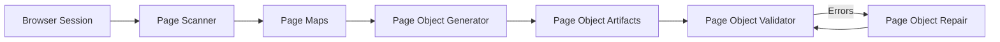
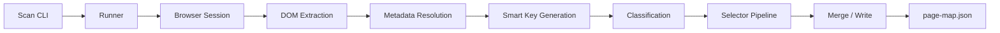

# Playwright Page Automation Framework

A scalable Playwright automation framework built around **automated page discovery, generation, validation, and repair**.

The framework minimizes manual page-object maintenance by introducing a structured automation toolchain.

---

# 🚀 Framework Overview

The automation system is built around four core tools:

| Tool | Responsibility |
|-----|----------------|
| **page-scanner** | Extract page structure and generate page maps |
| **page-object-generator** | Generate page-object artifacts |
| **page-object-validator** | Validate framework structure |
| **page-object-repair** | Automatically repair structural issues |

---

# ⚙️ Automation Toolchain



---

# 🔎 Page Scanning Pipeline

The scanner analyzes the DOM and converts page structure into **page-map metadata**.



---

# 📂 Project Structure

```
src
├── pages
│   ├── maps
│   ├── objects
│   ├── index.ts
│   └── pageManager.ts
│
├── tools
│   ├── page-scanner
│   ├── page-object-generator
│   ├── page-object-validator
│   ├── page-object-repair
│   └── README.md
│
└── utils
```

Tool-specific documentation lives here:

```
src/tools/README.md
```

---

# 📚 Documentation

This framework includes detailed architecture and workflow documentation.

### 🏗 Architecture Overview
High-level system architecture and automation design.

```
docs/architecture.md
```

### ⚙️ Automation Toolchain
Detailed explanation of the scanning, generation, validation, and repair tools.

```
docs/toolchain.md
```

### ▶️ Test Execution Flow
How Playwright tests interact with generated page objects.

```
docs/execution-flow.md
```

---

# 🧪 Typical Workflow

1️⃣ Scan a page

```
npm run scan:page
```

2️⃣ Generate page objects

```
npm run generator:elements
```

3️⃣ Validate framework

```
npm run validator:check
```

4️⃣ Repair if needed

```
npm run repair:run
```

---

# 💡 Key Benefits

This framework provides:

- automated page discovery
- deterministic page-object generation
- structural validation layer
- automated repair capabilities
- scalable automation architecture

---
