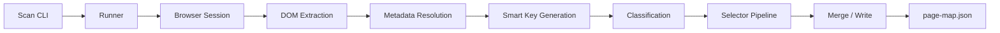

## 📚 Documentation

This framework includes detailed architecture and workflow documentation.

- 🏗 **Architecture Overview**  
  [View Architecture](docs/architecture.md)

- ⚙️ **Automation Toolchain**  
  [View Toolchain](docs/toolchain.md)

- ▶️ **Test Execution Flow**  
  [View Execution Flow](docs/execution-flow.md)
  

