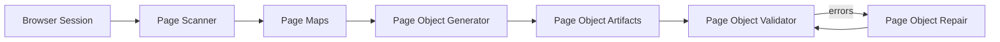
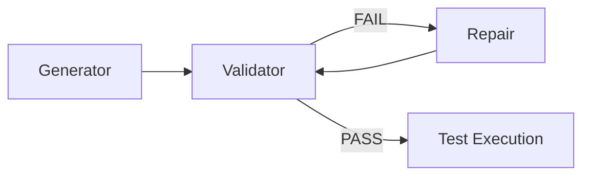
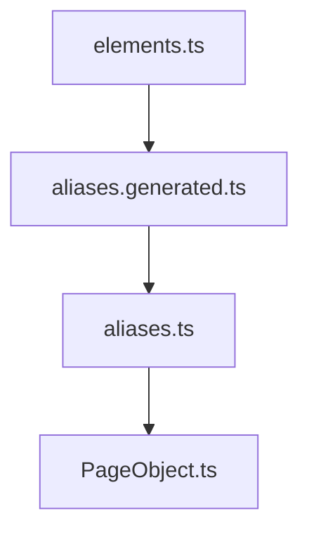

# Playwright Page Automation Framework

This repository contains a **scalable page-object automation framework** built on top of **Playwright**.

The framework provides a structured toolchain that automatically:

- scans web pages
- generates page objects
- validates framework consistency
- repairs structural issues

The architecture ensures automation code remains **deterministic, maintainable, and scalable**.

---

# 🧠 Core Philosophy

The framework is built on a **single source of truth model**.

```
page maps → generator → artifacts → validator → repair
```

- **Page maps are the source of truth**
- All artifacts are **derived**
- Validator ensures correctness
- Repair restores consistency

👉 Never manually fix generated artifacts unless absolutely necessary.

---

# 🏗 Framework Architecture

The automation system is built around **four core tools**.

| Tool | Responsibility |
|-----|----------------|
| page-scanner | Extract page structure and generate page maps |
| page-object-generator | Generate page-object artifacts |
| page-object-validator | Validate framework structure |
| page-object-repair | Automatically repair framework drift |

---

# 🔁 Toolchain Flow



---

# 🔗 Validator ↔ Repair ↔ Generator Parity

To ensure long-term stability, the framework maintains strict alignment between:

- Generator (builds artifacts)
- Validator (detects issues)
- Repair (fixes issues)

---

## Parity Matrix

| Contract | Generator | Validator | Repair | Notes |
|----------|----------|----------|--------|------|
| elements → aliases.generated | ✔ | ✔ | ✔ | fully auto-managed |
| aliases.generated → aliases | ✔ | ✔ | ✔ | fully auto-managed |
| aliases → PageObject methods | ✔ | ✔ | ✔ | managed region only |
| PageObject structure | ✔ | ✔ | ✔ | enforced |
| PageObject readiness | ✔ | ✔ | ✔ | metadata-driven |
| page-map schema | ✔ | ✔ | ✖ | source-of-truth |
| manifest metadata | ✔ | ✔ | ✔ | repair rebuilds |
| index.ts exports | ✔ | ✔ | ✔ | registry sync |
| pageManager.ts | ✔ | ✔ | ✔ | registry sync |

---

# 🚦 Pre-Execution Quality Gate

The framework enforces a **quality gate before test execution**.



---

## Recommended Script

```json
"test:e2e": "npm run generator:elements && npm run validator:check || (npm run repair:run && npm run validator:check) && npm run headers:fix && playwright test"
```

---

## CI Mode (Strict)

```json
"test:e2e:ci": "npm run generator:elements && npm run validator:check:strict && playwright test"
```

👉 Repair should NOT run in CI — failures should surface.

---

# 📁 Project Structure

```
src
├── pageObjects
│   ├── maps
│   ├── objects
│   ├── index.ts
│   └── pageManager.ts
│
├── pageObjectTools
│   ├── page-scanner
│   ├── page-object-generator
│   ├── page-object-validator
│   ├── page-object-repair
│   └── page-object-common
│
└── utils
```

---

# 🔗 Page Object Chain



Each layer builds on the previous one.

---

# ⚠️ Safe vs Unsafe Edits

## ❌ DO NOT EDIT

- `aliases.generated.ts`
- managed regions inside `PageObject.ts`
- `.manifest` files
- registry files (`index.ts`, `pageManager.ts`)

## ✅ SAFE TO EDIT

- `aliases.ts` (business mapping)
- PageObject custom methods (outside managed region)
- page maps (source of truth)

---

# 🛠 Troubleshooting Guide

| Issue | Action |
|------|--------|
| pageChain errors | run `npm run repair:run` |
| manifest errors | run `npm run repair:run` |
| registry errors | run `npm run repair:run` |
| source errors | fix page map manually |
| environment errors | check config/paths |

---

# 🔍 Debug Entry Points

Start debugging here:

- Page not working → check **page map**
- Method missing → check **aliases.ts**
- Validator failing → run `validator:check:verbose`
- Registry broken → run `repair:run`

---

# 🧩 Tools Overview

## Page Scanner
Extracts DOM → builds page maps

## Page Object Generator
Converts maps → automation code

## Page Object Validator
Detects structural issues

## Page Object Repair
Fixes inconsistencies automatically

---

# 🔄 Typical Workflow

```
npm run scan:page
npm run generator:elements
npm run validator:check
```

If issues:

```
npm run repair:run
```

---

# 📚 Documentation

This repository includes detailed documentation explaining the architecture, toolchain, and workflows.

---

## Architecture

- 🏗 **Architecture Overview**  
  [View Architecture](docs/architecture.md)

---

## Toolchain

- ⚙️ **Automation Toolchain**  
  [View Toolchain](docs/toolchain.md)

---

## Workflows

- ▶️ **Test Execution Flow**  
  [View Execution Flow](docs/execution-flow.md)

---

## Framework Guidelines

- 📖 **Tooling Guidelines (Dos & Don'ts)**  
  [View Guidelines](src/tools/README_GUIDELINES.md)

---

## Tool Documentation

- 🔎 **Page Scanner**  
  [View Docs](src/pageObjectTools/page-scanner/README.md)

- 🧩 **Page Object Generator**  
  [View Docs](src/pageObjectTools/page-object-generator/README.md)

- ✅ **Page Object Validator**  
  [View Docs](src/pageObjectTools/page-object-validator/README.md)

- 🛠 **Page Object Repair**  
  [View Docs](src/pageObjectTools/page-object-repair/README.md)

---

# 🚀 Benefits

- automatic page discovery  
- deterministic generation  
- strict validation layer  
- automated repair capability  
- scalable architecture  
- CI-safe automation  

---

# 🏁 Final Note

This framework is designed to be:

- self-healing  
- deterministic  
- scalable  

👉 Follow the toolchain.  
👉 Trust the validator.  
👉 Use repair when needed.  

Everything else is derived.

---