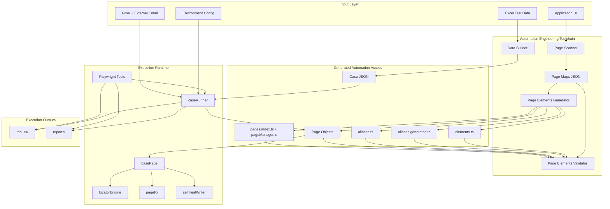

```mermaid
flowchart TB

%% =========================
%% LAYER 1 - INPUTS
%% =========================
subgraph L1["Input Layer"]
    EXCEL["Excel Test Data"]
    UI["Application UI"]
    ENV["Environment Config"]
    MAIL["Gmail / External Email"]
end

%% =========================
%% LAYER 2 - ENGINEERING TOOLCHAIN
%% =========================
subgraph L2["Automation Engineering Toolchain"]
    DB["Data Builder"]
    SCAN["Page Scanner"]
    MAP["Page Maps JSON"]
    GEN["Page Elements Generator"]
    VAL["Page Elements Validator"]
end

%% =========================
%% LAYER 3 - GENERATED AUTOMATION ASSETS
%% =========================
subgraph L3["Generated Automation Assets"]
    ELEM["elements.ts"]
    AG["aliases.generated.ts"]
    AH["aliases.ts"]
    PO["Page Objects"]
    REG["pages/index.ts + pageManager.ts"]
    CASEJSON["Case JSON"]
end

%% =========================
%% LAYER 4 - EXECUTION RUNTIME
%% =========================
subgraph L4["Execution Runtime"]
    TESTS["Playwright Tests"]
    RUNNER["caseRunner"]
    BASE["basePage"]
    LOC["locatorEngine"]
    FX["pageFx"]
    HEAL["selfHealWriter"]
end

%% =========================
%% LAYER 5 - OUTPUTS
%% =========================
subgraph L5["Execution Outputs"]
    RESULTS["results/"]
    REPORTS["reports/"]
end

%% =========================
%% FLOWS
%% =========================

EXCEL --> DB
DB --> CASEJSON

UI --> SCAN
SCAN --> MAP
MAP --> GEN

GEN --> ELEM
GEN --> AG
GEN --> AH
GEN --> PO
GEN --> REG

MAP --> VAL
ELEM --> VAL
AG --> VAL
AH --> VAL
PO --> VAL
REG --> VAL

CASEJSON --> RUNNER
TESTS --> RUNNER
ENV --> RUNNER
MAIL --> RUNNER

RUNNER --> PO
PO --> BASE
BASE --> LOC
BASE --> FX
BASE --> HEAL

RUNNER --> RESULTS
RUNNER --> REPORTS
TESTS --> RESULTS
TESTS --> REPORTS
```