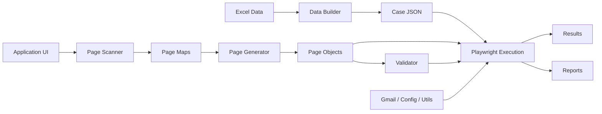

```mermaid
flowchart LR

A["Excel Data"] --> B["Data Builder"]
B --> C["Case JSON"]

D["Application UI"] --> E["Page Scanner"]
E --> F["Page Maps"]
F --> G["Page Generator"]
G --> H["Page Objects"]

H --> I["Validator"]

C --> J["Playwright Execution"]
H --> J
I --> J

J --> K["Results"]
J --> L["Reports"]
M["Gmail / Config / Utils"] --> J
```