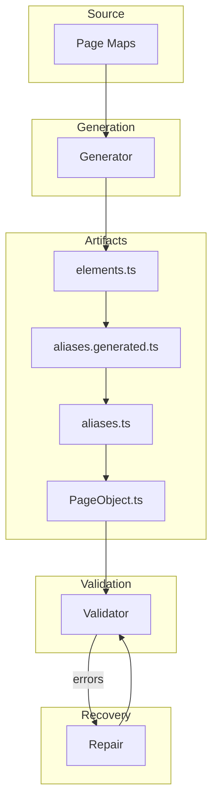

# 🏗 Architecture Overview

This document explains the **high-level architecture** of the Playwright automation framework.

---

## Core Design Principle

The framework follows a **deterministic pipeline architecture**:

```
page maps → generator → artifacts → validator → repair
```

- **Page maps = source of truth**
- All artifacts are derived
- System self-heals via validator + repair

---

## System Layers



---

## Responsibilities by Layer

### 1. Source Layer
- Page maps define:
  - elements
  - metadata (url, title)
- **Only manually edited layer**

---

### 2. Generation Layer
- Converts page maps into:
  - elements.ts
  - aliases.generated.ts
  - aliases.ts
  - PageObject.ts

---

### 3. Artifact Layer
Contains generated automation code.

| File | Purpose |
|------|--------|
| elements.ts | raw selectors |
| aliases.generated.ts | generated mapping |
| aliases.ts | business-friendly mapping |
| PageObject.ts | automation interface |

---

### 4. Validation Layer
- Ensures consistency across all layers
- Detects:
  - missing mappings
  - structural issues
  - registry drift
  - manifest inconsistencies

---

### 5. Recovery Layer (Repair)
- Fixes:
  - registry files
  - manifest
  - alias mismatches
- Keeps system consistent without manual intervention

---

## Key Architectural Guarantees

- Deterministic generation
- Self-healing structure
- Single source of truth
- Strong contract enforcement
- Scalable design

---

## Anti-Patterns (Avoid)

- Editing generated files manually
- Skipping validator
- Running tests without generator
- Ignoring manifest drift

---

## Summary

The architecture ensures:

- stability
- maintainability
- predictability

👉 Everything flows from **page maps**
👉 Everything else is **derived and enforced**