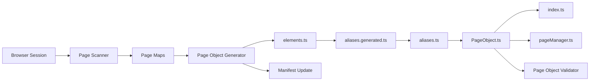
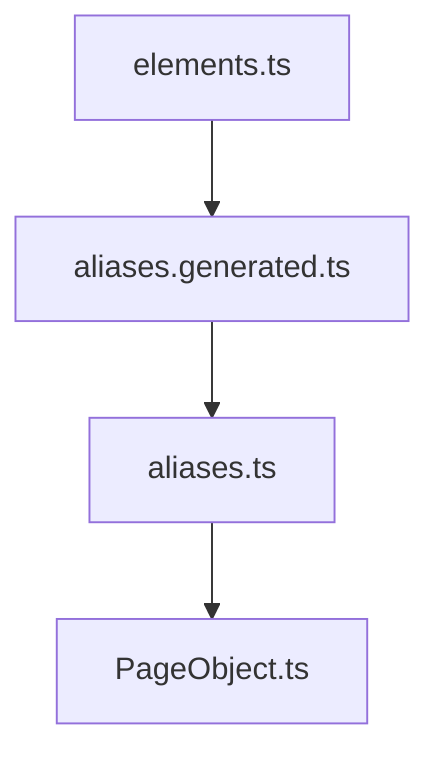
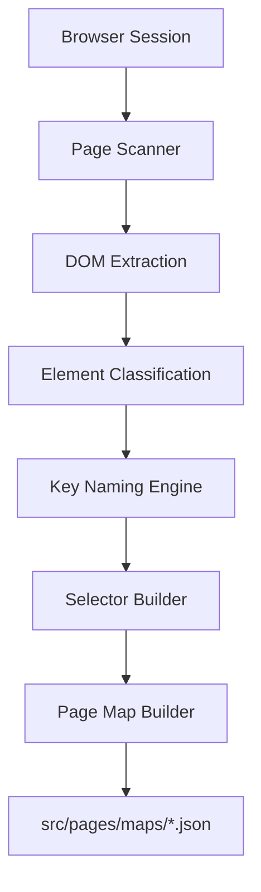
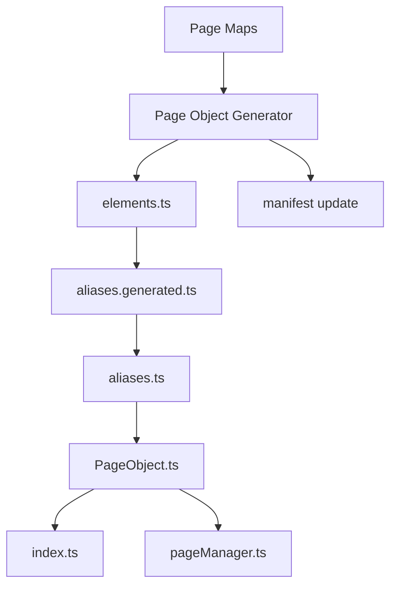
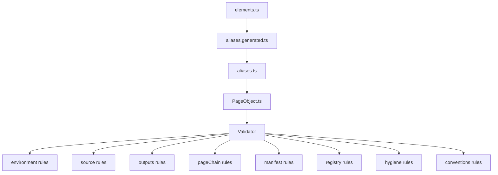
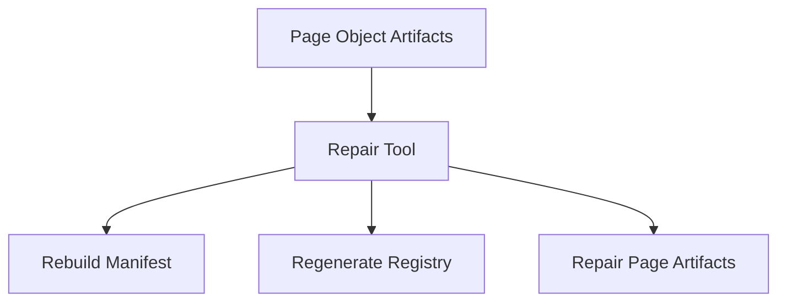

# Automation Framework Architecture

This repository implements a **structured Playwright automation framework** designed to scale large end-to-end automation suites.

The framework automates the full lifecycle of page automation:

- page discovery
- page-object generation
- structural validation
- automatic repair

Automation artifacts are generated and maintained through a **toolchain of CLI tools**.

---

# Core Toolchain

| Tool | Purpose |
|-----|--------|
| page-scanner | Extract page structure and generate page maps |
| page-object-generator | Convert page maps into page-object code |
| page-object-validator | Validate framework consistency |
| page-object-repair | Repair structural issues automatically |

---

# Master Architecture Overview



This diagram represents the core artifact lifecycle.  
The repair tool is a separate manual recovery tool used when validation reports issues.

---

# Page Object Chain

Generated page objects follow a strict dependency chain.



Each layer builds on the previous one.

| Layer | Purpose |
|------|--------|
elements.ts | raw locator definitions |
aliases.generated.ts | generated automation aliases |
aliases.ts | business-facing aliases |
PageObject.ts | Playwright page object implementation |

Important rule:

**`elements.ts` is the source of truth for the page object chain.**

---

# Registry System

The framework exposes page objects through two registry files.

```
src/pages/index.ts
src/pages/pageManager.ts
```

### index.ts

Exports page objects.

Example:

```ts
export { LoginOrRegistrationPage } from "@page-objects/athena/common/login-or-registration/LoginOrRegistrationPage"
```

### pageManager.ts

Provides centralized access to page objects.

Example usage:

```ts
pageManager.athena.loginOrRegistration
```

These files are **automatically maintained by the generator**.

---

# Manifest System

The framework maintains page metadata in:

```
src/pages/.manifest
```

Structure:

```
.manifest
├── index.json
└── pages
    ├── <pageKey>.json
```

Example entry:

```json
{
  "pageKey": "athena.common.login-or-registration",
  "className": "LoginOrRegistrationPage",
  "pageObjectImportPath": "@page-objects/athena/common/login-or-registration/LoginOrRegistrationPage",
  "elementCount": 4,
  "urlPath": "/",
  "title": "Login page"
}
```

The manifest is used for:

- incremental generation
- validation checks
- repair operations

---

# Page Scanner Architecture

The scanner extracts DOM metadata from a running browser.



The scanner connects to the browser using **Chrome DevTools Protocol (CDP)**.

Output:

```
src/pages/maps/<pageKey>.json
```

Page maps describe **page metadata and discovered elements**.

Important rule:

**Page maps are metadata only and are NOT the source of truth for page elements.**

---

# Generator Architecture

The generator transforms page maps into automation code.



Generated artifacts live in:

```
src/pages/objects/<product>/<group>/<page>/
```

Example:

```
src/pages/objects/athena/common/login-or-registration/
```

Files:

```
elements.ts
aliases.generated.ts
aliases.ts
LoginOrRegistrationPage.ts
```

---

# Validator Architecture

The validator enforces structural consistency across page artifacts.

Validation rule groups:

```
environment
source
outputs
pageChain
manifest
registry
hygiene
conventions
```



The validator ensures that all generated artifacts remain synchronized.

---

# Repair Architecture

The repair tool is a **separate manual recovery tool** used to fix framework drift.

It does not run automatically from the validator.



The repair tool restores framework integrity when inconsistencies are detected.

---

# Source of Truth Rules

The framework follows strict source-of-truth rules.

| Component | Source of Truth |
|-----------|----------------|
Page elements | `elements.ts` |
Generated aliases | `aliases.generated.ts` |
Business aliases | `aliases.ts` |
Page objects | `PageObject.ts` |
Metadata | page maps |
Registry | generator |
Manifest | generator / repair |

Important rule:

**Page maps are metadata only.**

---

# Typical Developer Workflow

Standard automation workflow:

```
1. Scan page
2. Generate page objects
3. Validate framework
4. Repair if needed
```

Example commands:

```
npm run scan:page
npm run generator:elements
npm run validator:check
```

If validator reports errors:

```
npm run repair:run
```

---

# Design Goals

This architecture is designed to provide:

- scalable automation architecture
- deterministic page-object generation
- strict structural validation
- automated repair capability
- minimal manual maintenance