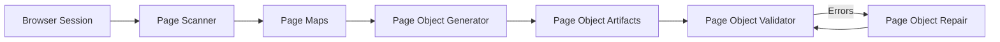
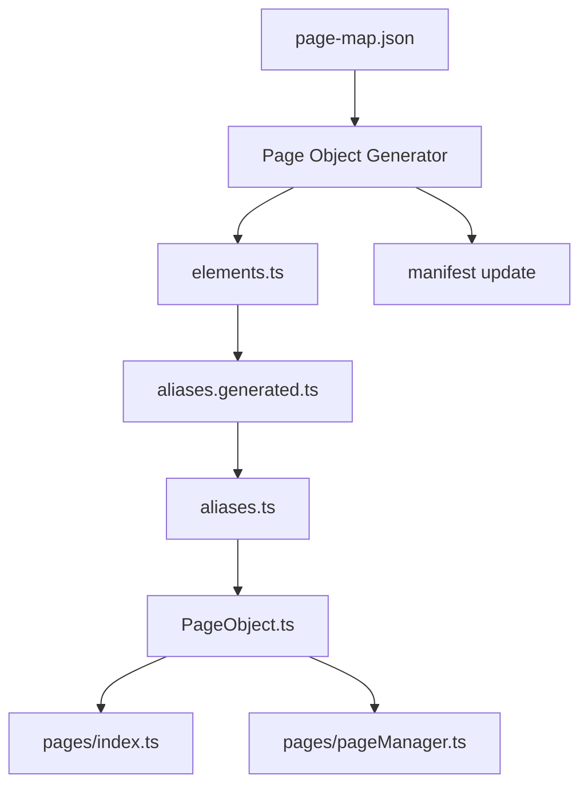

# ChatGPT Context — Playwright Automation Framework

This document provides **context for AI assistants (such as ChatGPT)** to understand the automation framework used in this repository.

It summarizes the architecture, tools, and conventions used in the project.

---

# Framework Overview

This repository implements a **structured Playwright automation framework** designed for scalable page-object automation.

The framework automates:

- page discovery
- page-object generation
- structural validation
- automatic repair

Automation artifacts are **generated and validated using a toolchain of CLI tools**.

---

# Repository Structure

Key directories used in this framework:

```
src
├── pages
│   ├── maps                # page maps generated by scanner
│   ├── objects             # generated page objects
│   │
│   ├── .manifest           # page object metadata
│   │   ├── index.json
│   │   └── pages
│   │       └── *.json
│   │
│   ├── index.ts            # page registry exports
│   └── pageManager.ts      # page manager access layer
│
├── tools
│   ├── page-scanner
│   ├── page-object-generator
│   ├── page-object-validator
│   ├── page-object-repair
│   └── page-object-common  # shared utilities used by tools
│
└── utils                   # CLI utilities, logging, helpers
```

---

# Core Toolchain

The automation system consists of four primary tools.

| Tool | Responsibility |
|-----|----------------|
| page-scanner | Extract page structure from a browser and generate page maps |
| page-object-generator | Generate page-object artifacts from page maps |
| page-object-validator | Validate framework consistency |
| page-object-repair | Automatically repair structural issues |

---

# Toolchain Flow



---

# Page Maps

Page maps describe page metadata discovered by the scanner.

Location:

```
src/pages/maps
```

Example file:

```
src/pages/maps/athena.common.login-or-registration.json
```

Example structure:

```json
{
  "pageKey": "athena.common.login-or-registration",
  "urlPath": "/",
  "title": "Login page",
  "elements": {
    "loginButton": {
      "type": "button",
      "preferred": "css=#login",
      "fallbacks": ["role=button[name=/login/i]"]
    }
  }
}
```

Important rule:

**Page maps are metadata only and are NOT used as the source of truth for page elements.**

---

# Page Object Chain

Generated automation code follows a strict dependency chain.

```
elements.ts
↓
aliases.generated.ts
↓
aliases.ts
↓
PageObject.ts
```

| Layer | Purpose |
|------|--------|
elements.ts | locator definitions |
aliases.generated.ts | generated aliases |
aliases.ts | business-friendly aliases |
PageObject.ts | Playwright page object |

Important rule:

**elements.ts is the source of truth for the page chain.**

---

# Generator Chain



---

# Page Object Locations

Generated page objects live in:

```
src/pages/objects/<product>/<group>/<page>/
```

Example:

```
src/pages/objects/athena/common/login-or-registration/
```

Files:

```
elements.ts
aliases.generated.ts
aliases.ts
LoginOrRegistrationPage.ts
```

---

# Page Registry

Two registry files expose page objects to the framework.

```
src/pages/index.ts
src/pages/pageManager.ts
```

### index.ts

Exports page objects.

### pageManager.ts

Provides centralized access.

Example:

```ts
pageManager.athena.loginOrRegistration
```

---

# Manifest System

The framework maintains metadata about page objects in:

```
src/pages/.manifest
```

Structure:

```
.manifest
├── index.json
└── pages
    ├── <pageKey>.json
```

Example manifest entry:

```json
{
  "pageKey": "athena.common.login-or-registration",
  "className": "LoginOrRegistrationPage",
  "pageObjectImportPath": "@page-objects/athena/common/login-or-registration/LoginOrRegistrationPage",
  "elementCount": 4
}
```

The manifest is used for:

- incremental generation
- validation checks
- repair operations

---

# Page Scanner

The page scanner extracts DOM metadata from a running browser.

It connects to the browser using **Chrome DevTools Protocol (CDP)**.

Example workflow:

```
Start browser in CDP mode
↓
Open target page
↓
Run scanner
↓
Generate page map
```

Scanner output:

```
src/pages/maps/<pageKey>.json
```

---

# Generator

The generator converts page maps into automation artifacts.

Generated files:

```
elements.ts
aliases.generated.ts
aliases.ts
<PageName>Page.ts
```

Generator commands:

```
npm run generator:elements
npm run generator:elements:changed
```

---

# Validator

The validator ensures framework consistency.

Validation rule groups:

```
environment
source
outputs
pageChain
manifest
registry
hygiene
conventions
```

Validator command:

```
npm run validator:check
```

---

# Repair Tool

The repair tool automatically fixes structural issues detected by the validator.

Repairs include:

- manifest rebuilding
- registry repair
- artifact correction

Repair command:

```
npm run repair:run
```

---

# Typical Developer Workflow

Standard automation workflow:

```
1. Scan page
2. Generate page objects
3. Validate framework
4. Repair if needed
```

Example:

```
npm run scan:page
npm run generator:elements
npm run validator:check
```

If errors occur:

```
npm run repair:run
```

---

# Source of Truth Rules

The framework follows strict source-of-truth rules.

| Component | Source of Truth |
|-----------|----------------|
Page elements | `elements.ts` |
Generated aliases | `aliases.generated.ts` |
Business aliases | `aliases.ts` |
Page objects | `PageObject.ts` |
Metadata | page maps |
Registry | generator |
Manifest | generator / repair |

---

# Important Framework Rules

1. `elements.ts` is the **source of truth for the page chain**.
2. Page maps are **metadata only**.
3. Generated files must remain **deterministic**.
4. Validators enforce **structural consistency**.
5. Repair tool fixes **framework drift automatically**.

---

# When Assisting With This Project

When providing suggestions or code:

- follow the page-object chain
- do not treat page maps as the source of truth
- maintain compatibility with generator / validator / repair tools
- respect existing folder structure
- avoid breaking generated artifacts