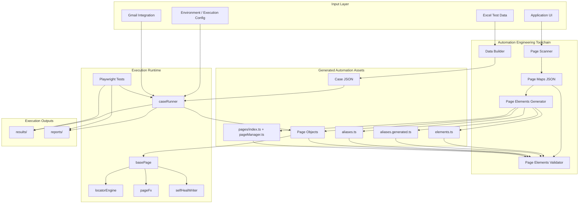

```mermaid
flowchart TB

subgraph INPUT["Input Layer"]
    EXCEL["Excel Test Data"]
    UI["Application UI"]
    CFG["Environment / Execution Config"]
    GMAIL["Gmail Integration"]
end

subgraph TOOLCHAIN["Automation Engineering Toolchain"]
    DB["Data Builder"]
    SCAN["Page Scanner"]
    MAP["Page Maps JSON"]
    GEN["Page Elements Generator"]
    VAL["Page Elements Validator"]
end

subgraph ASSETS["Generated Automation Assets"]
    CASEJSON["Case JSON"]
    ELEM["elements.ts"]
    AG["aliases.generated.ts"]
    AH["aliases.ts"]
    PO["Page Objects"]
    REG["pages/index.ts + pageManager.ts"]
end

subgraph RUNTIME["Execution Runtime"]
    TESTS["Playwright Tests"]
    RUNNER["caseRunner"]
    BASE["basePage"]
    LOC["locatorEngine"]
    FX["pageFx"]
    HEAL["selfHealWriter"]
end

subgraph OUTPUT["Execution Outputs"]
    RESULTS["results/"]
    REPORTS["reports/"]
end

EXCEL --> DB
DB --> CASEJSON

UI --> SCAN
SCAN --> MAP
MAP --> GEN

GEN --> ELEM
GEN --> AG
GEN --> AH
GEN --> PO
GEN --> REG

MAP --> VAL
ELEM --> VAL
AG --> VAL
AH --> VAL
PO --> VAL
REG --> VAL

CASEJSON --> RUNNER
CFG --> RUNNER
GMAIL --> RUNNER
TESTS --> RUNNER

RUNNER --> PO
PO --> BASE
BASE --> LOC
BASE --> FX
BASE --> HEAL

RUNNER --> RESULTS
RUNNER --> REPORTS
TESTS --> RESULTS
TESTS --> REPORTS
```