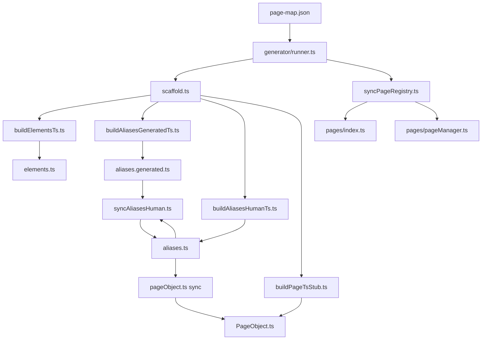
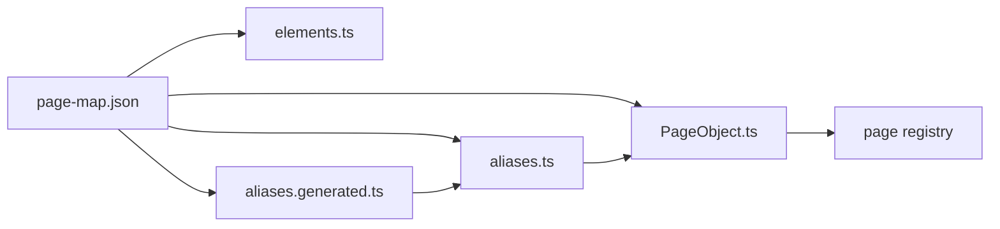

```mermaid
flowchart TD

A["page-map.json"] --> B["generator/runner.ts"]
B --> C["scaffold.ts"]

C --> D["buildElementsTs.ts"]
C --> E["buildAliasesGeneratedTs.ts"]
C --> F["buildAliasesHumanTs.ts"]
C --> G["buildPageTsStub.ts"]

D --> H["elements.ts"]
E --> I["aliases.generated.ts"]
F --> J["aliases.ts"]
G --> K["PageObject.ts"]

J --> L["syncAliasesHuman.ts"]
I --> L
L --> J

J --> M["pageObject.ts sync"]
M --> K

B --> N["syncPageRegistry.ts"]
N --> O["pages/index.ts"]
N --> P["pages/pageManager.ts"]
```

## Compact Business-friendly layered version

```mermaid
flowchart LR

MAP["page-map.json"]
MAP --> ELEM["elements.ts"]
MAP --> AG["aliases.generated.ts"]
MAP --> AH["aliases.ts"]
MAP --> PO["PageObject.ts"]

AG --> AH
AH --> PO
PO --> REG["page registry"]
```

