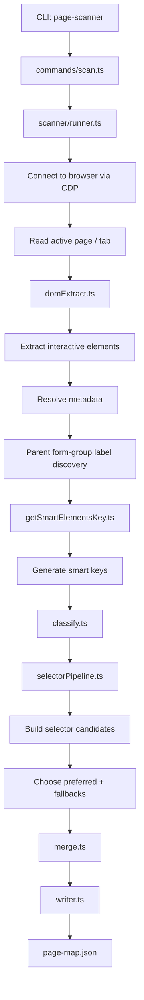
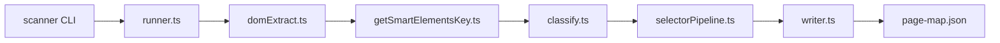

```mermaid
flowchart TD

A["CLI: page-scanner"] --> B["commands/scan.ts"]
B --> C["scanner/runner.ts"]

C --> D["Connect to browser via CDP"]
D --> E["Read active page / tab"]
E --> F["domExtract.ts"]

F --> G["Extract interactive elements"]
G --> H["Resolve metadata"]
H --> I["Parent form-group label discovery"]
I --> J["getSmartElementsKey.ts"]

J --> K["Generate smart keys"]
K --> L["classify.ts"]
L --> M["selectorPipeline.ts"]

M --> N["Build selector candidates"]
N --> O["Choose preferred + fallbacks"]
O --> P["merge.ts"]
P --> Q["writer.ts"]

Q --> R["page-map.json"]
```

## Compact scanner diagram

```mermaid
flowchart LR

CLI["scanner CLI"] --> RUN["runner.ts"]
RUN --> DOM["domExtract.ts"]
DOM --> KEY["getSmartElementsKey.ts"]
KEY --> CLASS["classify.ts"]
CLASS --> SEL["selectorPipeline.ts"]
SEL --> WRITE["writer.ts"]
WRITE --> MAP["page-map.json"]
```
