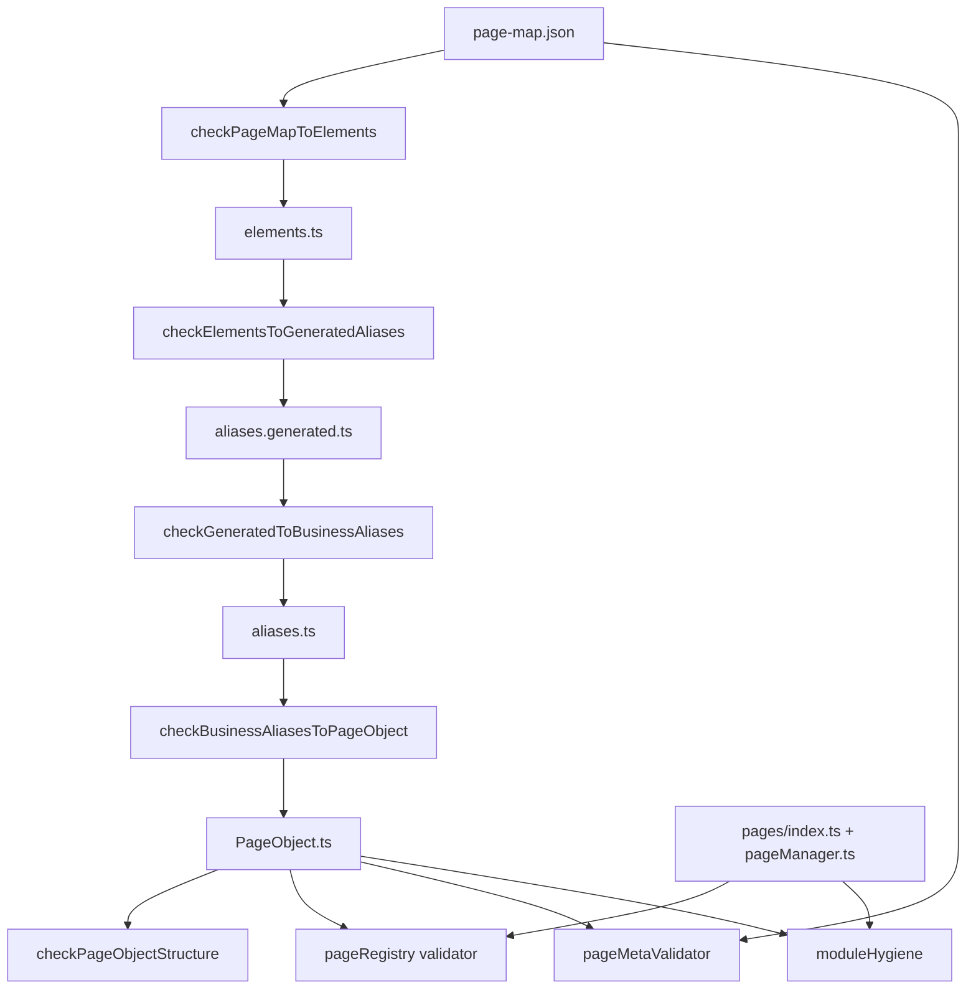
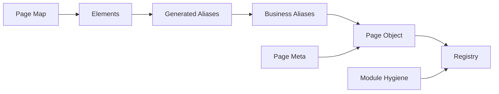

```mermaid
flowchart TD

A["page-map.json"]
B["elements.ts"]
C["aliases.generated.ts"]
D["aliases.ts"]
E["PageObject.ts"]
F["pages/index.ts + pageManager.ts"]

A --> V1["checkPageMapToElements"]
V1 --> B

B --> V2["checkElementsToGeneratedAliases"]
V2 --> C

C --> V3["checkGeneratedToBusinessAliases"]
V3 --> D

D --> V4["checkBusinessAliasesToPageObject"]
V4 --> E

E --> V5["checkPageObjectStructure"]

F --> V6["pageRegistry validator"]
E --> V6

A --> V7["pageMetaValidator"]
E --> V7

E --> V8["moduleHygiene"]
F --> V8
```

## Report-style validator view

```mermaid
flowchart LR

MAP["Page Map"] --> EL["Elements"]
EL --> AG["Generated Aliases"]
AG --> AH["Business Aliases"]
AH --> PO["Page Object"]
PO --> REG["Registry"]

META["Page Meta"] --> PO
HYG["Module Hygiene"] --> REG
```

