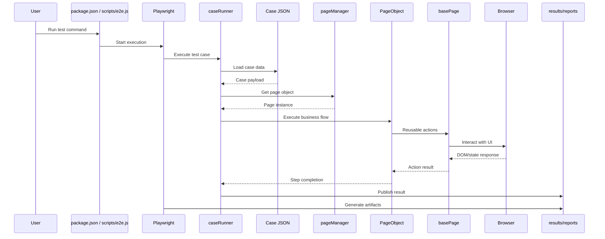
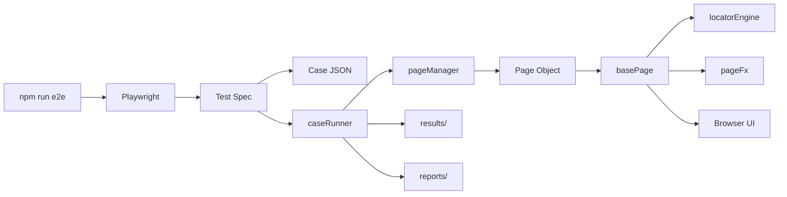

# Test Execution Flow

This document explains how tests are executed in the framework.

Execution is powered by:

- Playwright
- Case Runner
- Page Manager
- Page Objects

---

# Test Execution Flow

---

# Execution Flow (Simplified)

