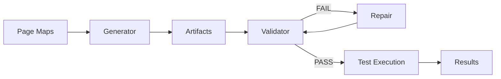
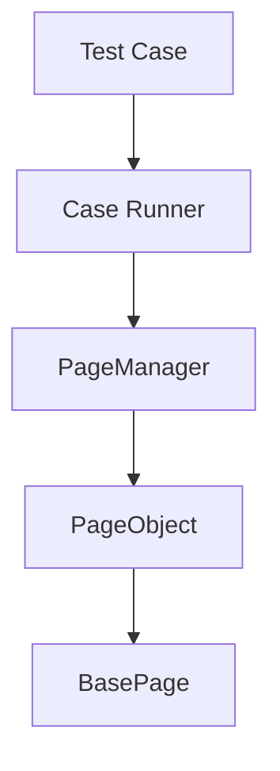

# ▶️ Test Execution Flow

This document explains how tests execute within the automation framework.

---

## Execution Pipeline



---

## Step-by-Step Flow

### 1. Generator
- Builds artifacts from page maps

---

### 2. Validator
- Ensures:
  - mappings are correct
  - structure is valid
  - registry is consistent

---

### 3. Repair (if needed)
- Fixes detected inconsistencies
- Re-runs validator

---

### 4. Test Execution
- Uses:
  - PageManager
  - PageObjects
  - Aliases

---

## Runtime Flow



---

## Page Access Pattern

```ts
pageManager.athena.loginOrRegistration.login()
```

---

## Key Guarantees

- Tests run only on validated structure
- No broken mappings at runtime
- Consistent page access

---

## Failure Handling

| Stage | Action |
|------|--------|
| Generator fails | fix page map |
| Validator fails | run repair |
| Repair fails | manual intervention |

---

## CI Flow

```
generator → validator (strict) → test
```

Repair should NOT run in CI.

---

## Summary

Execution ensures:

- reliability
- predictability
- consistency

👉 Validator is the gatekeeper  
👉 Repair is the safety net  
👉 Generator is the source builder  