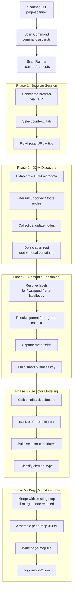
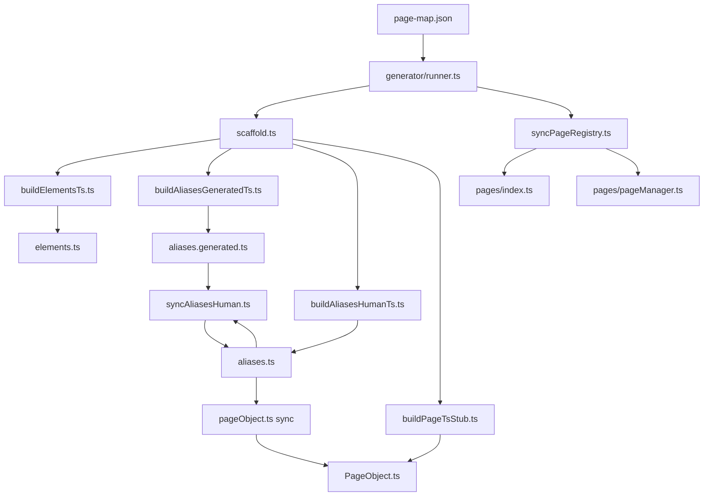
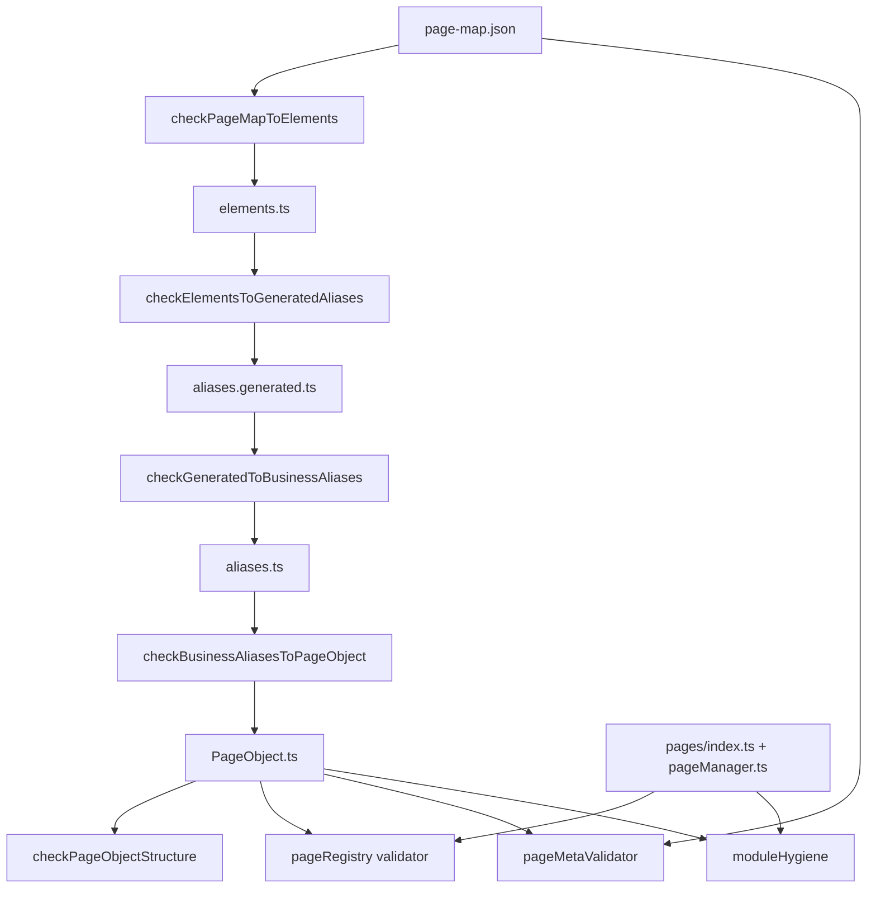

# Automation Toolchain

This document explains the internal automation toolchain used to build and maintain page objects.

The toolchain includes:

- Page Scanner
- Elements Generator
- Page Validator

---

# 1) Page Scanner Flow

---
# 2) Elements Generator Flow

---
# 3) Validator Pipeline

