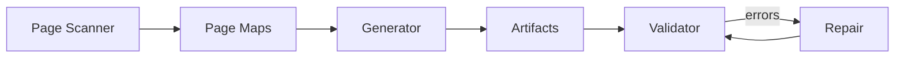

# ⚙️ Automation Toolchain

This document explains the **four core tools** in the framework and how they interact.

---

## Tool Overview

| Tool | Responsibility |
|-----|----------------|
| page-scanner | Extract page structure |
| page-object-generator | Generate artifacts |
| page-object-validator | Validate consistency |
| page-object-repair | Fix inconsistencies |

---

## Toolchain Flow



---

## Tool Details

---

### 🔎 Page Scanner

**Purpose**
- Extract DOM structure
- Build page maps

**Output**
```
src/pageObjects/maps/<pageKey>.json
```

---

### 🧩 Page Object Generator

**Purpose**
- Convert page maps into code

**Generates**
```
elements.ts
aliases.generated.ts
aliases.ts
PageObject.ts
```

---

### ✅ Page Object Validator

**Purpose**
- Validate framework consistency

**Rule Groups**
```
environment
source
outputs
pageChain
manifest
registry
hygiene
conventions
```

---

### 🛠 Page Object Repair

**Purpose**
- Fix structural inconsistencies

**Repairs**
- manifest
- registry
- page-object chain

---

## Tool Responsibilities Matrix

| Layer | Scanner | Generator | Validator | Repair |
|------|--------|----------|----------|--------|
| page maps | ✔ | ✔ | ✔ | ✖ |
| elements | ✖ | ✔ | ✔ | ✔ |
| aliases | ✖ | ✔ | ✔ | ✔ |
| page objects | ✖ | ✔ | ✔ | ✔ |
| manifest | ✖ | ✔ | ✔ | ✔ |
| registry | ✖ | ✔ | ✔ | ✔ |

---

## Execution Order

Correct order:

```
scan → generate → validate → repair (if needed) → test
```

---

## Common Mistakes

❌ Running tests without generator  
❌ Ignoring validator errors  
❌ Editing generated files manually  

---

## Summary

The toolchain guarantees:

- consistent structure
- automated maintenance
- reduced manual work

👉 Always follow the toolchain sequence