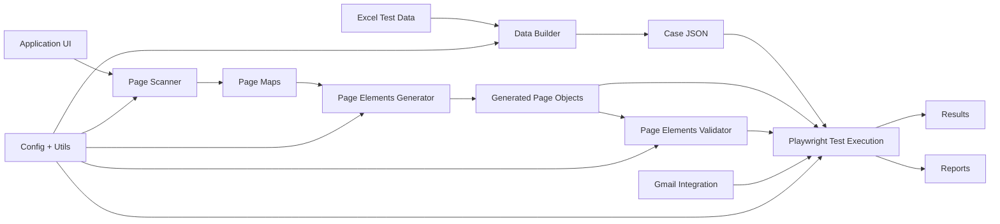

# AZOnline Automation Framework

This project is a **Playwright + TypeScript automation framework** designed for scalable UI test automation with automated page model generation, data-driven testing, and validation tooling.

The framework combines:

- UI Test Execution
- Automated Page Object Generation
- Page Structure Validation
- Excel-driven Test Data
- Gmail Integration
- Self-Healing Locators
- Modular Toolchain


---

## Automation System Overview



---

## High Level Architecture

```mermaid
flowchart TB

subgraph Entry["Execution Entry"]
PKG["package.json scripts"]
E2E["scripts/e2e.js"]
PW["playwright.config.ts"]
end

subgraph Tests
T["src/tests"]
R["reports"]
RES["results"]
end

subgraph Runtime
CR["caseRunner"]
PM["pageManager"]
BP["basePage"]
LE["locatorEngine"]
FX["pageFx"]
SH["selfHealWriter"]
end

subgraph Pages
PO["PageObjects"]
ALIAS["aliases"]
ELEMENTS["elements"]
end

subgraph Tools
SCAN["page-scanner"]
GEN["elements-generator"]
VAL["elements-validator"]
end

subgraph Data
DB["data-builder"]
EXCEL["Excel"]
JSON["Case JSON"]
end

EXCEL --> DB
DB --> JSON
JSON --> CR

CR --> PM
PM --> PO
PO --> BP
BP --> LE
BP --> FX
BP --> SH

SCAN --> GEN
GEN --> ELEMENTS
GEN --> ALIAS
GEN --> PO

VAL --> PO

CR --> R
CR --> RES