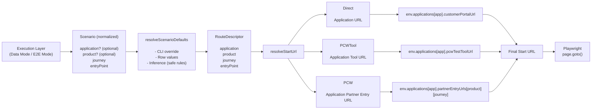

# Config Layer

This folder contains all configuration and route-resolution logic used by the automation framework.

It is responsible for three things:

1. defining runtime behavior that is global to execution
2. defining environment-specific URLs and application mappings
3. resolving scenario-driven routing inputs into a concrete start URL

This layer must stay declarative and predictable. It should not contain page automation logic, Playwright selector logic, or business journey execution steps.

---

# Design Principles

## 1. Scenario-driven routing
Routing is resolved at runtime using:
- application
- product
- journey
- entryPoint

## 2. Environment vs Application
Environment:
- dev, test, demo, nft

Application:
- AzOnline, Ferry, Britannia

## 3. All URLs belong to application
All URLs are accessed via:
env.applications[application]

## 4. Strict inference
- Application ≠ Journey
- Product ≠ Partner

No mixing.

## 5. Config must stay pure
Only:
- constants
- mappings
- pure resolver functions

---

# Folder Overview

```
src/config
├── domain
├── env.ts
├── environments
└── execution.config.ts
```

---

# execution.config.ts

Technical runtime config:
- browser
- timeouts
- artifacts
- diagnostics

---

# env.ts

Resolves current environment:
- TARGET_ENV
- returns envConfig

No routing logic here.

---

# environments/

Each file = one environment:
- dev.ts
- test.ts
- demo.ts
- nft.ts

Each contains:

applications: {
  AzOnline: { ... },
  Ferry: { ... },
  Britannia: { ... }
}

Each application contains:
- customerPortalUrl
- supportPortalUrl
- pcwTestToolUrl
- backdatingToolUrl
- partnerEntryUrls

---

# partnerEntryUrls structure

partnerEntryUrls: {
  Motor: {
    CTM,
    CNF,
    MSM,
    GOCO
  },
  Home: {
    CTM,
    CNF,
    MSM,
    GOCO
  }
}

---

# domain/

Core routing logic lives here.

## routing.config.ts
Defines:
- Application
- Product
- EntryPoint
- RouteDescriptor

## journey.config.ts
Normalizes journeys:
Direct, CTM, CNF, MSM, GOCO

## application.inference.config.ts
ONLY application rules.

## product.inference.config.ts
ONLY product rules.

## application.resolver.ts
Resolves application safely.

## product.resolver.ts
Resolves product safely.

## resolveScenarioDefaults.ts
Combines:
- CLI
- row data
- inference

## resolveApplicationUrl.ts
Returns:
application URLs

## resolvePcwUrl.ts
Returns:
partner entry URL

## resolveStartUrl.ts
Main routing engine.

---

# Routing Model

EntryPoint → Behavior

Direct:
→ customerPortalUrl

PCWTool:
→ pcwTestToolUrl

PCW:
→ partnerEntryUrls[product][journey]

---

# Example

Direct:
AzOnline → customerPortalUrl

PCWTool:
AzOnline → pcwTestToolUrl

PCW:
Britannia + Home + CTM → partnerEntryUrls.Home.CTM

---

# Playwright Config Rule

Playwright MUST NOT:
- hardcode URLs
- know application
- know product

Routing is runtime responsibility.

---

# Modes

Data Mode:
- uses source + schema

E2E Mode:
- uses excel row

Both resolve:
application + product + journey + entryPoint

---

# Anti-patterns

DO NOT:
- hardcode AzOnline
- infer product from CTM
- infer application from CNF
- use START_FROM
- duplicate routing logic

---

# Summary

This layer provides:
- environment isolation
- application-based URL ownership
- strict inference
- unified routing

---

# Diagram

