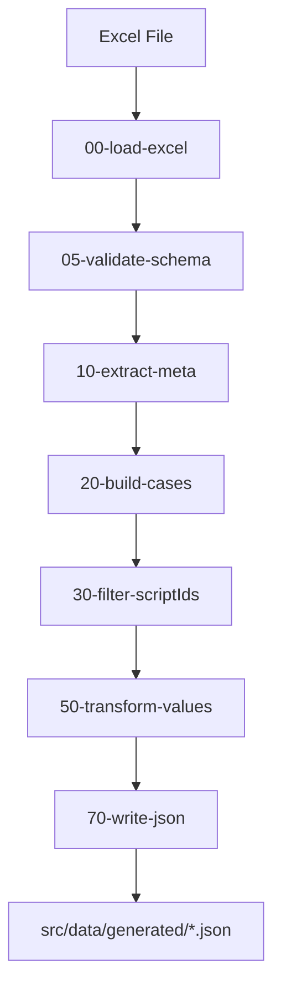
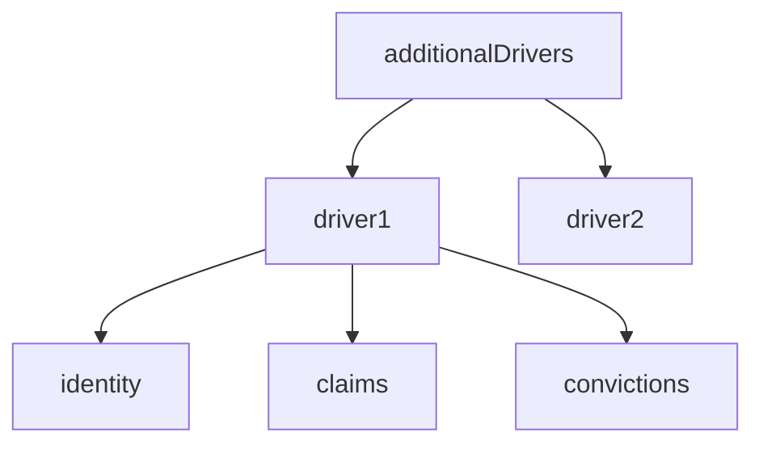
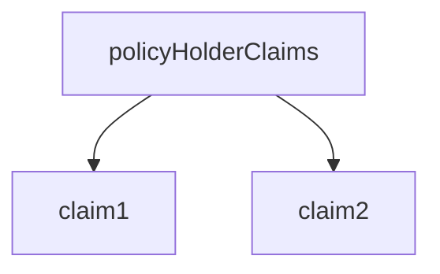
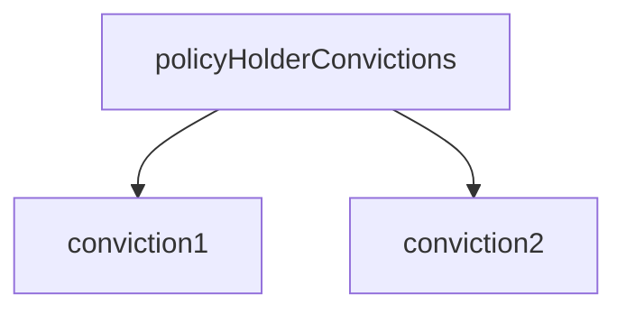
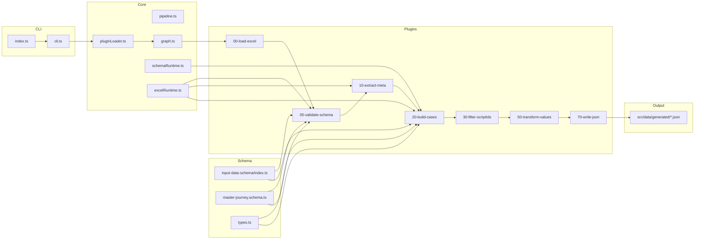

<!-- src/data/data-builder/README.md -->

# Data Builder

---

# 1. Overview

The **Data Builder** converts structured **Excel test data** into normalized **JSON test cases** used by the automation framework.

It reads Excel sheets containing business-maintained test data and transforms them into a consistent JSON structure driven by a **schema definition**.

The generated JSON files become the **runtime data source for automated tests**.

The Data Builder ensures that:

- Excel remains **human-friendly for business users**
- JSON remains **automation-friendly for test execution**

---

# 2. Purpose

The Data Builder automates the transformation of Excel test sheets into structured test data.

Its primary goals are:

- convert Excel test data into structured JSON
- support multiple insurance journeys
- enforce consistent data structure
- reduce manual JSON maintenance
- allow business teams to maintain test data
- enable scalable automated testing

---

# 3. Toolchain Context


---

# 4. Inputs

## Excel Test Data

Each column = **test case**  
Each row = **field**

---

## Sheet Name

Example:
Direct, CNF, CTM, GoCo, MSM

---

## Schema Name

Schemas define mapping:

```
src/data/input-data-schema
```

---

# 5. Outputs

```
src/data/generated/<Sheet>.json
```

---

# 6. Schema System

Schema controls:

- field mapping
- nested structure
- repeated groups (drivers, claims, convictions)

---

# 7. Data Builder Pipeline



---

## Plugin Responsibilities

| Plugin | Responsibility |
|------|------|
| 00-load-excel | Load workbook and sheet |
| 05-validate-schema | Validate Excel (normal + strict mode) |
| 10-extract-meta | Extract Script IDs and structure |
| 20-build-cases | Build JSON using schema |
| 30-filter-scriptIds | Filter test cases |
| 50-transform-values | Normalize values |
| 70-write-json | Write JSON output |

---

# 8. CLI Usage

```bash
npm run data -- --excel file.xlsx --sheet Direct --schema direct
```

---

# 9. Required Arguments

| Argument | Description |
|--------|-------------|
| --excel | Excel file |
| --sheet | Sheet name |
| --schema | Schema name |

---

# 10. Optional Arguments

| Argument | Description |
|--------|-------------|
| --ids | Filter Script IDs |
| --excludeEmptyFields | Remove empty values |
| --strictValidation | Enable strict validation |
| --out | Custom output path |
| --verbose | Debug logs |

---

# 11. Strict Validation

## Normal Mode

- required fields exist
- schema mapping is valid

## Strict Mode

Additionally checks:

- duplicate Excel fields
- AdditionalDriversCount consistency
- invalid counts
- schema completeness

Example:

```bash
npm run data -- \
--excel file.xlsx \
--sheet Direct \
--schema direct \
--strictValidation
```

---

# 12. Example Commands

### Normal
```bash
npm run data -- --excel file.xlsx --sheet Direct --schema direct
```

### Strict
```bash
npm run data:build:strict
```

### Clean + Strict
```bash
npm run data:build:noEmpty:strict
```

---

# 13. Additional Drivers Structure



---

# 14. Claims Structure



---

# 15. Convictions Structure



---

# 16. Adding New Journeys

1. Create schema  
2. Register schema  
3. Run builder  

---

# 17. Shared Utilities

```
src/utils
```

Includes:
- logging
- CLI parsing
- formatting
- timers

---

# 18. Design Principles

- schema-driven
- plugin-based
- scalable
- business-friendly
- automation-ready

---

# 19. End-to-End Flow



---

# 20. Troubleshooting

Excel file not found → check `--excel`  
Sheet not found → check `--sheet`  
Schema not found → run `npm run data -- --help`

---

# 21. Summary

The **Data Builder** provides a scalable pipeline for converting Excel test data into structured JSON used by the automation framework.

It enables:

- business-friendly test data management
- schema-driven automation
- consistent test case structures
- scalable multi-journey testing