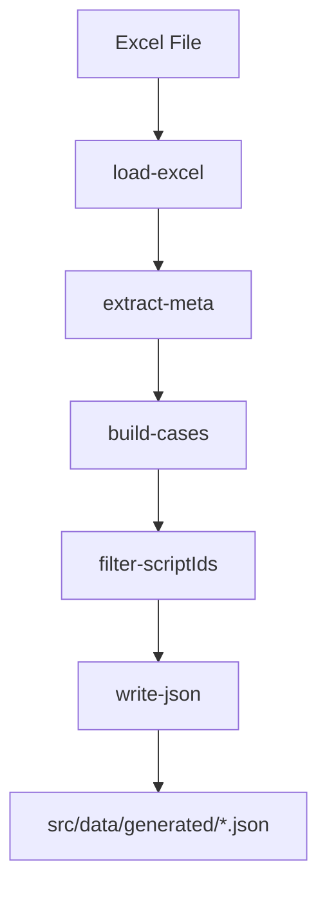
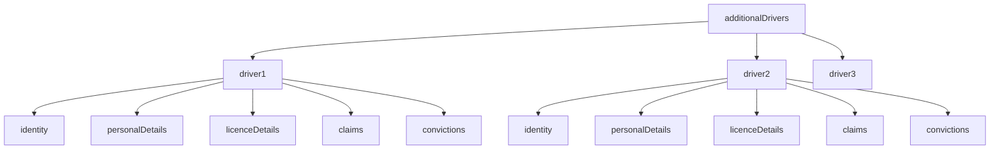
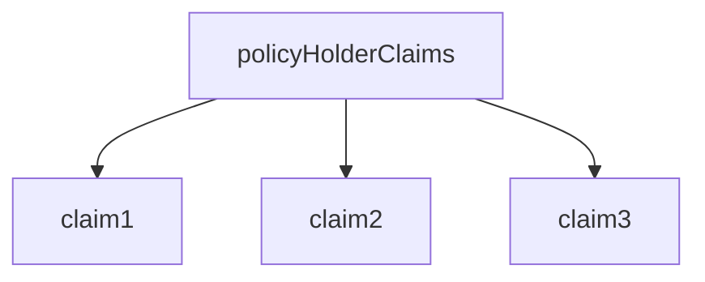
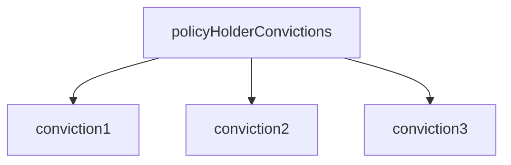
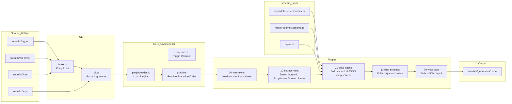

<!-- src/data/data-builder/README.md -->

# Data Builder

---

# 1. Overview

The **Data Builder** converts structured **Excel test data** into normalized **JSON test cases** used by the automation framework.

It reads Excel sheets containing business-maintained test data and transforms them into a consistent JSON structure driven by a **schema definition**.

The generated JSON files become the **runtime data source for automated tests**.

The Data Builder ensures that:

- Excel remains **human-friendly for business users**
- JSON remains **automation-friendly for test execution**

---

# 2. Purpose

The Data Builder automates the transformation of Excel test sheets into structured test data.

Its primary goals are:

- convert Excel test data into structured JSON
- support multiple insurance journeys
- enforce consistent data structure
- reduce manual JSON maintenance
- allow business teams to maintain test data
- enable scalable automated testing

Instead of manually creating JSON test files, testers and analysts can maintain **Excel sheets**, and the builder generates the structured data automatically.

---

# 3. Toolchain Context

Within the automation framework, the Data Builder acts as the **test data preparation layer**.


The builder **does not execute tests**.

It produces structured JSON that the **automation runtime consumes**.

---

# 4. Inputs

The Data Builder requires the following inputs.

## Excel Test Data

Test data is maintained in Excel.

Each column represents a **test case**, while rows represent **data fields**.

Example:

| Field | TC1 | TC2 |
|------|-----|-----|
| Script ID | 1 | 2 |
| ScriptName | TC001 | TC002 |
| Firstname | John | Jane |

Excel allows non-technical users to manage test data easily.

---

## Sheet Name

Each journey may have its own sheet.

Example:

Direct  
CNF  
CTM  
GoCo  
MSM  

---

## Schema Name

Each journey uses a **schema** that maps Excel fields to canonical JSON fields.

Schemas are located in:

src/data/input-data-schema

Example schemas:

direct  
cnf  
ctm  
goco  
msm  

---

# 5. Outputs

The Data Builder generates **JSON test data files**.

Location:

src/data/generated

Example output:

src/data/generated/Direct.json

---

## Example Output Structure

```json
{
  "sheet": "Direct",
  "sourceExcel": "Athena_TestData.xlsx",
  "generatedAt": "2026-03-17T12:00:00Z",
  "caseCount": 2,
  "cases": [
    {
      "caseIndex": 1,
      "scriptName": "TC001",
      "scriptId": "1",
      "description": "Happy path",
      "data": {
        "accountInformation": {},
        "carDetails": {},
        "policyHolder": {},
        "additionalDrivers": {}
      }
    }
  ]
}
```

Each case contains a fully structured **automation-ready payload**.

---

# 6. Schema System

Schemas define how Excel columns map to JSON fields.

Location:

src/data/input-data-schema

Example structure:

```text
input-data-schema
 ├── master-journey.schema.ts
 ├── types.ts
 └── index.ts
```

Schemas allow the framework to support **multiple journeys with different Excel layouts while maintaining the same canonical JSON structure**.

---

# 7. Data Builder Pipeline

The Data Builder operates using a **plugin pipeline architecture**.



---

## Plugin Responsibilities

| Plugin | Responsibility |
|------|------|
| load-excel | Load workbook and sheet |
| extract-meta | Extract Script IDs and Script Names |
| build-cases | Convert Excel rows into structured test cases |
| filter-scriptIds | Filter cases using `--ids` |
| write-json | Write final JSON output |

Plugins are located in:

src/data/data-builder/plugins

---

# 8. CLI Usage

The Data Builder is executed using CLI.

Basic command:

```text
npm run data
```

or

```text
ts-node src/data/data-builder/index.ts
```

---

# 9. Required Arguments

| Argument | Description |
|--------|-------------|
| --excel | Path to Excel file |
| --sheet | Excel sheet name |
| --schema | Journey schema name |

Example:

```text
npm run data -- \
--excel Athena_TestData.xlsx \
--sheet Direct \
--schema direct
```

---

# 10. Optional Arguments

| Argument | Description |
|--------|-------------|
| --ids | Filter Script IDs |
| --excludeEmptyFields | Remove empty Excel fields |
| --out | Custom output path |
| --verbose | Enable debug logs |
| --help | CLI help |

---

# 11. Example Commands

Generate JSON

```text
npm run data -- \
--excel Athena_TestData.xlsx \
--sheet Direct \
--schema direct
```

Filter Script IDs

```text
npm run data -- \
--excel Athena_TestData.xlsx \
--sheet Direct \
--schema direct \
--ids 1-10
```

Exclude Empty Fields

```text
npm run data -- \
--excel Athena_TestData.xlsx \
--sheet Direct \
--schema direct \
--excludeEmptyFields
```

Verbose Mode

```text
npm run data -- \
--excel Athena_TestData.xlsx \
--sheet Direct \
--schema direct \
--verbose
```

---

# 12. Output Location

Generated JSON files are written to:

src/data/generated

Example:

src/data/generated/Direct.json

---

# 13. Additional Drivers Structure

Additional drivers are dynamically created using:

AdditionalDriversCount

Example structure:



Each driver may contain:

- identity
- personalDetails
- licenceDetails
- claims
- convictions

---

# 14. Claims Structure

Claims are controlled using:

ClaimsCount

Example:



---

# 15. Convictions Structure

Convictions are controlled using:

ConvictionsCount

Example:



---

# 16. Adding New Journeys

To add a new journey:

1️⃣ Create schema

src/data/input-data-schema/<journey>.schema.ts

2️⃣ Register schema

Update:

src/data/input-data-schema/index.ts

3️⃣ Run builder

```text
npm run data -- --schema <journey>
```

---

# 17. Shared Utilities

The Data Builder uses shared utilities from:

src/utils

Utilities include:

- CLI formatting
- logging
- argument parsing
- timers
- file helpers

---

# 18. Design Principles

The Data Builder is designed to be:

- schema-driven
- plugin-based
- journey-independent
- automation-friendly
- business-maintainable

Excel remains readable for business users while JSON remains optimized for automation.

---

# 19. End-to-End Flow



---

# 20. Troubleshooting

Excel file not found

Check:

--excel path

Sheet not found

Check:

--sheet Direct

Schema not found

Run:

```text
npm run data -- --help
```

---

# 21. Summary

The **Data Builder** provides a scalable pipeline for converting Excel test data into structured JSON used by the automation framework.

It enables:

- business-friendly test data management
- schema-driven automation
- consistent test case structures
- scalable multi-journey testing