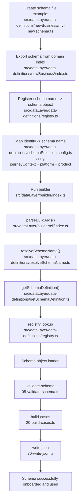

---
# Schema Onboarding Workflow

```mermaid

flowchart TD

A["Create schema file
example:
src/dataLayer/data-definitions/newBusiness/my-new.schema.ts"] --> B["Export schema from domain index
src/dataLayer/data-definitions/newBusiness/index.ts"]

B --> C["Register schema name -> schema object
src/dataLayer/data-definitions/registry.ts"]

C --> D["Map identity -> schema name
src/dataLayer/data-definitions/schemaSelection.config.ts
using:
journeyContext + platform + product"]

D --> E["Run builder
src/dataLayer/builder/index.ts"]

E --> F["parseBuildArgs()
src/dataLayer/builder/cli/index.ts"]

F --> G["resolveSchemaName()
src/dataLayer/data-definitions/resolveSchemaName.ts"]

G --> H["getSchemaDefinition()
src/dataLayer/data-definitions/getSchemaDefinition.ts"]

H --> I["registry lookup
src/dataLayer/data-definitions/registry.ts"]

I --> J["Schema object loaded"]

J --> K["validate-schema
05-validate-schema.ts"]

K --> L["build-cases
20-build-cases.ts"]

L --> M["write-json
70-write-json.ts"]

M --> N["Schema successfully onboarded and used"]


```
---