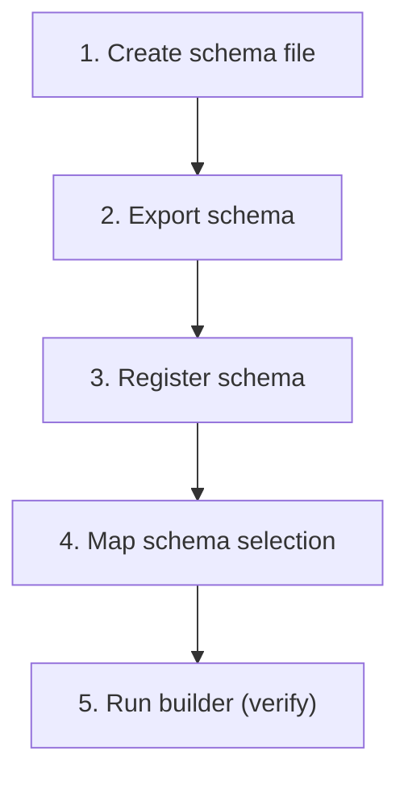

---
# Schema Onboarding Workflow

---

### 🔗 File References

| Step | File | What you do |
|------|------|-------------|
| 1. Create schema file | [my-new.schema.ts](data-definitions/newBusiness/my-new.schema.ts) | Create new schema definition |
| 2. Export schema | [index.ts](data-definitions/newBusiness/index.ts) | Export the schema |
| 3. Register schema | [registry.ts](data-definitions/registry.ts) | Register schema (name → object mapping) |
| 4. Map schema selection | [schemaSelection.config.ts](data-definitions/schemaSelection.config.ts) | Map journeyContext + platform (+ product) → schemaName |
| 5. Run builder (verify) | [index.ts](builder/index.ts) | Run builder to verify (no code change) |

---