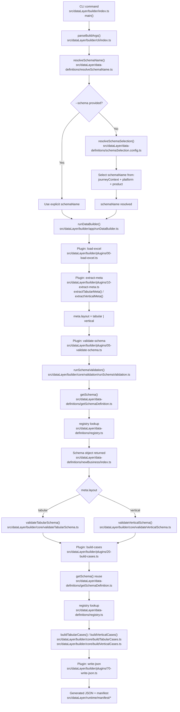

---
# Schema Selection Workflow

```mermaid

flowchart TD

A["CLI command
src/dataLayer/builder/index.ts
main()"] --> B["parseBuildArgs()
src/dataLayer/builder/cli/index.ts"]

B --> C["resolveSchemaName()
src/dataLayer/data-definitions/resolveSchemaName.ts"]

C --> D{"--schema provided?"}

D -->|Yes| E["Use explicit schemaName"]

D -->|No| F["resolveSchemaSelection()
src/dataLayer/data-definitions/schemaSelection.config.ts"]

F --> G["Select schemaName from:
journeyContext + platform + product"]

G --> H["schemaName resolved"]

E --> I["runDataBuilder()
src/dataLayer/builder/app/runDataBuilder.ts"]

H --> I

I --> J["Plugin: load-excel
src/dataLayer/builder/plugins/00-load-excel.ts"]

J --> K["Plugin: extract-meta
src/dataLayer/builder/plugins/10-extract-meta.ts
extractTabularMeta() / extractVerticalMeta()"]

K --> L["meta.layout = tabular | vertical"]

L --> M["Plugin: validate-schema
src/dataLayer/builder/plugins/05-validate-schema.ts"]

M --> N["runSchemaValidation()
src/dataLayer/builder/core/validation/runSchemaValidation.ts"]

N --> O["getSchema()
src/dataLayer/data-definitions/getSchemaDefinition.ts"]

O --> P["registry lookup
src/dataLayer/data-definitions/registry.ts"]

P --> Q["Schema object returned
src/dataLayer/data-definitions/newBusiness/index.ts"]

Q --> R{"meta.layout"}

R -->|tabular| S["validateTabularSchema()
src/dataLayer/builder/core/validateTabularSchema.ts"]

R -->|vertical| T["validateVerticalSchema()
src/dataLayer/builder/core/validateVerticalSchema.ts"]

S --> U["Plugin: build-cases
src/dataLayer/builder/plugins/20-build-cases.ts"]
T --> U

U --> V["getSchema() reuse
src/dataLayer/data-definitions/getSchemaDefinition.ts"]

V --> W["registry lookup
src/dataLayer/data-definitions/registry.ts"]

W --> X["buildTabularCases() / buildVerticalCases()
src/dataLayer/builder/core/buildTabularCases.ts
src/dataLayer/builder/core/buildVerticalCases.ts"]

X --> Y["Plugin: write-json
src/dataLayer/builder/plugins/70-write-json.ts"]

Y --> Z["Generated JSON + manifest
src/dataLayer/runtime/manifest/*"]

%% --- Click handlers (relative paths) ---
click A "src/dataLayer/builder/index.ts"
click B "src/dataLayer/builder/cli/index.ts"
click C "src/dataLayer/data-definitions/resolveSchemaName.ts"
click F "src/dataLayer/data-definitions/schemaSelection.config.ts"
click I "src/dataLayer/builder/app/runDataBuilder.ts"
click J "src/dataLayer/builder/plugins/00-load-excel.ts"
click K "src/dataLayer/builder/plugins/10-extract-meta.ts"
click M "src/dataLayer/builder/plugins/05-validate-schema.ts"
click N "src/dataLayer/builder/core/validation/runSchemaValidation.ts"
click O "src/dataLayer/data-definitions/getSchemaDefinition.ts"
click P "src/dataLayer/data-definitions/registry.ts"
click Q "src/dataLayer/data-definitions/newBusiness/index.ts"
click S "src/dataLayer/builder/core/validateTabularSchema.ts"
click T "src/dataLayer/builder/core/validateVerticalSchema.ts"
click U "src/dataLayer/builder/plugins/20-build-cases.ts"
click X "src/dataLayer/builder/core/buildTabularCases.ts"
click Y "src/dataLayer/builder/plugins/70-write-json.ts"

```
---