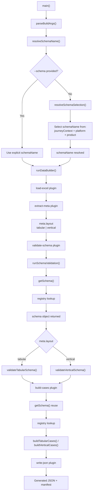

# Schema Selection Workflow

---

### 🔗 File References

| Step | File |
|------|------|
| main | [index.ts](builder/index.ts) |
| parseBuildArgs | [index.ts](builder/cli/index.ts) |
| resolveSchemaName | [resolveSchemaName.ts](data-definitions/resolveSchemaName.ts) |
| schemaSelection | [schemaSelection.config.ts](data-definitions/schemaSelection.config.ts) |
| runDataBuilder | [runDataBuilder.ts](builder/app/runDataBuilder.ts) |
| load-excel | [00-load-excel.ts](builder/plugins/00-load-excel.ts) |
| extract-meta | [10-extract-meta.ts](builder/plugins/10-extract-meta.ts) |
| validate-schema | [05-validate-schema.ts](builder/plugins/05-validate-schema.ts) |
| runSchemaValidation | [runSchemaValidation.ts](builder/core/validation/runSchemaValidation.ts) |
| getSchema | [getSchemaDefinition.ts](data-definitions/getSchemaDefinition.ts) |
| registry | [registry.ts](data-definitions/registry.ts) |
| validateTabular | [validateTabularSchema.ts](builder/core/validateTabularSchema.ts) |
| validateVertical | [validateVerticalSchema.ts](builder/core/validateVerticalSchema.ts) |
| build-cases | [20-build-cases.ts](builder/plugins/20-build-cases.ts) |
| buildTabularCases | [buildTabularCases.ts](builder/core/buildTabularCases.ts) |
| buildVerticalCases | [buildVerticalCases.ts](builder/core/buildVerticalCases.ts) |
| write-json | [70-write-json.ts](builder/plugins/70-write-json.ts) |
| manifest | [manifest](runtime/manifest) |

---
