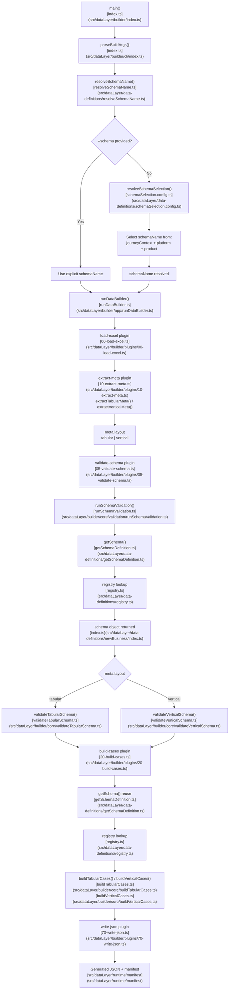

# Schema Selection Workflow

```mermaid

flowchart TD

A["main()
[index.ts](src/dataLayer/builder/index.ts)"] --> B["parseBuildArgs()
[index.ts](src/dataLayer/builder/cli/index.ts)"]

B --> C["resolveSchemaName()
[resolveSchemaName.ts](src/dataLayer/data-definitions/resolveSchemaName.ts)"]

C --> D{"--schema provided?"}

D -->|Yes| E["Use explicit schemaName"]

D -->|No| F["resolveSchemaSelection()
[schemaSelection.config.ts](src/dataLayer/data-definitions/schemaSelection.config.ts)"]

F --> G["Select schemaName from:
journeyContext + platform + product"]

G --> H["schemaName resolved"]

E --> I["runDataBuilder()
[runDataBuilder.ts](src/dataLayer/builder/app/runDataBuilder.ts)"]

H --> I

I --> J["load-excel plugin
[00-load-excel.ts](src/dataLayer/builder/plugins/00-load-excel.ts)"]

J --> K["extract-meta plugin
[10-extract-meta.ts](src/dataLayer/builder/plugins/10-extract-meta.ts)
extractTabularMeta() / extractVerticalMeta()"]

K --> L["meta.layout
tabular | vertical"]

L --> M["validate-schema plugin
[05-validate-schema.ts](src/dataLayer/builder/plugins/05-validate-schema.ts)"]

M --> N["runSchemaValidation()
[runSchemaValidation.ts](src/dataLayer/builder/core/validation/runSchemaValidation.ts)"]

N --> O["getSchema()
[getSchemaDefinition.ts](src/dataLayer/data-definitions/getSchemaDefinition.ts)"]

O --> P["registry lookup
[registry.ts](src/dataLayer/data-definitions/registry.ts)"]

P --> Q["schema object returned
[index.ts](src/dataLayer/data-definitions/newBusiness/index.ts)"]

Q --> R{"meta.layout"}

R -->|tabular| S["validateTabularSchema()
[validateTabularSchema.ts](src/dataLayer/builder/core/validateTabularSchema.ts)"]

R -->|vertical| T["validateVerticalSchema()
[validateVerticalSchema.ts](src/dataLayer/builder/core/validateVerticalSchema.ts)"]

S --> U["build-cases plugin
[20-build-cases.ts](src/dataLayer/builder/plugins/20-build-cases.ts)"]
T --> U

U --> V["getSchema() reuse
[getSchemaDefinition.ts](src/dataLayer/data-definitions/getSchemaDefinition.ts)"]

V --> W["registry lookup
[registry.ts](src/dataLayer/data-definitions/registry.ts)"]

W --> X["buildTabularCases() / buildVerticalCases()
[buildTabularCases.ts](src/dataLayer/builder/core/buildTabularCases.ts)
[buildVerticalCases.ts](src/dataLayer/builder/core/buildVerticalCases.ts)"]

X --> Y["write-json plugin
[70-write-json.ts](src/dataLayer/builder/plugins/70-write-json.ts)"]

Y --> Z["Generated JSON + manifest
[src/dataLayer/runtime/manifest](src/dataLayer/runtime/manifest)"]

```
---