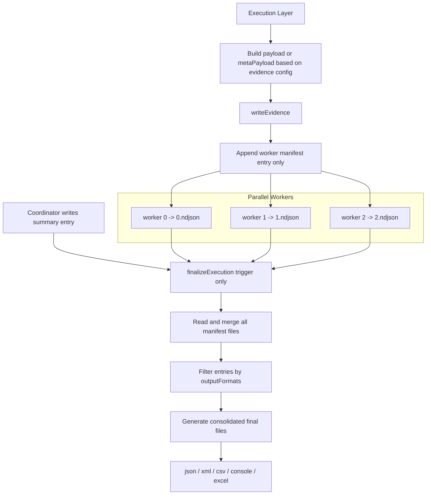

# Evidence Factory (consumer-only)

A config-driven evidence writer for AZOnline.

This package is intentionally a **consumer only**. It does **not** define evidence fields.  
It consumes the evidence configuration already defined in:

- src/configLayer/models/evidence/types.ts
- src/configLayer/models/evidence/views/*
- src/configLayer/models/evidence/fields/*

---

## Design

- executionLayer builds payload objects that already match your evidence config keys
- evidenceFactory only:
  - projects configured fields
  - appends NDJSON manifest events
  - reads manifest data as the source of truth
  - generates consolidated final files during `finalizeExecution()`
  - archives old execution folders

---

## Important rule

Do NOT add fields inside `src/evidenceFactory`.

Add or change fields only in:

`src/configLayer/models/evidence`

---

## Expected payload shape

Your execution layer should send payload keys that match config keys directly.

Example:
```ts
{
  scenarioId: "SCN-001",
  scenarioName: "Create Quote",
  platform: "Athena",
  application: "AzOnline",
  product: "Motor",
  journeyStartWith: "NewBusiness",
  description: "Create quote and verify premium",
  status: "passed",
  itemNo: 1,
  action: "Create Quote",
  testCaseRef: "TC001",
  startedAt: new Date().toISOString(),
  finishedAt: new Date().toISOString(),
  calculatedEmail: "test@example.com",
  quoteNumber: "Q-10001",
  policyNumber: "P-10001"
}
```

---

## Factory setup (executionLayer)

Example:
```ts
const factory = new EvidenceFactory({
  rootDir: process.env.EVIDENCE_ROOT_DIR ?? "artifacts",
  fileNaming: {
    includeTimestamp: false,
    timestampSource: "payload"
  },
  archive: {
    olderThanDays: 14,
    zip: true,
    maxCurrentExecutionsPerSuite: 30
  }
});
```

### Note

If your `executionId` already contains a timestamp such as:

```ts
const runId = "test-run-20260413_114220";
```

then keep:

```ts
includeTimestamp: false
```

to avoid duplicate timestamps in final filenames.

---

## Write evidence during execution using `payload` or `metaPayload`

### Item entry
```ts
await factory.writeEvidence({
  entryType: "item",
  executionId: "RUN-001",
  suiteName: "motor-regression",
  workerId: "0",
  artifactId: "TC001",
  artifactName: "create-quote",
  status: "passed",
  consoleMode: "e2e",
  outputFormats: ["json", "excel"],
  payload: {
    scenarioId: "SCN-001",
    scenarioName: "Create Quote",
    platform: "Athena",
    application: "AzOnline",
    product: "Motor",
    journeyStartWith: "NewBusiness",
    description: "Create quote and verify premium",
    status: "passed",
    itemNo: 1,
    action: "Create Quote",
    subType: "HappyPath",
    portal: "AzOnline",
    testCaseRef: "TC001",
    startedAt: startedAt.toISOString(),
    finishedAt: new Date(startedAt.getTime() + 2500).toISOString(),
    message: "",
    errorDetails: "",
    blockedBy: "",
    calculatedEmail: "test@example.com",
    calculatedEmailId: "test",
    quoteNumber: "Q-10001",
    policyNumber: "P-10001"
  }
});
```

### Summary entry
```ts
await factory.writeEvidence({
  entryType: "summary",
  executionId: "RUN-001",
  suiteName: "motor-regression",
  workerId: "0",
  outputFormats: ["excel", "console"],
  metaPayload: {
    runId: "RUN-001",
    mode: "e2e",
    environment: "qa",
    evidenceDirectory: "artifacts/current/motor-regression/RUN-001",
    totalItems: 2,
    passedCount: 1,
    failedCount: 1,
    passRate: "50.00%"
  }
});
```

### Finalize execution
```ts
await factory.finalizeExecution({
  executionId: "RUN-001",
  suiteName: "motor-regression"
});
```

---

## Final behavior

### `writeEvidence()`
- writes **manifest only**
- does **not** generate JSON / XML / CSV / Console / Excel files
- stores:
  - `entryType`
  - `payload` or `metaPayload`
  - `outputFormats`
  - `workerId`

### `finalizeExecution()`
- acts as a **trigger only**
- reads all manifest files for the execution
- treats manifest as the **source of truth**
- generates only consolidated final files

---

## Output structure

### Single worker / default worker `0`
```text
artifacts/
  current/
    motor-regression/
      RUN-001/
        manifests/
          0.ndjson
        json/
          motor-regression_RUN-001.json
        excel/
          motor-regression_RUN-001.xlsx
```

### Multi-worker / parallel execution
```text
artifacts/
  current/
    motor-regression/
      RUN-001/
        manifests/
          0.ndjson
          1.ndjson
          2.ndjson
        json/
          motor-regression_RUN-001.json
        xml/
          motor-regression_RUN-001.xml
        csv/
          motor-regression_RUN-001.csv
        console/
          motor-regression_RUN-001.log
        excel/
          motor-regression_RUN-001.xlsx
```

---

## Manifest model

### Item entry
- contains execution item payload
- contains `status`
- contains `outputFormats`
- grouped by status during final file generation

### Summary entry
- contains `metaPayload`
- contains `outputFormats`
- used for summary sections in final files

---

## Output formats

Each manifest entry carries its own `outputFormats`.

That means:

- item 1 → `["json"]` → included only in consolidated JSON
- item 2 → `["excel"]` → included only in consolidated Excel
- summary → `["excel", "console"]` → included only in consolidated Excel and Console

There is **no coupling** between formats.

---

## Status grouping for item entries

For `entryType = "item"`, final outputs still stay status-based.

That means:

- final JSON → grouped by `passed`, `failed`, `error`, `not_executed`
- final XML → grouped by `passed`, `failed`, `error`, `not_executed`
- final CSV → grouped by `passed`, `failed`, `error`, `not_executed`
- final Excel → tabs:
  - Summary
  - Passed
  - Failed
  - Error
  - Not Executed

---

## Worker handling

- one manifest file per worker / agent
- file path:
  - `manifests/<workerId>.ndjson`
- if `workerId` is not provided, factory defaults it to:

```ts
"0"
```

This makes parallel execution safe and avoids manifest write collisions.

---

## File naming strategy

If `includeTimestamp: false`:
```text
motor-regression_RUN-001.json
motor-regression_RUN-001.xlsx
```

If `includeTimestamp: true` and executionLayer provides `artifactTimestamp`:
```text
motor-regression_RUN-001_2026-04-13T09-42-27-050Z.json
motor-regression_RUN-001_2026-04-13T09-42-27-050Z.xlsx
```

Use only one timestamp source.  
If `executionId` already contains timestamp, prefer `includeTimestamp: false`.

---

## Parallel execution

- each worker writes its own manifest file
- no final files are generated during execution
- one coordinator writes summary entry
- one coordinator calls `finalizeExecution()`
- finalization merges all worker manifests and creates consolidated outputs

---

## Archiving strategy

Configurable:

- `olderThanDays` → move old runs
- `zip` → compress archived runs
- `maxCurrentExecutionsPerSuite` → keep limited runs

Archive structure:
```text
artifacts/archive/YYYY-MM/<suite>/<executionId>.zip
```

---

## Useful commands
```bash
npm run check:types
```

---

# Flow


