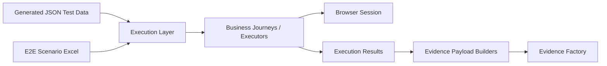
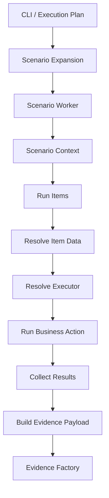

# Execution Layer

---

# 1. Overview

The **Execution Layer** runs automation scenarios using structured scenario definitions and generated test data.

It is responsible for:

- loading execution plans
- resolving item data
- opening and closing browser sessions
- executing journey actions through registered executors
- capturing runtime outputs
- collecting normalized execution results
- handing evidence payloads to the **Evidence Factory**

The Execution Layer is the **runtime orchestration engine** of the framework.

---

# 2. Purpose

The Execution Layer turns prepared data and scenario definitions into actual automated execution.

Its primary goals are:

- run test scenarios in **data mode** and **e2e mode**
- separate orchestration from journey logic
- support reusable executors for business actions
- support browser-based and non-browser execution
- produce normalized execution results
- integrate cleanly with config-driven evidence generation

---

# 3. Toolchain Context



---

# 4. Execution Modes

## Data Mode

Runs test cases directly from generated JSON data.

Typical usage:

- single business flow
- smoke data validation
- lightweight execution
- output verification

---

## E2E Mode

Runs scenarios composed of multiple items.

Each scenario may contain:

- NewBusiness
- MTA
- Renewal
- future business actions

Each item resolves its own test data and executor.

---

# 5. Inputs

## Data Mode Inputs

- generated JSON from `src/dataLayer/generated`
- platform
- application
- product
- journey context
- optional overrides
- environment

---

## E2E Mode Inputs

- scenario workbook
- scenario sheet
- platform
- application
- product
- scenario rows and execution items
- item test case references
- environment

---

# 6. Outputs

The Execution Layer produces:

- execution console output
- scenario/item results
- runtime outputs
- evidence payloads via config-driven builders
- final evidence artifacts through `src/evidenceFactory`

---

# 7. High-Level Flow



---

# 8. Core Responsibilities

The Execution Layer handles:

- scenario orchestration
- item execution order
- stop-on-failure logic
- browser session lifecycle
- output propagation
- result aggregation
- evidence payload handoff

It does **not** own:

- schema building
- generated JSON creation
- evidence field definitions
- Excel formatting rules
- business-specific page details

---

# 9. Key Concepts

## Execution Plan

A normalized set of run inputs including:

- mode
- environment
- scenarios
- iterations
- parallel count
- platform
- application
- product

---

## Scenario

A unit of execution.

In data mode, a single case behaves like a simple scenario.

In e2e mode, a scenario may contain multiple items.

---

## Item

A single executable business action inside a scenario.

Examples:

- NewBusiness
- MTA
- Renewal

---

## Executor

A business action implementation that knows how to run an item.

Executors receive:

- execution context
- item definition
- resolved item data

---

## Execution Context

Shared mutable runtime object for the scenario.

Contains:

- scenario
- outputs
- itemResults
- current identifiers like quote/policy
- browser/page/session references
- browser metadata
- environment information

---

# 10. Browser Handling

Browser lifecycle is managed centrally.

The Execution Layer is responsible for:

- creating browser session
- attaching session to execution context
- closing browser session safely
- exposing browser metadata for evidence/reporting

Captured browser details may include:

- browser name
- channel
- version
- headless flag

---

# 11. Result Model

The Execution Layer records:

## Item-level result

Contains:

- item number
- action
- status
- startedAt
- finishedAt
- error/message
- resolved details
- item outputs

---

## Scenario-level result

Contains:

- scenarioId
- scenario status
- itemResults
- aggregated outputs
- browser metadata
- scenario routing fields such as platform/application/product

---

# 12. Status Handling

Supported item states include:

- `passed`
- `failed`
- `not_executed`

Supported scenario states include:

- `passed`
- `failed`

If stop-on-failure is enabled, remaining items may be marked as `not_executed`.

---

# 13. Data Resolution

Execution item data is resolved through the runtime item data registry.

Resolution may come from:

- generated manifest-backed JSON
- explicit overrides
- future custom providers

This keeps execution independent from raw Excel reading.

---

# 14. Execution Registry

Executors are resolved through a registry.

This enables:

- action-based dispatch
- journey-specific behavior
- future expansion without changing the runner

---

# 15. Logging

The Execution Layer renders structured console output for:

- run header
- per-scenario summary
- per-item result details
- final run summary

Console output is config-driven through evidence view definitions, so console fields stay aligned with report fields.

---

# 16. Evidence Integration

The Execution Layer no longer writes run evidence directly.

Instead it:

- builds item payloads through `buildEvidencePayload`
- builds run meta payloads through `buildEvidenceMetaPayload`
- uses evidence field definitions from `src/configLayer/models/evidence`
- sends item and summary entries to the **Evidence Factory**
- lets the Evidence Factory finalize execution artifacts and archive old executions

This keeps evidence generation consumer-only and config-driven.

---

# 17. Parallel Execution

The runner supports batched parallel execution.

Parallel execution is controlled by:

- iteration expansion
- batch size / parallel count
- scenario worker batching
- Evidence Factory writes per execution entry

---

# 18. Current Runtime Flow

```mermaid
flowchart LR

    A[runScenarios]
    B[runScenarioBatch]
    C[runScenarioWorker]
    D[runExecutionScenario]
    E[runScenarioItems]
    F[runExecutionItem]
    G[executor]
    H[result aggregation]
    I[buildEvidencePayload / buildEvidenceMetaPayload]
    J[Evidence Factory]

    A --> B
    B --> C
    C --> D
    D --> E
    E --> F
    F --> G
    G --> H
    H --> I
    I --> J
```



---

# 19. CLI and Routing Model

The CLI now uses dedicated parser modules for:

- mode
- environment
- execution settings
- journey context
- platform
- application
- product

This makes runtime routing explicit and keeps the runner aligned with the actual CLI inputs.

---

# 20. Folder Responsibilities

## `core/`
Runtime orchestration, browser control, runners, result handling.

## `contracts/`
Execution types and normalized result models.

## `runtime/`
Runtime helpers such as run id resolution and item data lookup.

## `logging/`
Execution header, summaries, rendering helpers.

## `reporting/`
Evidence payload builders and reporting adapters.

## `cli/`
Entry point, argument parsing, handlers.

## `constants/`
Framework-level execution constants.

---

# 21. Design Principles

The Execution Layer is designed to be:

- orchestration-first
- executor-driven
- mode-aware
- browser-safe
- reporting-friendly
- config-driven for evidence payloads
- extensible for future actions

---

# 22. What It Should Not Do

The Execution Layer should not:

- read raw business Excel directly during execution
- embed large raw payloads into final evidence
- define evidence fields
- own Excel formatting rules
- hardcode business flow details into the runner
- mix page selectors with orchestration logic

---

# 23. Future Extension Points

The current design supports future additions such as:

- retry handling
- flaky detection
- tags / suites / release labels
- CI metadata
- git metadata
- richer scenario-level reporting
- additional business actions
- stricter typed output contracts

---

# 24. Typical Commands

Examples:

```bash
npm run execution -- --mode data --env test --platform Athena --application AzOnline --product Motor --journeyContext NewBusiness
npm run execution -- --mode e2e --env demo --excel "sampleData/E2E Scenarios.xlsx" --sheet "Scenarios" --platform Athena --application AzOnline --product Motor
```

---

# 25. Summary

The Execution Layer is the runtime orchestration engine of the framework.

It reads scenario inputs, resolves item data, executes business journeys, collects normalized results, builds config-driven evidence payloads, and hands them to the Evidence Factory for final artifact generation.
