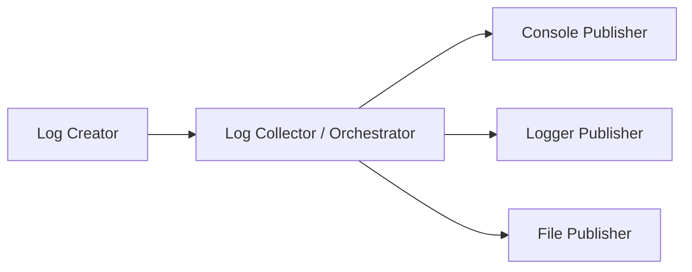
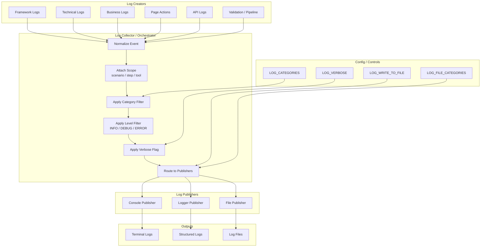

# Logging

## Architecture



### Layers

1. **Log Creator**  
   Produces logs from framework, technical, business, page action, pipeline, validation, artifact, API, or diagnostic areas.

2. **Log Collector / Orchestrator**  
   Collects logs, applies visibility rules, groups logs by scope, and decides what should be published.

3. **Log Publisher**  
   Sends logs to console, logger, or file output.

---

## Console controls

LOG_VERBOSE=true  
LOG_CATEGORIES=framework,business,technical  

or

LOG_CATEGORIES=all  

### Behavior

- INFO → always shown  
- DEBUG → shown only when `LOG_VERBOSE=true`  
- ERROR → always shown  
- Category-based filtering applies  

---

## File controls

LOG_WRITE_TO_FILE=true  
LOG_FILE_CATEGORIES=technical,api  
LOG_FILE_DIR=results/logs  
LOG_RUN_ID=my_run_id  

### Behavior

- Logs are written as JSON lines  
- File logging is category-based  
- Supports parallel execution safely  
- Each run generates its own folder using `runId`  
- Each process writes using `pid`  

---

## Example Output Structure

```text
results/logs/
  20260325_182934_12345/
    technical/
      technical_pid12345.log
    api/
      api_pid12345.log
```

---

## Notes

- Console and file logging are independent  
- You can:
  - show fewer logs in console  
  - store detailed logs in files  
- Designed for:
  - execution layer  
  - data builder  
  - tools (scanner, generator, validator, repair)
  - API integrations  

---

## Future Extensions

- Central log orchestrator
- Action-level logging (page actions, API calls)
- Structured reporting / analytics
- Per-app logging policies

---

## Architecture (Detailed)



---
