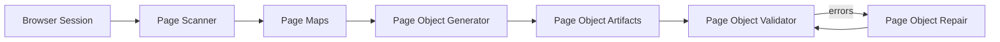
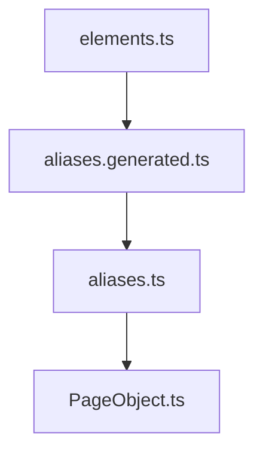
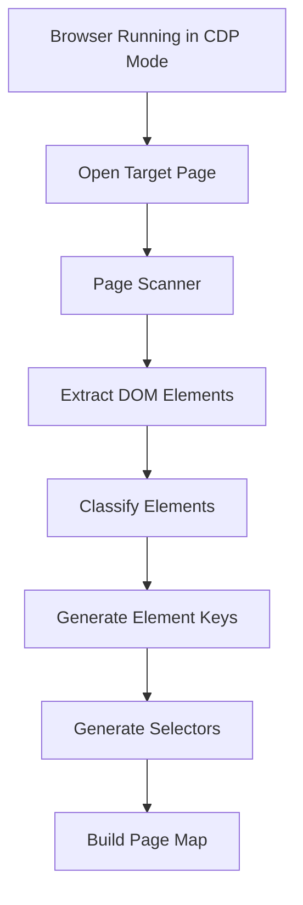
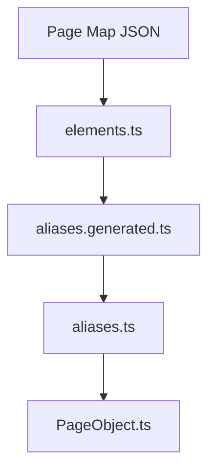
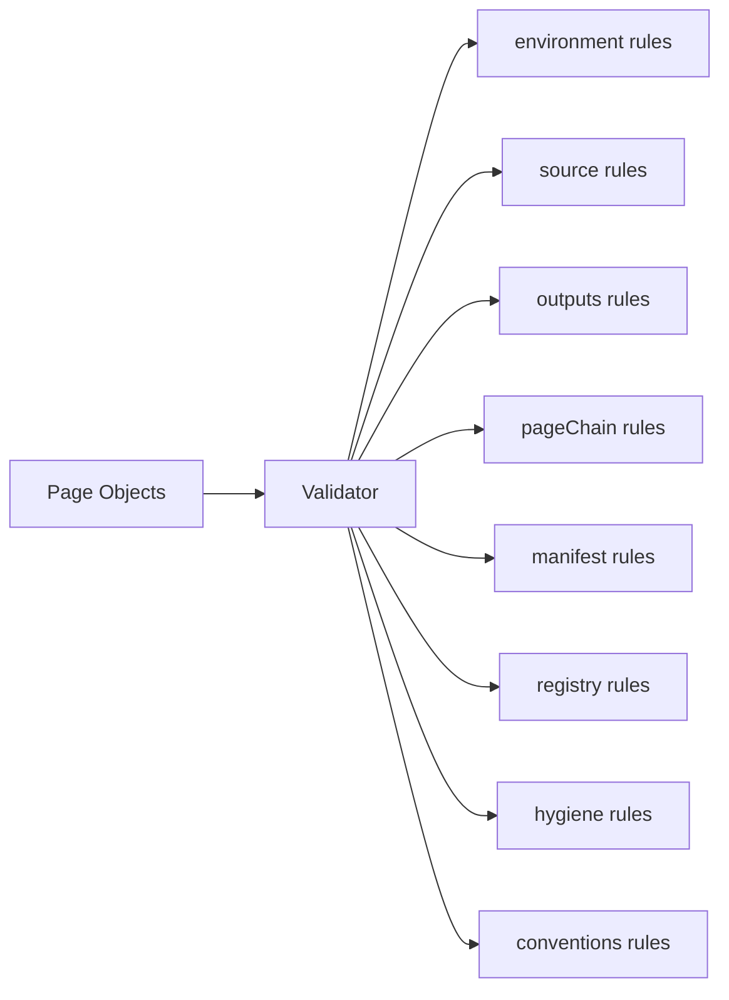
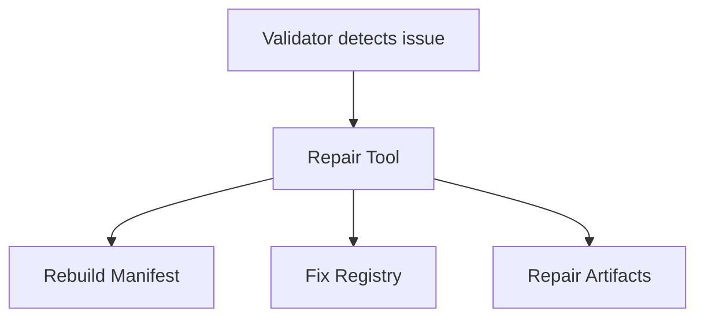
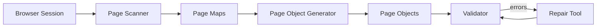

# Playwright Page Automation Framework

This repository contains a **scalable page-object automation framework** built on top of **Playwright**.

The framework provides a structured toolchain that automatically:

- scans web pages
- generates page objects
- validates framework consistency
- repairs structural issues

The architecture ensures automation code remains **deterministic, maintainable, and scalable**.

---

# Framework Architecture

The automation system is built around **four core tools**.

| Tool | Responsibility |
|-----|----------------|
| page-scanner | Extract page structure and generate page maps |
| page-object-generator | Generate page-object artifacts |
| page-object-validator | Validate framework structure |
| page-object-repair | Automatically repair framework drift |

---

# Toolchain Flow



---

# Project Structure

```
src
├── pages
│   ├── maps
│   ├── objects
│   ├── index.ts
│   └── pageManager.ts
│
├── tools
│   ├── page-scanner
│   ├── page-object-generator
│   ├── page-object-validator
│   ├── page-object-repair
│   └── page-object-common
│
└── utils
```

---

# Page Object Chain

Generated automation code follows a strict dependency chain.



Each layer builds on the previous one.

---

# Manifest System

The framework maintains metadata about page objects in:

```
src/pages/.manifest
```

Structure:

```
.manifest
├── index.json
└── pages
    ├── <pageKey>.json
```

Example manifest entry:

```json
{
  "pageKey": "athena.common.login-or-registration",
  "className": "LoginOrRegistrationPage",
  "pageObjectImportPath": "@page-objects/athena/common/login-or-registration/LoginOrRegistrationPage",
  "elementCount": 4,
  "urlPath": "/",
  "title": "Login page"
}
```

The manifest is used for:

- incremental generation
- validation checks
- repair operations

---

# Registry System

Two registry files expose page objects to tests.

```
src/pages/index.ts
src/pages/pageManager.ts
```

### index.ts

Exports all page objects.

Example:

```ts
export { PageManager } from "./pageManager"

export * from "@page-objects/athena/common/login-or-registration/LoginOrRegistrationPage"
```

---

### pageManager.ts

Provides central access to page objects.

Example usage:

```ts
pageManager.athena.loginOrRegistration
```

---

# Tool 1 — Page Scanner

The **Page Scanner** discovers page elements from a running browser session.

It connects to a browser via **Chrome DevTools Protocol (CDP)** and extracts page structure.

---

## Scanner Flow



---

## Scanner Output

```
src/pages/maps/<pageKey>.json
```

Example:

```json
{
  "pageKey": "athena.common.login-or-registration",
  "urlPath": "/",
  "title": "Login page",
  "elements": {
    "loginButton": {
      "type": "button",
      "preferred": "css=#login",
      "fallbacks": ["role=button[name=/login/i]"]
    }
  }
}
```

---

## Start Browser (CDP Mode)

Example:

```powershell
$profile = Join-Path $env:TEMP ("edge-cdp-" + (Get-Date -Format "yyyyMMdd-HHmmss"))
Start-Process "C:\Program Files (x86)\Microsoft\Edge\Application\msedge.exe" "--remote-debugging-port=9222 --user-data-dir=$profile"
Start-Sleep -Seconds 2
$CDP = (Invoke-RestMethod http://localhost:9222/json/version).webSocketDebuggerUrl
```

---

## Run Scanner

```
npm run scan:page:verbose -- --connectCdp="$CDP" --pageKey="athena.motor.car-details"
```

---

## Kill Browser Session

```
taskkill /IM msedge.exe /F
```

---

# Tool 2 — Page Object Generator

The **Page Object Generator** converts page maps into automation code.

Generated artifacts include:

```
elements.ts
aliases.generated.ts
aliases.ts
<PageName>Page.ts
```

---

## Generator Flow



---

## Generator Commands

```
npm run generator:elements
npm run generator:elements:changed
npm run generator:elements:verbose
```

---

# Tool 3 — Page Object Validator

The **Page Object Validator** ensures the framework structure remains consistent.

Validator rule groups:

```
environment
source
outputs
pageChain
manifest
registry
hygiene
conventions
```

---

## Validator Architecture



---

## Validator Commands

```
npm run validator:check
npm run validator:check:verbose
npm run validator:check:strict
```

---

# Tool 4 — Page Object Repair

The **Page Object Repair Tool** automatically fixes framework inconsistencies.

It repairs:

- manifest metadata
- registry exports
- page-object structure

Repair operations are derived from **actual artifacts and metadata**.

---

## Repair Flow



---

## Repair Commands

```
npm run repair:run
npm run repair:run:verbose
```

---

# Shared Utilities

Common utilities used by all tools:

```
src/tools/page-object-common
```

Files include:

```
extractTsObjectKeys.ts
pagePaths.ts
readPageMap.ts
tsObjectParser.ts
```

These utilities provide:

- page-map loading
- TypeScript object parsing
- artifact path resolution
- shared helper logic

---

# Typical Workflow

Developer workflow:

```
1. Scan page
2. Generate page objects
3. Validate framework
4. Repair if necessary
```

Example:

```
npm run scan:page
npm run generator:elements
npm run validator:check
```

If validator reports errors:

```
npm run repair:run
```

---

# Example End-to-End Flow



---

# Benefits of This Architecture

This framework provides:

- automatic page discovery
- deterministic page-object generation
- strict validation layer
- automated repair capability
- scalable automation architecture

It allows large automation projects to remain **stable, maintainable, and easy to extend**.

---
