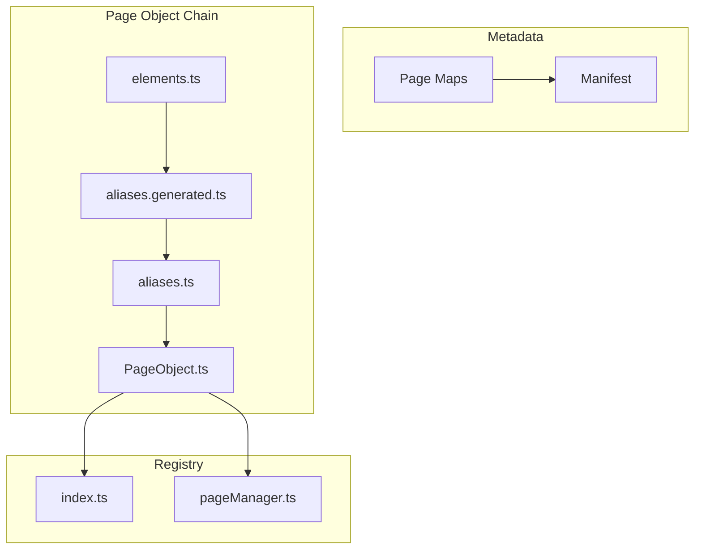
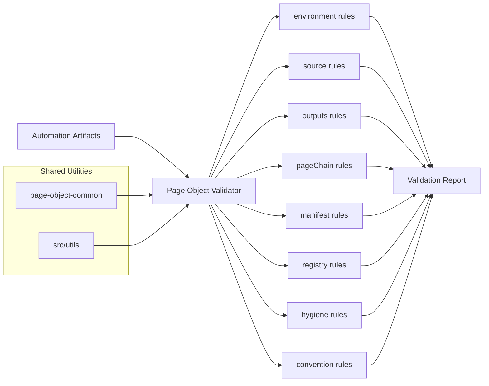
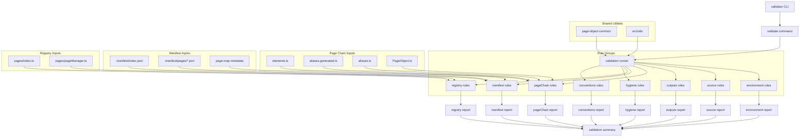

<!-- src/tools/page-object-validator/README.md -->

# Page Object Validator

---

# 1. Overview

The **Page Object Validator** analyzes the page-object ecosystem and verifies that all artifacts follow the expected automation structure.

It detects inconsistencies between:

- page object artifacts
- generated aliases
- business aliases
- registry files
- manifest metadata

The validator provides detailed reports showing **warnings, errors, and structural problems** within the framework.

This tool helps maintain **automation reliability and structural integrity**.

---

# 2. Purpose

The validator ensures that the automation framework remains **consistent and maintainable**.

Its primary goals are:

- detect structural inconsistencies
- enforce framework conventions
- validate artifact dependencies
- identify missing or invalid metadata
- prevent broken automation code

The validator acts as a **quality gate for page-object artifacts**.

---

# 3. Toolchain Context

Within the automation architecture, the validator acts as the **verification layer**.

```
Generated Page Objects
        ↓
Page Object Validator
        ↓
Validation Report
        ↓
(optional) Repair Tool
```

The validator ensures the framework structure is correct before tests execute.

---

# 4. Inputs

The validator analyzes several framework components.

### Page Object Artifacts

Location:

```
src/pages/objects
```

Files include:

```
elements.ts
aliases.generated.ts
aliases.ts
PageObject.ts
```

---

### Page Registry

Location:

```
src/pages
```

Files:

```
index.ts
pageManager.ts
```

---

### Manifest Metadata

Location:

```
src/pages/.manifest
```

Structure:

```
src/pages/.manifest
├── index.json
└── pages/*.json
```

---

### Page Maps

Location:

```
src/pages/maps
```

Page maps provide metadata used during validation checks.

---

# 5. Outputs

The validator produces a **structured validation report**.

The report contains:

- passed checks
- warnings
- errors
- affected files
- suggested fixes

Example summary output:

```
--------------------------------
VALIDATE SUMMARY
--------------------------------
Checks run       : 15
Passed checks    : 14
Warn checks      : 0
Failed checks    : 1
Total warnings   : 1
Total errors     : 1
Exit code        : 1
--------------------------------
```

The validator **does not modify files**.

---

# 6. Validation Chain

The validator verifies the integrity of multiple framework layers, not just the page-object artifact chain.

Validation covers:

- page object artifacts
- generated aliases
- business aliases
- page maps
- manifest metadata
- registry files
- framework conventions



Each layer must remain synchronized to ensure the automation framework operates correctly.

---

# 7. Validation Responsibilities

## Page Chain Validation

Ensures the artifact dependency chain remains consistent.

Checks include:

- elements vs generated aliases
- generated aliases vs business aliases
- business aliases vs page object methods

---

## Manifest Validation

Ensures manifest metadata reflects the current artifact structure.

Checks include:

- manifest entries exist
- metadata fields match artifacts
- element counts are correct
- referenced files exist

---

## Registry Validation

Validates page registry files.

Checks include:

```
src/pages/index.ts
src/pages/pageManager.ts
```

The validator ensures:

- page objects are exported
- page manager references are correct
- registry structure remains valid

---

## Convention Validation

Ensures naming conventions are respected.

Checks include:

- pageKey naming
- className format
- element key format

---

# 8. Manifest System

The validator checks the **manifest metadata system**.

Location:

```
src/pages/.manifest
```

Structure:

```
src/pages/.manifest
├── index.json
└── pages
    ├── <pageKey>.json
```

Example manifest entry:

```json
{
  "pageKey": "athena.common.login-or-registration",
  "className": "LoginOrRegistrationPage",
  "elementCount": 4,
  "urlPath": "/",
  "title": "Login page"
}
```

The validator ensures metadata matches the artifact structure.

---

# 9. Registry Validation

Registry files are validated to ensure page objects are accessible to the framework.

Registry files:

```
src/pages/index.ts
src/pages/pageManager.ts
```

Validator checks include:

- page object exports
- page manager references
- missing page registrations

---

# 10. Validator Commands

Available commands:

```
npm run validator:check
npm run validator:check:verbose
npm run validator:check:strict
npm run validator:check:strict:verbose
npm run validator:help
```

---

# 11. Validation Modes

## Standard Validation

```
npm run validator:check
```

Reports errors and warnings.

---

## Verbose Validation

```
npm run validator:check:verbose
```

Displays detailed rule execution.

---

## Strict Validation

```
npm run validator:check:strict
```

Treats warnings as blocking issues.

---

# 12. Validation Strategy

The validator executes a series of validation rules grouped by category.

Rule groups include:

```
environment
source
outputs
pageChain
manifest
registry
hygiene
conventions
```

Each rule validates a specific aspect of the automation structure.

---

# 13. Import Strategy

The validator uses TypeScript path aliases to resolve framework modules.

Examples:

```
@page-objects/*
@page-maps/*
@pages/*
```

These aliases are configured in `tsconfig.json`.

---

# 14. Repair Relationship

The validator integrates with the repair tool.

Typical flow:

```
Validator detects errors
        ↓
Developer runs repair tool
        ↓
Validator confirms structure is valid
```

When structural errors occur, the validator suggests running:

```
npm run repair:run
```

---

# 15. Typical Workflow

Typical developer workflow:

1. Generate page objects
2. Run validator
3. Fix or repair issues

Example:

```
npm run generator:elements
npm run validator:check
```

If errors are detected:

```
npm run repair:run
```

---

# 16. Shared Utilities

The validator relies on shared utilities located in:

```
src/tools/page-object-common
```

Utilities include:

```
extractTsObjectKeys.ts
pagePaths.ts
readPageMap.ts
tsObjectParser.ts
```

These utilities support:

- TypeScript object parsing
- artifact path resolution
- page-map loading
- metadata extraction

Additional helpers are provided by:

```
src/utils
```

These utilities provide:

- CLI formatting
- logging
- argument parsing
- filesystem helpers

---

# 17. Example End-to-End Flow

The validator executes a set of rule groups that verify different parts of the automation framework.

Rule groups executed by the validator:

```
environment
source
outputs
pageChain
manifest
registry
hygiene
conventions
```



The validator runs these rule groups and produces a structured validation report highlighting warnings, errors, and structural issues.

---

# 17. Detailed End-to-End Flow


---