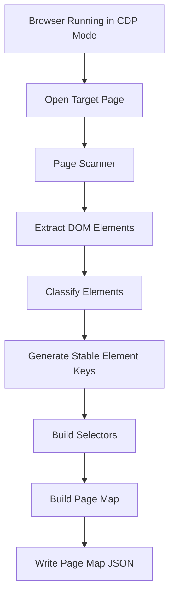
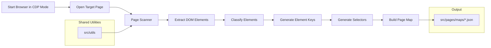

<!-- src/tools/page-scanner/README.md -->

# Page Scanner

---

# 1. Overview

The **Page Scanner** is responsible for discovering and extracting page structure from a running web application.

It uses **Playwright and DOM analysis** to automatically identify page elements and produce structured **page-map JSON files** used by the automation framework.

The scanner converts **live page DOM information into structured metadata** that later tools use to generate automation code.

Output from the scanner becomes the **foundation of the page-object generation pipeline**.

---

# 2. Purpose

The Page Scanner automates the discovery of page elements and produces structured metadata describing the page.

Its primary goals are:

- automatically discover page elements
- generate stable automation metadata
- reduce manual locator creation
- enforce consistent element naming
- support scalable page automation

Instead of manually defining page metadata, developers can **scan the page and generate the page-map automatically**.

---

# 3. Toolchain Context

Within the automation architecture, the scanner acts as the **metadata discovery layer**.

```
Browser (running session)
      ↓
Page Scanner
      ↓
Page Map JSON
      ↓
Page Object Generator
```

The scanner **does not generate automation code directly**.  
It produces **page-map metadata**, which the generator converts into automation artifacts.

---

# 4. Inputs

The scanner requires:

### Browser Session (CDP)

The scanner connects to an already running browser using **Chrome DevTools Protocol (CDP)**.

This allows scanning pages that:

- require login
- require manual navigation
- are part of complex flows
- already exist in a running browser session

### Target Page

The browser must already have the target page open.

Example:

```
https://example.com/login
```

### Page Key

Each scan requires a **pageKey** identifying the page.

Example:

```
athena.common.login-or-registration
```

### Optional Existing Page Map

Existing page maps can be merged with newly scanned data.

Location:

```
src/pages/maps
```

---

# 5. Outputs

The scanner generates **page-map JSON files**.

Location:

```
src/pages/maps
```

Example output file:

```
src/pages/maps/athena.common.login-or-registration.json
```

Example page map structure:

```json
{
  "pageKey": "athena.common.login-or-registration",
  "url": "https://example.com/login",
  "urlPath": "/login",
  "title": "Login page",
  "scannedAt": "2026-03-09T12:48:41.552Z",
  "elements": {
    "loginButton": {
      "type": "button",
      "preferred": "css=#login",
      "fallbacks": [
        "role=button[name=/login/i]"
      ]
    }
  }
}
```

These page maps are later consumed by the **page-object-generator**.

---

# 6. Browser Connection (CDP Mode)

The scanner connects to a browser using the **Chrome DevTools Protocol (CDP)**.

This allows scanning pages that:

- require authentication
- require manual navigation
- are part of complex flows
- exist inside an already running browser session

Instead of launching a new browser, the scanner attaches to an existing one.

---

## Start Browser in CDP Mode

Example using Microsoft Edge:

```powershell
$profile = Join-Path $env:TEMP ("edge-cdp-" + (Get-Date -Format "yyyyMMdd-HHmmss"))
Start-Process "C:\Program Files (x86)\Microsoft\Edge\Application\msedge.exe" "--remote-debugging-port=9222 --user-data-dir=$profile"
Start-Sleep -Seconds 2
$CDP = (Invoke-RestMethod http://localhost:9222/json/version).webSocketDebuggerUrl
```

---

## Run Scanner

```
npm run scan:page:verbose -- --connectCdp="$CDP" --pageKey="athena.motor.car-details"
```

Parameters:

| Parameter | Description |
|--------|-------------|
| `--connectCdp` | WebSocket URL used to connect to the running browser |
| `--pageKey` | Page identifier used to generate the page-map |

---

## Close Browser Session

After scanning is complete, you can terminate the browser session:

```
taskkill /IM msedge.exe /F
```

This ensures the temporary CDP browser instance is fully closed.

---

# 7. Scanning Pipeline

The scanner follows a multi-stage pipeline to extract page metadata.



Each stage transforms raw DOM information into structured automation metadata.

---

# 8. DOM Extraction

DOM extraction collects interactive elements from the page.

The scanner focuses on elements such as:

- buttons
- inputs
- links
- selects
- checkboxes
- radio buttons
- textareas

Extraction is implemented in:

```
scanner/domExtract.ts
scanner/domExtractors/
```

DOM extraction runs inside the browser through Playwright.

---

# 9. Element Classification

After extraction, elements are classified into automation types.

Examples:

| HTML Element | Classified Type |
|--------------|----------------|
| button | button |
| input[type=text] | textbox |
| select | dropdown |
| a | link |

Classification logic is implemented in:

```
scanner/pageMap/classifyElementType.ts
```

---

# 10. Element Key Generation

Each discovered element is assigned a **stable automation key**.

Example:

```
loginButton
submitFormButton
emailTextbox
```

Key generation logic is located in:

```
scanner/keyNaming
```

Strategies include:

- semantic naming
- heuristic rules
- normalization rules
- DOM attribute analysis

This ensures readable and stable element identifiers.

---

# 11. Selector Generation

Selectors are generated using multiple strategies.

Location:

```
scanner/selectors
```

Selector strategies include:

### CSS Strategy

```
css=#login
```

### Role Strategy

```
role=button[name=/login/i]
```

### Text Strategy

```
text=Login
```

Selectors are grouped into:

```
preferred
fallbacks
```

This improves locator robustness.

---

# 12. Page Map Builder

The page map builder constructs the final page metadata object.

Location:

```
scanner/pageMap/buildPageMap.ts
```

Responsibilities:

- assembling page metadata
- grouping elements
- assigning selectors
- attaching element types
- generating element keys

The builder outputs the final **page-map JSON structure**.

---

# 13. Page Map Merge

If a page map already exists, the scanner can merge updates.

Location:

```
scanner/pageMap/mergePageMaps.ts
```

Merge behavior:

- preserve existing element keys
- update selectors if necessary
- add newly discovered elements
- retain manually edited metadata

This ensures scanning does not overwrite manual improvements.

---

# 14. Scanner Commands

Available commands:

```
npm run scan:page
npm run scan:page:verbose
npm run scan:page:merge
npm run scan:page:merge:verbose
npm run scan:help
```

---

# 15. Scan Modes

## Standard Scan

```
npm run scan:page
```

Scans a page and produces a new page map.

---

## Merge Scan

```
npm run scan:page:merge
```

Updates an existing page map while preserving manual changes.

---

# 16. Shared Utilities

The scanner uses shared utilities from:

```
src/utils
```

These utilities provide:

- CLI formatting
- logging
- argument parsing
- filesystem helpers

Scanner-specific types are located in:

```
scanner/types.ts
```

---

# 17. Example End-to-End Flow



The scanner converts a live web page into structured **page-map metadata** that drives the rest of the automation framework.