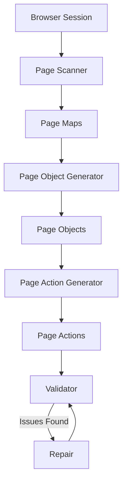
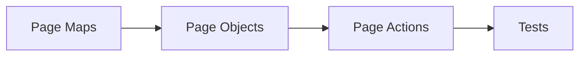
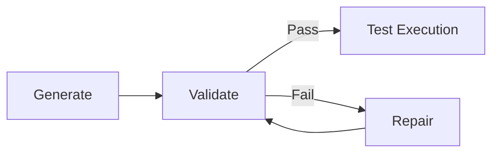
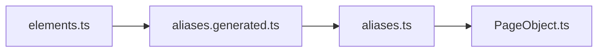
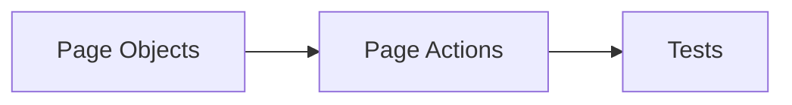
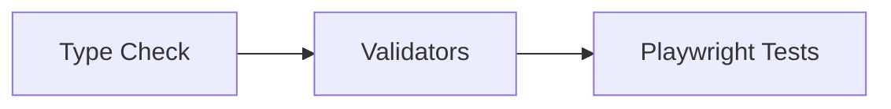

# Playwright Page Automation Framework

A scalable **Playwright automation framework** with a structured tooling layer that keeps automation assets deterministic, maintainable, and scalable.

The framework uses automated tooling to:

- scan web pages
- generate page objects
- validate structural consistency
- repair drift safely
- generate page actions
- validate page actions
- repair page actions safely

---

# High-Level Architecture

The framework is split into two automation layers:

| Layer | Purpose |
|------|---------|
| pageObjects | UI structure, selectors, page models |
| pageActions | reusable business flows using pageObjects |

---

# Core Tooling Modules

| Tool Group | Responsibility |
|-----------|----------------|
| pageScanner | Discover DOM structure and generate maps |
| pageObjects | Generate / validate / repair page object assets |
| pageActions | Generate / validate / repair action assets |
| common | Shared deterministic builders and utilities |

---

# End-to-End Flow



---

# Layer Relationship



- **Page Maps** describe discovered UI elements  
- **Page Objects** wrap selectors and reusable page APIs  
- **Page Actions** model business workflows  
- **Tests** consume actions instead of low-level selectors  

---

# Toolchain Philosophy

The framework enforces three responsibilities:

| Tool | Purpose |
|------|---------|
| Generator | Build deterministic artifacts |
| Validator | Detect drift, missing assets, invalid structure |
| Repair | Restore safe framework-owned assets |

---

# Validator ↔ Repair Loop



This keeps the framework stable before tests run.

---

# Current Tooling Structure

```text
src/toolingLayer
├── pageScanner
├── pageObjects
│   ├── generator
│   ├── validator
│   ├── repair
│   └── common
│
├── pageActions
│   ├── generator
│   ├── validator
│   ├── repair
│   └── common
│
└── shared
```

---

# Page Objects

The pageObjects layer owns:

- selectors
- alias chains
- page object classes
- registry exports
- manifest metadata



---

# Page Actions

The pageActions layer owns reusable business flows built on pageObjects.

Examples:

- login flow
- quote creation
- policy purchase
- renewal flow
- claims journey steps



Tests should prefer actions over direct selector usage.

---

# Manifest-Driven Design

Both layers use manifest metadata to enable:

- generation
- validation
- repair
- registry synchronization
- incremental maintenance

Typical examples:

```text
src/businessLayer/pageObjects/.manifest
src/businessLayer/pageActions/.manifest
```

---

# Safe Repair Philosophy

Repair tools are intentionally conservative.

They repair:

- missing generated files
- registry drift
- manifest drift
- structural inconsistencies

They avoid overwriting QA-owned business logic.

---

# Recommended Workflow

```bash
npm run check:types
npm run pageobjects:validate
npm run pageactions:validate
```

If issues are found:

```bash
npm run pageobjects:repair
npm run pageactions:repair
```

---

# Recommended CI Gate



---

# Design Benefits

- deterministic code generation  
- reduced manual maintenance  
- validator-enforced consistency  
- safe structural recovery  
- scalable automation growth  
- clear separation of concerns  
- cleaner test code through pageActions  

---

# Final Mental Model

```text
Scanner discovers pages
Generator builds assets
Validator checks drift
Repair restores structure
Tests consume actions
```

---

# Outcome

This architecture keeps Playwright automation:

- stable
- maintainable
- scalable
- team-friendly
- future-ready
