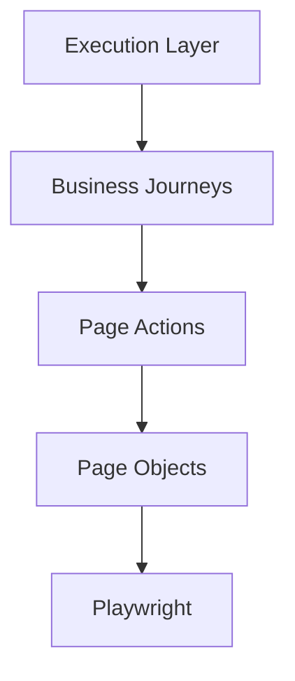
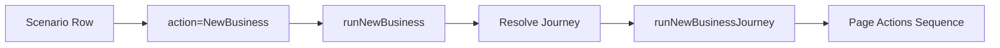
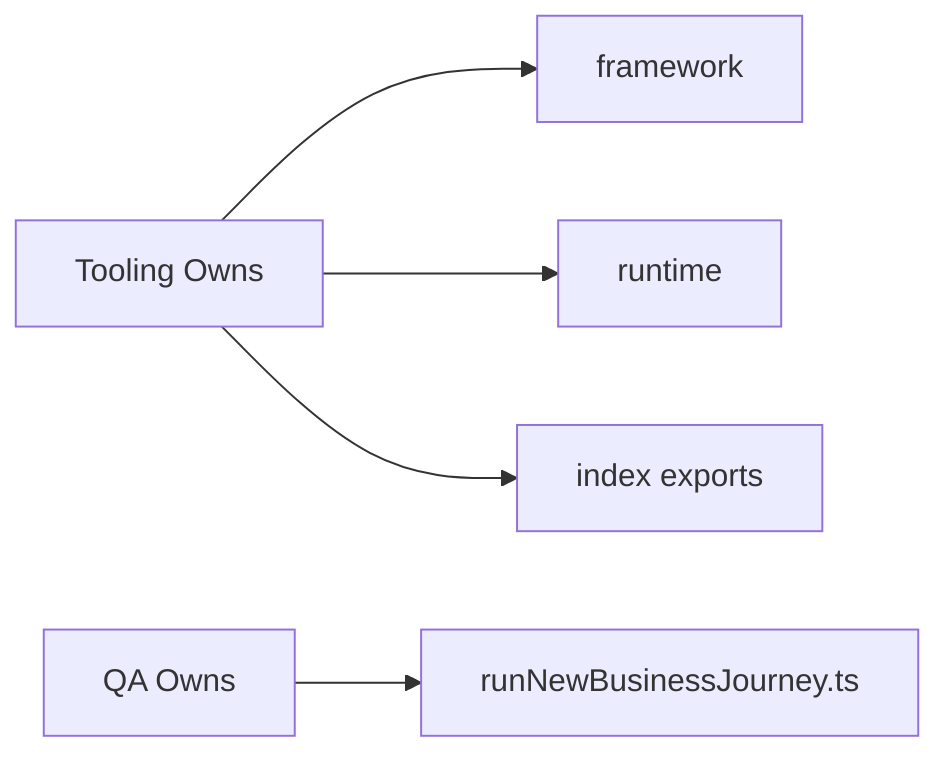
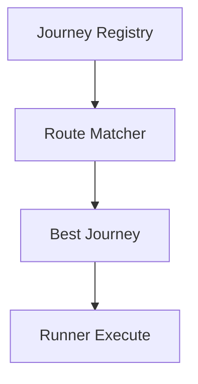

# Business Journeys ARCHITECTURE Guide

## Executive Summary

Business Journeys are the orchestration layer that converts reusable Page Actions into executable end-to-end insurance flows.

They sit between:

- Scenario Execution Engine
- Page Actions
- Playwright Browser Runtime

---

## Layered Architecture



---

## Responsibility by Layer

| Layer | Responsibility |
|---|---|
| Execution Layer | Reads scenarios, routes actions |
| Business Journeys | Multi-step business flows |
| Page Actions | Reusable business interactions |
| Page Objects | Raw selectors |
| Playwright | Browser automation |

---

## Why Business Journeys Exist

Without journeys:

- duplicated step sequences
- hardcoded portal flows
- poor reuse
- difficult maintenance

With journeys:

- reusable orchestration
- clean scenario inputs
- product/platform abstraction
- easier scaling

---

## Example Flow



---

## Journey Resolution Model

Route dimensions:

- Platform
- Application
- Product
- Journey Type

Example:

```text
Athena / AzOnline / Motor / NewBusiness
```

---

## Current Folder Model

```text
businessJourneys/
 ├── framework/
 ├── runtime/
 ├── Athena/
 │   └── AzOnline/
 │       └── Motor/
 │           └── NewBusiness/
```

---

## Framework Layer

Tool-owned reusable contracts.

Contains:

- types.ts
- runJourney.ts
- shared helpers

Purpose:

- generic runner execution
- common types
- orchestration contracts

---

## Runtime Layer

Execution integration layer.

Contains:

- resolveNewBusinessJourney.ts
- runNewBusiness.ts

Purpose:

- connect execution engine to journey registry

---

## Journey Layer

QA-owned business implementation.

Contains:

- runNewBusinessJourney.ts
- index.ts

Purpose:

- exact portal/product journey steps

---

## Ownership Model



---

## Safety Design

Repair tool never overwrites custom runner files.

Only tool-owned files are auto-updated.

---

## Scaling Strategy

Supports growth from:

```text
1 journey -> 100+ journeys
```

By dimensions:

- NewBusiness
- Renewals
- Amendments
- Claims
- ExistingPolicy
- MidTermAdjustments

---

## Future Registry Model



Dynamic discovery can replace static exports later.

---

## Performance Strategy

- lazy imports possible
- route-based loading
- generated registry indexes
- deterministic file paths

---

## Testing Strategy

### Unit
- target builder
- route resolver
- validators

### Integration
- journey runs correct steps

### Tooling
- generate -> validate -> repair

---

## CI/CD Recommended Pipeline


---

## Anti-Patterns

Avoid:

- selectors in journeys
- raw Playwright in journeys
- duplicated steps
- editing generated framework files
- giant 500-line runners

---

## Recommended Runner Style

```ts
await login();
await selectVehicle();
await enterDriver();
await payment();
```

Readable, business-focused orchestration.

---

## Future Enhancements

### V2
- Journey registry auto-discovery
- Conditional step DSL
- Retry policies
- Analytics timings
- Screenshots per step

### V3
- AI-generated journey suggestions
- Self-healing page action selection
- Visual flow designer

---

## Golden Principle

Page Actions perform actions.  
Business Journeys orchestrate business intent.  
Execution Layer runs scenarios.

---

## Final Architecture Statement

Business Journeys transform low-level automation into scalable business process automation.