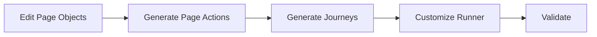

# Business Journeys CONTRIBUTING Guide

## Purpose
Guidelines for QA engineers and developers contributing to Business Journeys safely.

---

## Ownership Model

| Path | Owner |
|---|---|
| src/businessLayer/businessJourneys/framework | Tooling |
| src/businessLayer/businessJourneys/runtime | Tooling |
| src/businessLayer/businessJourneys/**/index.ts | Tooling |
| runNewBusinessJourney.ts | QA / Automation Engineers |

---

## Safe To Edit

You may edit:

- step ordering inside runner files
- conditional logic
- waits / retries
- assertions
- logging
- reusable helper imports

Example:

```ts
export const runNewBusinessJourney = async () => {
   await step1();
   await customWait();
   await step2();
}
```

---

## Do Not Edit

Avoid manual edits to:

- framework/*
- runtime/*
- generated index.ts exports

These can be regenerated by tooling.

---

## Adding New Page Actions

1. Add/update Page Object
2. Run:

```bash
npm run pageactions:generate
npm run businessjourneys:generate
npm run businessjourneys:validate
```

---

## Adding New Journey Types

Examples:

- Renewals
- Amendments
- ExistingPolicy
- Claims

Raise architecture PR before implementation.

---

## PR Checklist

- [ ] `npm run check:types`
- [ ] `npm run businessjourneys:validate`
- [ ] Runner logic tested
- [ ] No edits in generated framework files
- [ ] Naming conventions followed

---

## Naming Rules

| Item | Convention |
|---|---|
| Folder | PascalCase |
| Runner | runXJourney.ts |
| Export | runXJourney |
| Journey | NewBusiness |

---

## Recovery

If files are broken:

```bash
npm run businessjourneys:repair
npm run businessjourneys:validate
```

---

## Mermaid Lifecycle



---

## Golden Rule

Customize runner logic only.  
Let tooling manage generated infrastructure.