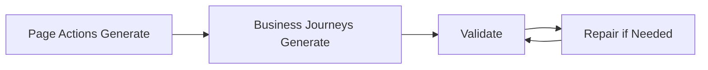

# Business Journeys Tooling - Master Enterprise README

## Lifecycle



## Tool Commands

```bash
npm run businessjourneys:generate
npm run businessjourneys:validate
npm run businessjourneys:repair
```

## Ownership Model

| Area | Owner |
|---|---|
| framework | Tool |
| runtime | Tool |
| journey exports | Tool |
| runner custom logic | QA Engineers |

## Golden Flow

```bash
npm run pageactions:generate
npm run businessjourneys:generate
npm run businessjourneys:validate
```

## Recovery Flow

```bash
npm run businessjourneys:validate
npm run businessjourneys:repair
npm run businessjourneys:validate
```

## CI Recommendation
- types check
- validator required
- repair optional local tool

## Result States
- ALL GOOD
- WARNINGS FOUND
- INVALID
- REPAIR APPLIED
- NO CHANGES