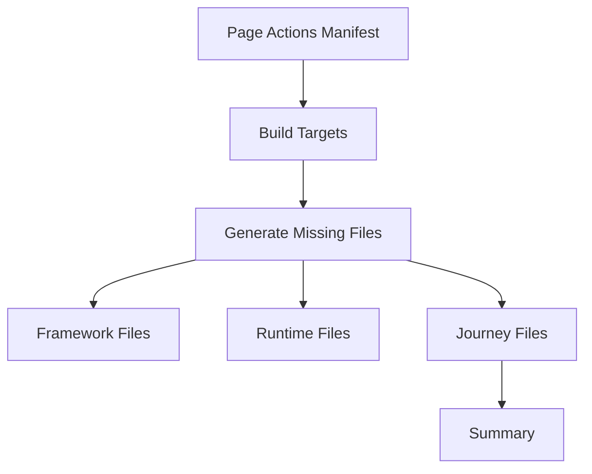

# Business Journeys Generator - Enterprise README

## Overview
The generator creates missing Business Journey files using the Page Actions registry as source-of-truth.

## Command
```bash
npm run businessjourneys:generate
```

## Objectives
- Zero manual boilerplate
- Deterministic generation
- Safe re-runs
- Never overwrite QA customized runner files

## Inputs
- Page Actions manifest
- Page Actions registry
- Platform/Application mapping

## Outputs
- framework/
- runtime/
- root index.ts
- Journey folders
- runNewBusinessJourney.ts
- Journey index.ts

## Architecture



## Generation Strategy
1. Read available page actions
2. Infer valid products/apps
3. Build supported targets
4. Skip unsupported targets
5. Create only missing files

## Safety Rules
- Existing runner files are preserved
- Existing custom edits remain untouched
- Framework files may be regenerated if tool-owned

## Example Logs
```text
Created: 1
Files created: 6
Result: ALL GOOD
```

## Recommended Usage
```bash
npm run pageactions:generate
npm run businessjourneys:generate
npm run businessjourneys:validate
```

## CI Usage
Run after page action generation.

## Future Roadmap
- Multi journey types
- Quote amendment journeys
- Existing policy flows