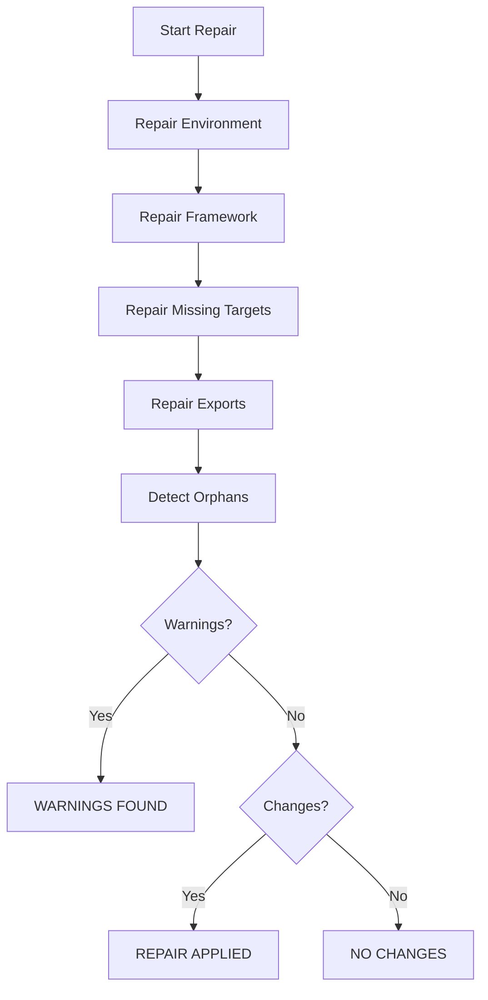

# Business Journeys Repair - Enterprise README

## Overview
Repair restores generated assets while protecting QA-owned journey logic.

## Command
```bash
npm run businessjourneys:repair
```

## Philosophy
Repair should be safe, deterministic, and non-destructive.

## Repair Pipeline



## What Can Be Repaired

### Created
- missing index.ts
- missing runner file
- missing framework files

### Updated
- broken framework exports
- broken runtime exports

### Warning Only
- unknown folders
- orphan journey files

## What Is Never Overwritten
Existing QA-edited runner implementations.

## Example Recoveries

### Missing Runner
```text
Created: 1
Result: REPAIR APPLIED
```

### Broken Framework
```text
Updated: 1
Result: REPAIR APPLIED
```

### Fake Folder
```text
Warning: 1
Result: WARNINGS FOUND
```

## Recommended Usage
```bash
npm run businessjourneys:validate
npm run businessjourneys:repair
npm run businessjourneys:validate
```