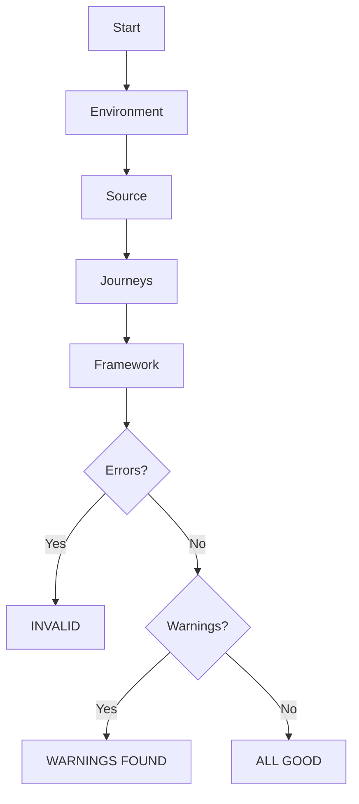

# Business Journeys Validator - Enterprise README

## Overview
Validator checks structural integrity, exports, references, and ownership boundaries.

## Command
```bash
npm run businessjourneys:validate
```

## Rule Groups
- environment
- source
- journeys
- framework

## Validation Pipeline



## Rules

### Environment
- required folders exist
- framework exists
- runtime exists

### Source
- journey uses pageActionsRegistry
- references valid page actions

### Journeys
- index.ts exists
- run file exists
- expected targets covered
- no orphan runners

### Framework
- framework exports valid
- runtime exports valid
- root exports valid

## Severity Model
- Error => exit code 1
- Warning => exit code 0
- Success => exit code 0

## Examples

### Missing file
```text
INVALID
missing journey file
```

### Orphan file
```text
WARNINGS FOUND
manual review suggested
```

## CI Usage
```bash
npm run check:types
npm run businessjourneys:validate
```

## Recommended Gate
Block merge on INVALID.