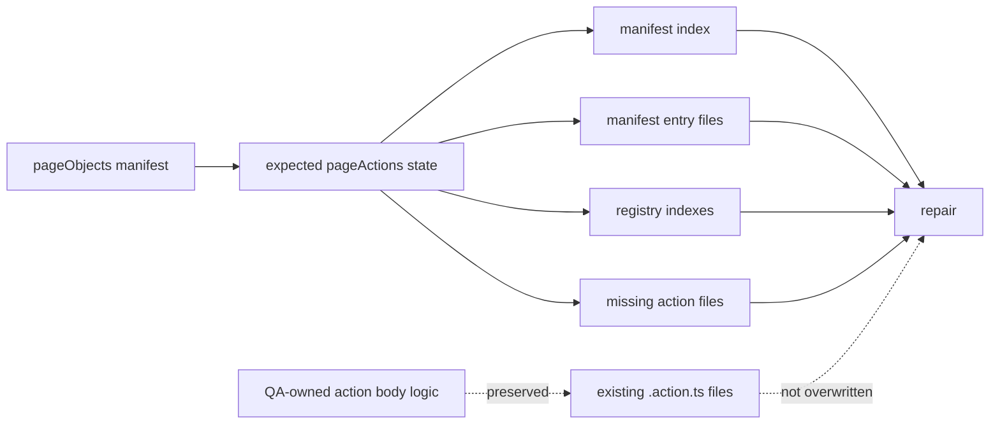
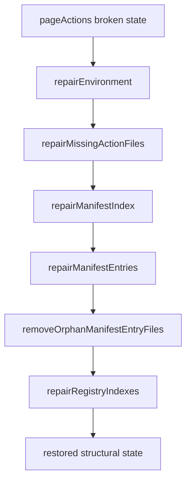
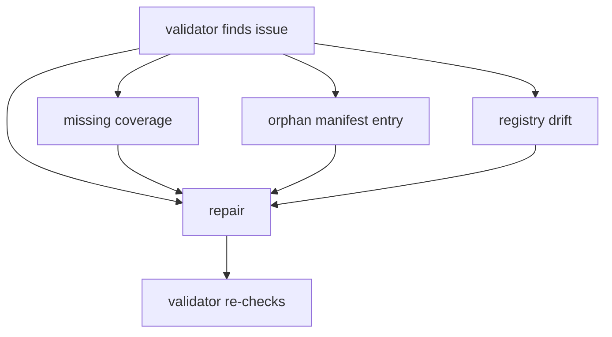

<!-- src/toolingLayer/pageActions/repair/README.md -->

# Page Action Repair

---

# 1. Overview

The **Page Action Repair** tool restores structural consistency in the **pageActions** layer.

It repairs framework-owned artifacts that are expected to be generated or synchronized from the **pageObjects** source of truth, while intentionally avoiding destructive edits to **QA-owned page action logic**.

For this toolchain, the source of truth remains:

```text
src/businessLayer/pageObjects/.manifest
```

The repair tool focuses on restoring:

- missing or out-of-sync page action manifest metadata
- generated registry indexes
- missing generated action files
- required directory structure

It does **not** attempt to rewrite business behavior inside action bodies.

---

# 2. Purpose

The repair tool exists to recover from structural drift in the pageActions layer.

Typical causes of drift include:

- accidental deletion of generated files
- merge conflicts
- partial generator runs
- stale manifest state
- registry export drift
- missing page action coverage for new pageObjects

Its main goals are:

- restore deterministic generated structure
- keep pageActions aligned with pageObjects
- safely rebuild framework-owned metadata
- preserve QA customization
- support validator → repair → validator workflows

---

# 3. Toolchain Context

Within the automation architecture, repair acts as the **recovery layer** for pageActions.

```text
Page Objects Manifest
    ↓
Page Action Generator
    ↓
Page Action Validator
    ↓
Page Action Repair
    ↓
Page Action Validator
```

The intended lifecycle is:

1. generator creates scaffold structure
2. validator checks integrity
3. repair restores safe structural issues
4. validator confirms repaired state

---

# 4. Source of Truth

The repair tool treats the **pageObjects manifest** as the source of truth.

Primary source:

```text
src/businessLayer/pageObjects/.manifest
```

Repaired layer:

```text
src/businessLayer/pageActions
```

This means repair restores pageActions to the state that should exist **for the current pageObjects manifest**, not the other way around.

---

# 5. What Repair Owns

Repair is responsible for **framework-owned structure only**.

It currently owns:

- required pageActions directories
- pageActions manifest index
- pageActions manifest entry files
- generated registry index files
- missing action file creation

These are generated or derived artifacts and are safe to restore.

---

# 6. What Repair Does Not Own

Repair intentionally does **not** own QA business logic.

It does not rewrite:

- custom action-body flow
- domain-specific conditions
- hand-tuned waits
- business-oriented payload logic
- QA-specific helper usage inside existing action bodies

This boundary is deliberate and important.

Repair should restore **structure**, not alter **behavior**.

---

# 7. Safe Repair Principles

The tool follows these principles:

- repair structure, not business behavior
- create missing files only
- rewrite generated metadata only
- preserve manual edits
- be deterministic
- be idempotent

Idempotent means a second repair run should produce:

```text
NO CHANGES
```

when nothing is broken.

---

# 8. Inputs

Repair reads the following sources.

## Page Object Manifest

Location:

```text
src/businessLayer/pageObjects/.manifest
```

Used to derive:

- expected page action keys
- expected action names
- expected manifest entry paths
- expected registry structure
- expected action file locations

## Page Action Manifest

Location:

```text
src/businessLayer/pageActions/.manifest
```

Used to restore:

- `.manifest/index.json`
- `.manifest/**/*.action.json`

## Page Action Registry

Locations include:

```text
src/businessLayer/pageActions/index.ts
src/businessLayer/pageActions/actions/index.ts
src/businessLayer/pageActions/actions/<platform>/index.ts
src/businessLayer/pageActions/actions/<platform>/<application>/index.ts
src/businessLayer/pageActions/actions/<platform>/<application>/<product>/index.ts
```

## Page Action Files

Location:

```text
src/businessLayer/pageActions/actions
```

Used only for **safe creation of missing files**.

---

# 9. Outputs

Repair may create or update:

- pageActions directories
- `.manifest/index.json`
- `.manifest/**/*.action.json`
- generated `index.ts` files
- missing `.action.ts` files

Repair avoids overwriting existing QA-edited action files.

---

# 10. Current Rule Groups

The current repair tool uses these groups:

- environment
- actions
- manifest
- registry

A runtime repair placeholder existed earlier, but was intentionally removed from active repair execution because it produced noisy no-op output and risked blurring the QA ownership boundary.

---

# 11. Environment Rules

## `repairEnvironment`

Purpose:

- ensure required pageActions directories exist before other repair rules run

Typical repairs:

- create missing `src/businessLayer/pageActions/actions`
- create missing `src/businessLayer/pageActions/.manifest`

This is low-risk structural setup.

---

# 12. Actions Rules

## `repairMissingActionFiles`

Purpose:

- create action files that are expected from pageObjects but currently missing

Behavior:

- create only when file is absent
- use current generator rendering logic
- do not overwrite existing action files
- preserve QA customizations

This is one of the most important safety boundaries in the repair design.

---

# 13. Manifest Rules

The manifest group repairs framework-owned metadata.

## `repairManifestIndex`

Purpose:

- rebuild `.manifest/index.json` so it matches pageObjects source of truth

Behavior:

- restores missing action coverage
- removes extra coverage drift
- preserves `generatedAt` when safe
- avoids rewriting file unnecessarily
- reports only actual delta count

## `repairManifestEntries`

Purpose:

- rewrite `.manifest/**/*.action.json` files from expected deterministic state

Behavior:

- safe to rewrite because these are generated metadata files
- derived from pageObjects + naming/path expectations

## `removeOrphanManifestEntryFiles`

Purpose:

- remove orphan `.action.json` files that are no longer referenced by current manifest state

Behavior:

- cleans stale generated metadata
- prevents validator drift warnings from persisting

---

# 14. Registry Rules

## `repairRegistryIndexes`

Purpose:

- rebuild generated pageActions `index.ts` files

Behavior:

- restore missing exports
- restore nested export chain
- rewrite registry files deterministically
- use common registry builders

This protects framework discoverability and import consistency.

---

# 15. Mermaid: Repair Ownership Boundary



This is the most important mental model for repair.

---

# 16. Mermaid: Repair Flow



---

# 17. Mermaid: Validator and Repair Relationship



The toolchain is designed so validator identifies structural issues and repair restores them safely.

---

# 18. Repair Philosophy vs Validator Philosophy

The validator is broader than repair.

## Validator
- detects many kinds of structural drift
- includes non-auto-fixable checks
- may warn about issues requiring manual review

## Repair
- only fixes deterministic, safe, framework-owned issues
- intentionally has fewer rules
- avoids risky mutation of QA logic

This difference is healthy.

Checking is cheap.
Fixing is risky.

---

# 19. Why Repair Has Fewer Rules Than Validator

The validator currently checks more conditions than repair fixes.

That is expected.

Repair should only auto-fix issues that are:

- deterministic
- safe
- generated
- non-destructive

Examples of validator-only or manual-review territory:

- suspicious QA business logic drift
- runtime behavior quirks inside action bodies
- business-flow correctness
- semantic mistakes in manual code

So repair rule count should generally remain smaller than validator rule count.

---

# 20. Common Layer Relationship

Repair uses the shared **pageActions common layer** for consistent expected-state reconstruction.

Shared common ownership includes:

- manifest loaders
- expected action state
- expected manifest entry shape
- registry file content builders
- file write-if-changed behavior

This ensures generator, validator, and repair all operate from the same expectations.

---

# 21. Idempotency

Repair is designed to be idempotent.

That means:

- first run repairs actual drift
- second run should produce no changes
- generated metadata should not churn on every run
- timestamps like `generatedAt` should not be rewritten unnecessarily

This is critical for clean diffs and trustworthy automation tooling.

---

# 22. Handling `generatedAt`

Repair intentionally avoids turning every run into a new generated timestamp update.

For example:

- if `.manifest/index.json` already exists and only structure is being preserved
- and if no action-map delta exists

then `generatedAt` should remain stable

This prevents false-positive diffs and noisy repair behavior.

---

# 23. Action File Safety

Missing action files may be created, but existing action files are intentionally preserved.

This is because existing `.action.ts` files may contain manual QA logic such as:

- custom conditions
- specialized mapping
- sequencing decisions
- business-aware helper calls

Repair should not destroy those edits.

So current behavior is:

## Missing file
- can be created safely

## Existing file
- do not overwrite

This is the correct V1 boundary.

---

# 24. Typical Workflow

Recommended workflow:

```bash
npm run pageactions:generate
npm run pageactions:validate
npm run pageactions:repair
npm run pageactions:validate
```

This gives a predictable maintenance cycle.

---

# 25. Commands

Standard repair command:

```bash
npm run pageactions:repair
```

Verbose mode:

```bash
npm run pageactions:repair:verbose
```

Strict mode, if enabled in scripts:

```bash
npm run pageactions:repair:strict
```

---

# 26. Example Repair Output

The repair CLI follows the same ecosystem style as generator and validator.

Example title:

```text
********************************
🔧 PAGE ACTION REPAIR
********************************
```

Then sections:

- Environment
- Repair execution
- Repair summary

Typical statuses:

- `✔` repaired
- `ℹ` no changes
- `⚠` warning
- `✖` failed

---

# 27. Summary Fields

The repair summary currently reports:

- `Rules run`
- `Repaired rules`
- `Unchanged rules`
- `Warning rules`
- `Failed rules`
- `Changed files`
- `Repaired items`
- `Exit code`
- `Result`

Typical result values include:

- `REPAIR APPLIED`
- `NO CHANGES`
- `INCOMPLETE`

---

# 28. Example Repair Scenario

Suppose validator reports:

- one missing pageAction manifest entry
- one orphan manifest entry file

Repair should then:

- restore the missing `.manifest/index.json` mapping
- restore deterministic manifest state
- clean orphan metadata where applicable
- leave action body logic untouched

After repair, validator should return:

```text
ALL GOOD
```

This is the expected validator → repair → validator loop.

---

# 29. Relationship to Generator

Generator and repair overlap in some areas, but their responsibilities differ.

## Generator
- creates initial scaffold structure
- syncs generated metadata during normal generation flow

## Repair
- restores broken or missing structure after drift
- acts as a recovery mechanism
- should be safe to run after accidental damage or partial state loss

Generator is the creator.
Repair is the restorer.

---

# 30. Relationship to Future Runtime Repair

A runtime repair placeholder existed earlier but was removed from the active pipeline.

Why?

Because runtime mutation inside existing action files risks overwriting QA intent.

A future version may safely repair limited runtime issues such as:

- missing type import
- missing exported const wrapper
- malformed generated header

But V1 correctly avoids touching action bodies.

---

# 31. Design Strengths of Current V1

The current V1 repair tool is strong because it is:

- conservative
- deterministic
- idempotent
- non-destructive
- aligned to validator
- aligned to common expected-state builders

It solves the most important structural recovery problems without crossing into risky behavior rewriting.

---

# 32. Good Future Enhancements

Potential future improvements include:

- safe header-only repair for action files
- safe import-only repair for generated contracts
- optional verbose detail expansion
- guided manual-repair suggestions
- CI-friendly repair summaries
- cleanup of empty directories after orphan removal
- managed-region repair for explicitly protected sections

These are optional V2 enhancements, not missing V1 essentials.

---

# 33. Final Mental Model

```text
pageObjects define what should exist
generator creates the normal state
validator detects drift
repair restores safe structure
validator confirms recovery
QA owns custom action behavior
```

---

# 34. Final Note

The Page Action Repair tool should be treated as the **safe structural recovery tool** for pageActions.

Its value is not in rewriting business logic.

Its value is in ensuring that framework-owned generated assets can always be restored to a valid state without risking QA ownership of action behavior.
