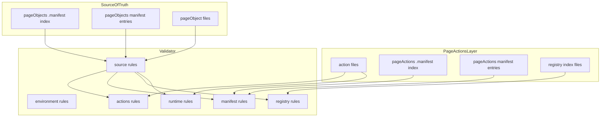
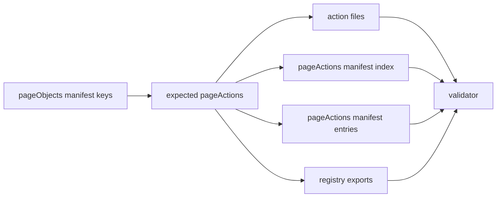
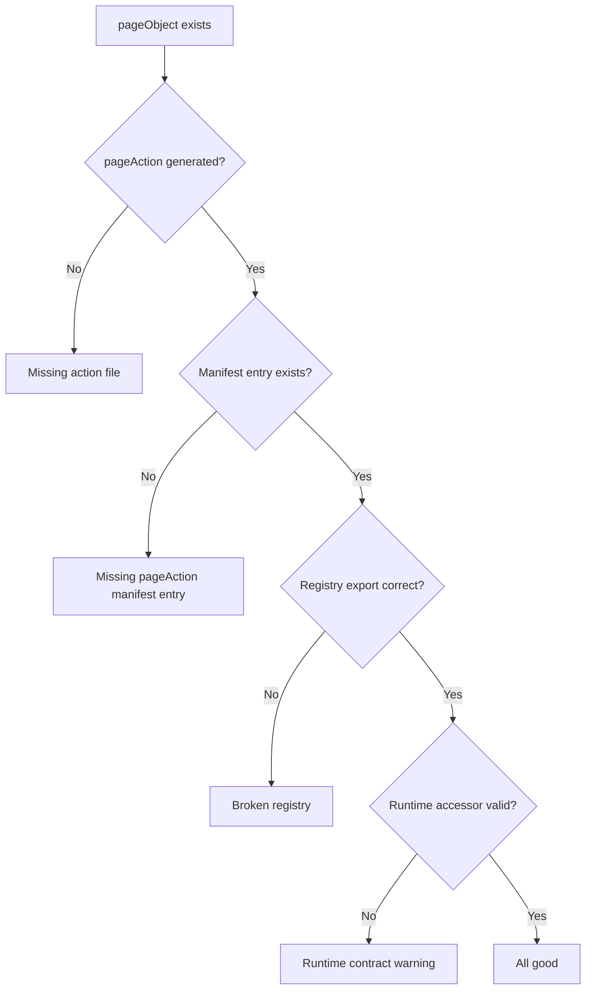

<!-- src/toolingLayer/pageActions/validator/README.md -->

# Page Action Validator

---

# 1. Overview

The **Page Action Validator** verifies that the **pageActions** layer remains structurally correct and aligned with the **pageObjects** layer.

It checks that generated page action artifacts, page action manifest metadata, registry exports, and runtime usage remain synchronized with the current source of truth.

For this toolchain, the source of truth is:

```text
src/businessLayer/pageObjects/.manifest
```

The validator is intentionally designed to be:

- strict about framework structure
- strict about generated metadata consistency
- permissive about **QA-owned action logic**
- suitable for local validation and CI enforcement

---

# 2. Purpose

The validator exists to detect structural drift before it becomes a larger framework problem.

Typical issues it protects against include:

- missing action files
- missing page action manifest entries
- extra page action manifest entries
- orphan action files
- orphan manifest entry files
- broken registry exports
- manifest path mismatches
- runtime accessor drift

Its main goals are:

- keep pageActions aligned with pageObjects
- protect generated framework integrity
- allow QA to safely refine action bodies
- support future repair tooling
- provide clear and actionable CLI output

---

# 3. Toolchain Context

Within the automation architecture, the validator acts as the **verification layer** for pageActions.

```text
Page Scanner
    ↓
Page Maps
    ↓
Page Object Generator
    ↓
Page Objects + Page Object Manifest
    ↓
Page Action Generator
    ↓
Page Actions + Page Action Manifest
    ↓
Page Action Validator
```

The validator does **not** generate or repair files.

It inspects the current framework state and reports whether it is valid.

---

# 4. Source of Truth

The validator treats the **pageObjects manifest** as the primary source of truth.

Primary source:

```text
src/businessLayer/pageObjects/.manifest
```

Validated layer:

```text
src/businessLayer/pageActions
```

This means:

- pageActions should not contain entries that are not backed by pageObjects
- pageActions should not be missing entries for pageObjects that should exist
- pageActions structure must remain consistent with generator expectations

---

# 5. Inputs

The validator reads several framework artifacts.

## Page Object Manifest

Location:

```text
src/businessLayer/pageObjects/.manifest
```

Used to determine:

- expected page keys
- expected scope
- expected page action names
- expected action paths
- expected registry exports

## Page Action Manifest

Location:

```text
src/businessLayer/pageActions/.manifest
```

Used to validate:

- page action manifest index
- page action manifest entries
- action path metadata
- pageActions coverage against pageObjects

## Page Action Files

Location:

```text
src/businessLayer/pageActions/actions
```

Used to validate:

- expected `.action.ts` files exist
- expected exports exist
- imports match generator/runtime contract
- no orphan action files remain

## Page Action Registry Files

Locations include:

```text
src/businessLayer/pageActions/index.ts
src/businessLayer/pageActions/actions/index.ts
src/businessLayer/pageActions/actions/<platform>/index.ts
src/businessLayer/pageActions/actions/<platform>/<application>/index.ts
src/businessLayer/pageActions/actions/<platform>/<application>/<product>/index.ts
```

Used to validate:

- expected exports exist
- nested index chain remains correct

---

# 6. Outputs

The validator produces a **structured validation report** in the terminal.

The report contains:

- environment block
- grouped rule execution output
- per-check status
- warnings
- errors
- final summary
- exit code

The validator does **not** modify files.

---

# 7. Validation Philosophy

The validator follows a deliberate rule:

## Validate structure, not QA creativity

That means it should validate:

- generated metadata consistency
- file existence
- registry correctness
- runtime contract expectations

But it should **not** fail simply because QA changed the internals of an action file.

Examples of safe QA edits that should remain allowed:

- changing payload mapping
- enabling TODO sections
- adding conditions
- adding waits
- changing call ordering
- adding business-specific logic

This keeps validator useful without making it hostile to real development.

---

# 8. Current Rule Groups

The validator currently uses these rule groups:

- environment
- source
- actions
- manifest
- registry
- runtime

These groups mirror the style used in the pageObjects validator so the tooling ecosystem stays consistent.

---

# 9. Environment Rules

The **environment** group validates that required roots exist.

Current rule:

- `checkEnvironment`

Typical checks include:

- pageObjects manifest index exists
- pageActions actions directory exists
- pageActions manifest directory exists
- pageActions manifest index exists

This is the validator’s first line of defense.

If the environment is broken, later checks cannot be trusted.

---

# 10. Source Rules

The **source** group validates the upstream source of truth.

Current rules:

- `checkPageObjectManifestIndex`
- `checkPageObjectManifestEntries`

These checks validate that the pageObjects manifest is usable by the pageActions validator.

Typical checks include:

- pageObjects manifest index parses as valid JSON
- `pages` map exists
- referenced pageObject manifest entries exist
- page entries contain valid scope
- referenced page object files exist

This ensures pageActions validation is grounded in a trustworthy source.

---

# 11. Actions Rules

The **actions** group validates generated action files.

Current rules include:

- `checkActionFilesExist`
- `checkActionExports`
- `checkActionFileImports`
- `checkNoOrphanActionFiles`

These checks validate that action files are present and structurally sound.

Typical checks include:

- expected `.action.ts` file exists for each pageObject
- expected export exists in action file
- expected `PageAction` type import exists
- required shared imports exist when used
- no extra action files remain on disk without pageObject backing

This group protects the action-file layer itself.

---

# 12. Manifest Rules

The **manifest** group validates the pageActions manifest system.

Current rules include:

- `checkPageActionManifestIndex`
- `checkActionManifestFileExists`
- `checkPageActionManifestEntries`
- `checkActionFilePathMatchesManifest`
- `checkManifestAgainstPageObjects`
- `checkPageObjectsCovered`
- `checkNoOrphanManifestEntryFiles`

This is one of the most important rule groups because the manifest is the structural metadata layer.

Typical checks include:

- pageActions manifest index exists and parses
- referenced manifest entry files exist
- manifest entry content matches expected action metadata
- action paths match expected generated values
- pageActions manifest does not contain extra entries beyond pageObjects
- pageObjects are fully represented by pageActions manifest
- no orphan manifest entry files remain on disk

This group catches both missing coverage and stale metadata drift.

---

# 13. Registry Rules

The **registry** group validates generated pageActions `index.ts` files.

Current rule:

- `checkPageActionIndexes`

Typical checks include:

- root index exports `./shared` and `./actions`
- actions index exports expected platform folders
- platform index exports expected application folders
- application index exports expected product folders
- product index exports expected action exports

This protects the discoverability and import chain of the pageActions layer.

---

# 14. Runtime Rules

The **runtime** group validates runtime usage expectations inside generated actions.

Current rule:

- `checkRuntimeContract`

Typical checks include:

- old legacy runtime accessor patterns are not used
- runtime access shape follows current contract
- action files do not drift into invalid `context.pages` access patterns

This matters because runtime accessor drift can break actions even when files and manifests still look valid.

---

# 15. Current Rule Set Summary

Current rule names:

## environment
- `checkEnvironment`

## source
- `checkPageObjectManifestIndex`
- `checkPageObjectManifestEntries`

## actions
- `checkActionFilesExist`
- `checkActionExports`
- `checkActionFileImports`
- `checkNoOrphanActionFiles`

## manifest
- `checkPageActionManifestIndex`
- `checkActionManifestFileExists`
- `checkPageActionManifestEntries`
- `checkActionFilePathMatchesManifest`
- `checkManifestAgainstPageObjects`
- `checkPageObjectsCovered`
- `checkNoOrphanManifestEntryFiles`

## registry
- `checkPageActionIndexes`

## runtime
- `checkRuntimeContract`

---

# 16. Mermaid: Validation Layers



---

# 17. Mermaid: Coverage Relationship



This is the core relationship the validator protects.

---

# 18. Mermaid: Typical Failure Patterns



---

# 19. CLI Output Style

The validator follows the same CLI presentation style as the pageObjects validator.

It shows:

- command title
- environment block
- rule execution tree
- final summary block

Example title:

```text
********************************
🔍 PAGE ACTION VALIDATOR
********************************
```

Example sections:

- `Environment`
- `Rule execution`
- `VALIDATE SUMMARY`

This consistency makes the full tooling ecosystem easier to use.

---

# 20. Summary Fields

The summary currently reports:

- `Checks run`
- `Passed checks`
- `Warn checks`
- `Failed checks`
- `Total warnings`
- `Total errors`
- `Exit code`
- `Result`

Typical result values include:

- `ALL GOOD`
- `INVALID`

---

# 21. Normal Mode

Standard validation command:

```bash
npm run pageactions:validate
```

Normal mode behavior:

- warnings do not fail the command
- errors fail the command

This is good for daily local development.

---

# 22. Strict Mode

Strict validation command:

```bash
npm run pageactions:validate:strict
```

Strict mode is intended for stronger enforcement.

In strict mode, warnings should be treated as blocking issues.

This is best suited for CI or release gates.

---

# 23. Verbose Mode

Verbose validation command:

```bash
npm run pageactions:validate:verbose
```

Verbose mode is intended for expanded diagnostics.

It is useful when investigating why a rule failed or produced warnings.

---

# 24. Typical Workflow

Recommended workflow:

```bash
npm run check:types
npm run pageobjects:generate
npm run pageactions:generate
npm run pageactions:validate
```

If issues are found later:

```bash
npm run pageactions:repair
npm run pageactions:validate:strict
```

---

# 25. Expected Behavior with Missing Manifest Index Entry

If a pageObject exists but its corresponding pageAction manifest entry is removed from:

```text
src/businessLayer/pageActions/.manifest/index.json
```

the validator should detect at least two things:

## Error
The pageObject is no longer covered by pageActions manifest.

Rule:

```text
checkPageObjectsCovered
```

## Warning
The old pageAction manifest entry file may still exist on disk but is no longer referenced.

Rule:

```text
checkNoOrphanManifestEntryFiles
```

This dual behavior is correct and useful.

It distinguishes between:

- broken structural coverage
- stale cleanup drift

---

# 26. Expected Behavior with Orphan Action Files

If an `.action.ts` file exists on disk without pageObject backing, the validator should report it via:

```text
checkNoOrphanActionFiles
```

This prevents pageActions from silently drifting beyond the pageObjects source of truth.

---

# 27. Expected Behavior with Extra PageActions Manifest Keys

If pageActions manifest index contains a page key that does not exist in pageObjects manifest, the validator should report it via:

```text
checkManifestAgainstPageObjects
```

This prevents stale or invalid pageAction metadata from lingering unnoticed.

---

# 28. What Validator Does Not Check

The validator currently does **not** validate:

- business correctness of QA logic
- selector behavior
- test data realism
- Playwright timing stability
- final workflow success
- domain-specific decision logic

Those belong to execution and test layers, not structural validation.

---

# 29. Relationship to Generator

The Page Action Generator creates and synchronizes scaffold structure.

The validator verifies that this structure remains sound afterward.

Generator responsibilities:
- create/update pageActions
- create/update manifests
- create/update registry files

Validator responsibilities:
- confirm structure exists
- confirm metadata matches expectations
- confirm no orphan drift remains
- confirm runtime usage follows contract

---

# 30. Relationship to Future Repair

The validator is also the foundation for future repair tooling.

Validator tells you:
- what is wrong
- where it is wrong
- whether it is missing, extra, or mismatched

Future repair can then use those findings to restore consistency.

This is why keeping rule groups clean and explicit is important.

---

# 31. Design Principles

The current validator follows these principles:

- pageObjects is source of truth
- pageActions must align to pageObjects
- action body customization must remain allowed
- generated metadata must remain deterministic
- output should be easy to read
- results should be actionable
- future repair should be easy to build on top

---

# 32. Current Strengths

The current validator now protects against several important forms of drift:

- missing pageAction manifest coverage
- orphan manifest entry files
- orphan action files
- broken manifest path metadata
- missing action files
- missing imports/exports
- broken registry structure
- runtime accessor drift

This makes it a strong V1 validator.

---

# 33. Planned Future Enhancements

Good future candidates include:

- managed-region validation inside action files
- more detailed runtime contract enforcement
- strict validation of generated headers where appropriate
- richer verbose diagnostics
- suggested repair actions in output
- unused action detection by journey references
- stricter CI policy handling

---

# 34. Final Mental Model

```text
pageObjects define expected action structure
generator creates draft action scaffolds
validator protects framework integrity
repair will fix structural drift
QA owns business behavior inside action bodies
```

---

# 35. Final Note

The Page Action Validator should be treated as the **structural integrity gate** for the pageActions layer.

It is not a replacement for QA review, but it is the tool that ensures:

- files exist where they should
- manifests stay aligned
- registry exports remain correct
- pageActions do not drift away from pageObjects
