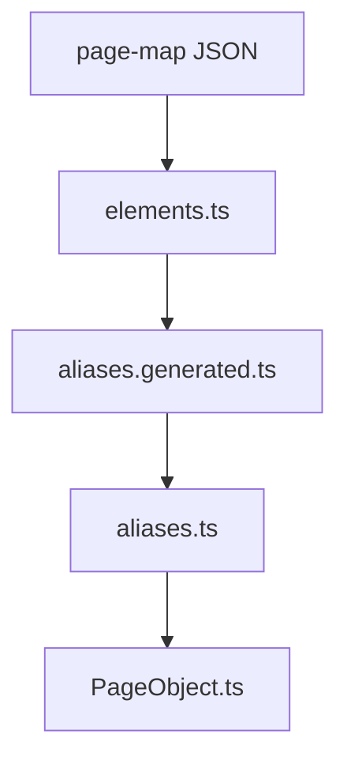
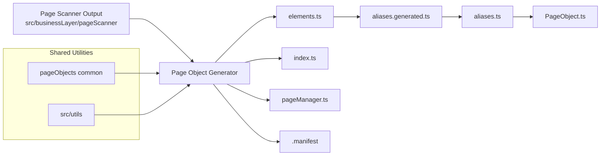
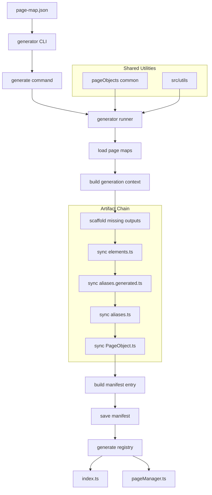

Page Object Generator

---

# 1. Overview

The Page Object Generator builds and synchronizes Playwright page-object artifacts from page-map definitions.

It transforms page metadata into a structured automation layer consisting of:

* elements.ts
* aliases.generated.ts
* aliases.ts
* <PageName>Page.ts
* registry exports (src/businessLayer/pageObjects/index.ts)
* page manager (src/businessLayer/pageObjects/pageManager.ts)
* page manifest metadata (src/businessLayer/pageObjects/.manifest)

The generator ensures page-object artifacts remain deterministic, scalable, and maintainable as the number of automated pages grows.

Unlike the page scanner, this tool does not inspect a live browser. It consumes the already-generated page-map layer and converts that metadata into usable page-object code.

---

# 2. Purpose

The generator exists to automate the creation and synchronization of page-object code.

Its main goals are:

* eliminate manual page-object boilerplate
* maintain consistent automation architecture
* synchronize generated artifacts
* reduce maintenance effort
* support scalable page-object growth
* preserve safe manual customization where allowed

Instead of writing page objects manually, developers define page metadata in page-maps, and the generator builds the required automation structure.

---

# 3. Toolchain Context

Within the automation architecture, the generator acts as the code creation layer.

It transforms page metadata into automation artifacts.
```
Live Browser Page
      ↓
Page Scanner
      ↓
Page Map JSON
      ↓
Page Object Generator
      ↓
Generated Page Object Artifacts
      ↓
Validator / Repair / Tests
```

The generator focuses exclusively on creating and synchronizing page-object code.

It sits between the scanner output and the higher-level automation layers.

---

# 4. Inputs

The generator reads page-map JSON files from the scanner output.

Location:
```
src/businessLayer/pageScanner
```
Example page-map file:
```
src/businessLayer/pageScanner/athena/azonline/common/login-or-registration.json
```
Example structure:
```
{
  "pageKey": "athena.azonline.common.login-or-registration",
  "urlPath": "/",
  "title": "Login page",
  "scannedAt": "2026-03-09T12:48:41.552Z",
  "elements": {
    "loginButton": {
      "type": "button",
      "preferred": "css=#login",
      "fallbacks": ["role=button[name=/login/i]"]
    }
  }
}
```

Key fields used by the generator:

Field	Description
pageKey	Unique page identifier
elements	Element definitions
urlPath	Page path
title	Page title
scannedAt	Scan timestamp
readiness	Recommended aliases used to build page readiness wiring

The generator depends on the page-map being valid and structurally consistent.

---

# 5. Outputs

The generator creates or updates several automation artifacts.

Generated page-object directory:
```
src/businessLayer/pageObjects/objects/<platform>/<application>/<product>/<page>/
├── elements.ts
├── aliases.generated.ts
├── aliases.ts
└── <PageName>Page.ts
```

Example:
```
src/businessLayer/pageObjects/objects/athena/azonline/common/login-or-registration/
├── elements.ts
├── aliases.generated.ts
├── aliases.ts
└── LoginOrRegistrationPage.ts
```

Shared framework files:
```
src/businessLayer/pageObjects/index.ts
src/businessLayer/pageObjects/pageManager.ts
```

Manifest metadata:
```
src/businessLayer/pageObjects/.manifest
├── index.json
└── athena/
    └── azonline/
        ├── common/
        │   ├── insurance-type-selection.json
        │   ├── login-or-registration.json
        │   └── manage-cookies.json
        └── motor/
            └── car-details.json
```
---

# 6. Page Object Chain

The generator builds artifacts in a strict dependency chain.

Each stage depends on the previous artifact.

This chain is central to both generation and validation.

---

# 7. Generated File Responsibilities
```
elements.ts
```
Defines page element locators used by automation.
```
Example:

export const elements = {
  loginButton: {
    type: "button",
    preferred: "css=#login",
    fallbacks: ["role=button[name=/login/i]"]
  }
}
```

This file represents the automation-level element definitions.

It is the lowest generated TypeScript layer derived from the page-map.

---
```
aliases.generated.ts
```
Automatically generated alias layer.

Maps elements to generated aliases and contains page metadata.

Example:
```
export const aliasesGenerated = {
  loginButton: "loginButton" as ElementKey
}
```

Also includes metadata fields such as:

* pageMeta.pageKey
* pageMeta.urlPath
* pageMeta.urlRe
* pageMeta.title
* pageMeta.titleRe

This file is fully generator-owned.

---
```
aliases.ts
```
Human-maintained alias layer.

Purpose:

* provide business-friendly naming
* create stable API for tests
* separate generated logic from manual customization

Example:
```
export const aliases = {
  clickLogin: aliasesGenerated.loginButton
}
```

Generator behavior:

* adds missing aliases
* preserves existing aliases
* rewrites RHS references when generated keys are renamed
* never overwrites manual alias naming intent

This file is the safe customization boundary between generated structure and business-facing naming.

---
```
PageObject.ts
```
Defines the Playwright page object class.

Example:
```
export class LoginOrRegistrationPage {
  constructor(private readonly page: Page) {}
  async clickLogin() {
    await this.clickAliasKey(aliasKeys.clickLogin)
  }
}
```

Generator maintains the managed alias region while preserving custom developer code outside that managed block.

It also wires readiness logic using page-map readiness metadata.

---

# 8. Manifest System

The generator maintains metadata about all page objects.

Location:
```
src/businessLayer/pageObjects/.manifest
```

Structure:
```
src/businessLayer/pageObjects/.manifest
├── index.json
└── athena
    └── azonline
        └── common
            └── login-or-registration.json
```

Example index.json:
```
{
  "version": 1,
  "generatedAt": "2026-04-16T18:56:56.982Z",
  "pages": {
    "athena.azonline.common.login-or-registration": "athena/azonline/common/login-or-registration.json"
  }
}
```

Example manifest entry:
```
{
  "pageKey": "athena.azonline.common.login-or-registration",
  "scope": {
    "platform": "athena",
    "application": "azonline",
    "product": "common",
    "name": "login-or-registration",
    "namespace": "athena.azonline.common"
  },
  "className": "LoginOrRegistrationPage",
  "paths": {
    "pageObjectImport": "@businessLayer/pageObjects/objects/athena/azonline/common/login-or-registration/LoginOrRegistrationPage",
    "pageObjectFile": "src/businessLayer/pageObjects/objects/athena/azonline/common/login-or-registration/LoginOrRegistrationPage.ts",
    "elementsFile": "src/businessLayer/pageObjects/objects/athena/azonline/common/login-or-registration/elements.ts",
    "aliasesGeneratedFile": "src/businessLayer/pageObjects/objects/athena/azonline/common/login-or-registration/aliases.generated.ts",
    "aliasesFile": "src/businessLayer/pageObjects/objects/athena/azonline/common/login-or-registration/aliases.ts",
    "pageMapFile": "src/businessLayer/pageScanner/athena/azonline/common/login-or-registration.json"
  },
  "pageMeta": {
    "urlPath": "/",
    "urlPathRe": "/\\//i",
    "title": "Login page",
    "elementCount": 4
  },
  "source": {
    "scannedUrl": "https://example.com/",
    "scannedAt": "2026-03-09T12:48:41.552Z",
    "mapHash": "abc123"
  }
}
```

Purpose of the manifest:

* store page metadata
* support incremental generation logic
* provide registry source-of-truth
* support validation and repair
* map page keys to generated artifact files

---

# 9. Registry Generation

The generator updates registry files used by the automation framework.
```
index.ts
```
Exports all generated page objects.
```
export * from "./pageManager";
export * from "@businessLayer/pageObjects/objects/athena/azonline/common/login-or-registration/LoginOrRegistrationPage";
```
```
pageManager.ts
```
Provides a central access layer for page objects.

Example usage:
```
pageManager.common.loginOrRegistration
pageManager.motor.carDetails
```

The current registry shape is generated from manifest entries and groups page objects by product.

---

# 10. Generator Commands

Available commands:
```
npm run pageobjects:generate
npm run pageobjects:generate:verbose
npm run pageobjects:help
```

There is now one main generation command path.

Old separate changed-only / merge command modes are no longer part of the user-facing workflow.

---

# 11. Generation Mode

Smart Generation

npm run pageobjects:generate

The generator processes all available page maps and determines the page-level operation automatically.

Possible results per page:

* created
* updated
* unchanged
* failed

This means the command itself stays simple while the generator decides what actually happened for each page.

---

# 12. Page-Level Operations

The generator now reports operations at the page level.

created

A page is reported as created when outputs were missing and new artifacts had to be scaffolded/generated.

Typical example:

* new page-map added
* new folder created in pageObjects/objects/...
* new elements.ts
* new aliases.generated.ts
* new aliases.ts
* new PageObject.ts
* registry updated

updated

A page is reported as updated when existing visible generated artifacts changed.

Examples:

* elements.ts changed due to page-map updates
* aliases.generated.ts changed due to renamed / added elements
* aliases.ts gained new generated mappings
* PageObject.ts managed region changed

unchanged

A page is reported as unchanged when no visible generated artifact changed.

For unchanged pages, the CLI output is intentionally compact.

failed

A page is reported as failed when generation could not complete because of invalid input or runtime processing errors.

---

# 13. Summary Output

Typical CLI summary now looks like this:

Available Page Maps      : 5
Created                  : 1
Updated                  : 0
Unchanged                : 4
Failed                   : 0
Files generated          : 4
Registry pages updated   : 1
Invalid pages            : 0
Exit code                : 0

Meaning of the rows:

* Available Page Maps – total scanner page maps discovered
* Created – pages whose generated outputs were newly created
* Updated – pages whose visible generated outputs changed
* Unchanged – pages requiring no artifact changes
* Failed – pages that failed during generation
* Files generated – generated/scaffolded managed files changed or created
* Registry pages updated – pages that caused registry updates
* Invalid pages – pages rejected due to invalid page-map / manifest generation conditions

---

# 14. Generation Strategy

The generator works incrementally.

High-level behavior:

1. read page maps
2. resolve page scope from pageKey
3. build artifact paths
4. scaffold missing outputs if needed
5. sync elements.ts
6. sync aliases.generated.ts
7. sync aliases.ts
8. sync PageObject.ts
9. update manifest entry
10. regenerate registry from manifest

This makes the command deterministic and repeatable.

---

# 15. Scaffold Behavior

When a page object does not yet exist, the generator scaffolds the base structure.

It can create:

* page folder
* aliases.ts
* aliases.generated.ts
* PageObject.ts
* later sync elements.ts

This is why a newly created page can show multiple generated files in a single run.

---

# 16. Synchronization Rules

elements.ts sync

The generator reads the page map and writes element definitions.

It supports:

* adding new keys
* preserving order where appropriate
* renaming keys through stableKey matching

aliases.generated.ts sync

The generator regenerates the generated alias layer from the current element state.

aliases.ts sync

The generator preserves manual alias naming while appending missing generated references.

PageObject.ts sync

The generator synchronizes the managed alias-method region.

Custom business logic outside the managed region remains untouched.

---

# 17. Preservation Rules

Important rule:

The generator is designed to preserve safe manual code.

Examples:

* manual alias names in aliases.ts are preserved
* custom code outside the managed region in PageObject.ts is preserved
* registry is regenerated from manifest rather than handwritten edits

This keeps the generated layer stable without erasing intended business customization.

---

# 18. Import Strategy

Generated imports use TypeScript path aliases.

Example:
```
@businessLayer/pageObjects/objects/athena/azonline/common/login-or-registration/LoginOrRegistrationPage
```

Benefits:

* cleaner imports
* consistent architecture
* scalable folder structure
* stable registry generation

---

# 19. Validation Relationship

The generator integrates tightly with validation rules.

Important principle:
```
elements.ts is the base file for validation

Validation chain:

elements.ts
   ↓
aliases.generated.ts
   ↓
aliases.ts
   ↓
PageObject.ts
```

The validator checks that these layers remain synchronized and structurally valid.

---

# 20. Repair Relationship

The repair tool complements generator behavior.

If something drifts out of sync, repair can rebuild/synchronize:

* manifest
* index exports
* page manager
* managed page-object regions
* generated alias chain

Typical workflow is still:

1. generate
2. validate
3. repair only when needed

---

# 21. Typical Workflow

Typical developer workflow:

1. generate or update page-map JSON via scanner
2. run generator
3. run validator
4. run repair only if validator reports issues

Example:
```
npm run pageobjects:generate
npm run pageobjects:validate
```

Verbose run:
```
npm run pageobjects:generate:verbose
```

---

# 22. Shared Utilities

The Page Object Generator relies on shared utilities located under the page-object common layer and shared repo utilities.

Important areas include:
```
src/toolingLayer/pageObjects/common
src/utils
```

Examples of responsibilities:

* read page maps
* resolve artifact paths
* parse page scope
* manage manifest IO
* compute generated headers
* CLI formatting and logging

---

# 23. Common Utility Areas

readPageMap.ts

Loads and normalizes page-map JSON files from the scanner directory.

Responsibilities:

* discover page-map files
* load page-map metadata
* expose page-map structures to generator / validator / repair

pagePaths.ts / artifacts

Responsible for computing consistent file paths for page-object artifacts.

Examples:

* resolve page object file paths
* resolve elements file paths
* resolve alias file paths
* compute registry import paths

manifest helpers

Responsible for:

* loading manifest index
* loading page manifest entries
* saving manifest index
* removing stale manifest entries
* building manifest entries from page-map data

---

# 24. End-to-End Flow


This process transforms page metadata into fully usable automation code while shared utilities handle file parsing, path resolution, manifest management, and CLI helpers.

---

# 25. Detailed End-to-End Flow

---

# 26. Example Generated Structure
```
src/businessLayer/pageObjects
├── .manifest
│   ├── index.json
│   └── athena
│       └── azonline
│           ├── common
│           │   ├── insurance-type-selection.json
│           │   ├── login-or-registration.json
│           │   └── manage-cookies.json
│           └── motor
│               └── car-details.json
├── index.ts
├── pageManager.ts
└── objects
    └── athena
        └── azonline
            ├── common
            │   └── login-or-registration
            │       ├── aliases.generated.ts
            │       ├── aliases.ts
            │       ├── elements.ts
            │       └── LoginOrRegistrationPage.ts
            └── motor
                └── car-details
                    ├── aliases.generated.ts
                    ├── aliases.ts
                    ├── elements.ts
                    └── CarDetailsPage.ts
```
---

# 27. Repeatability

The generator is intended to be repeatable and idempotent.

Typical behavior:

* first run after a new page-map may show created
* next immediate run should usually show unchanged

That behavior is expected and desirable.

---

# 28. Final Notes

The current model is intentionally simple:

* one primary generate command
* automatic per-page operation detection
* manifest-backed synchronization
* compact unchanged reporting
* generated detail only where actual changes occurred

This keeps the tool easy to run while still giving clear insight into what changed during generation.

---
