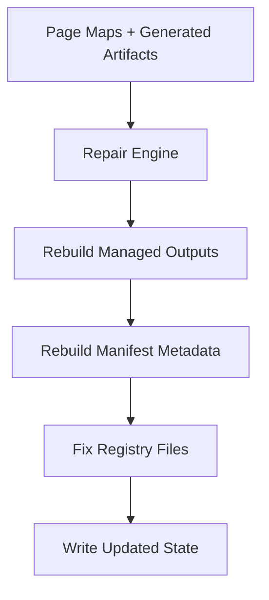
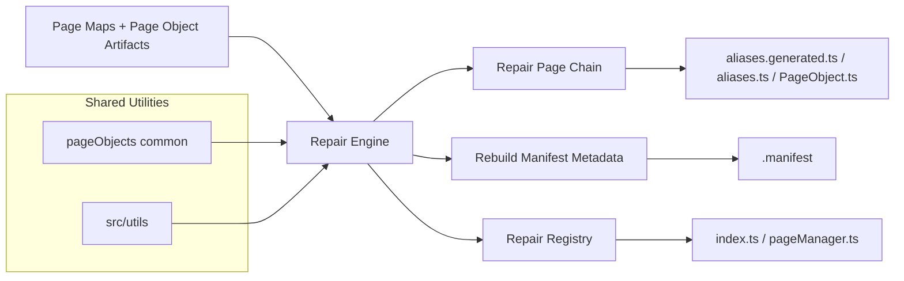
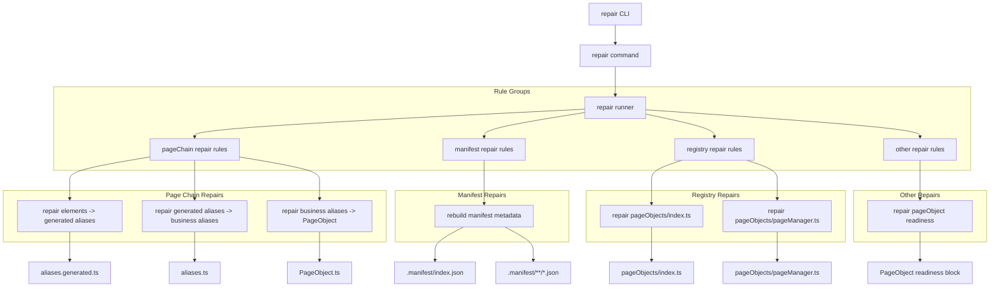
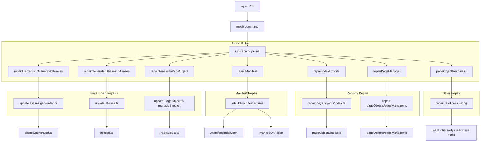

<!-- src/tools/page-object-repair/README.md -->

# Page Object Repair

---

# 1. Overview

The **Page Object Repair** tool detects and fixes inconsistencies across **generated page-object artifacts, manifest metadata, and registry files**.

It reconstructs the correct framework state when artifacts or metadata drift from the expected structure.

Typical repairs include:

- fixing manifest entries
- rebuilding missing metadata
- correcting artifact references
- restoring page-chain synchronization
- repairing registry exports
- restoring framework consistency

The repair tool ensures the automation framework can **recover from structural inconsistencies without manual intervention**.

---

# 2. Purpose

The repair tool exists to **restore consistency across the page-object ecosystem**.

Over time, inconsistencies can occur due to:

- manual file edits
- incomplete generator runs
- merge conflicts
- outdated metadata
- structural drift
- deleted or partially restored generated files

The repair tool automatically rebuilds the expected generated state to restore a valid automation structure.

Key goals:

- repair manifest inconsistencies
- synchronize metadata with artifacts
- recover from structural drift
- restore registry consistency
- reduce manual maintenance

---

# 3. Toolchain Context

Within the automation architecture, the repair tool acts as the **recovery layer**.

```text
Generated Artifacts
        ↓
Validator detects issues
        ↓
Repair fixes inconsistencies
        ↓
Framework returns to valid state
```

The repair tool focuses on **restoring consistency across the automation framework**.

It sits after generation and validation and is intended to bring the system back into a clean, repeatable state.

---

# 4. Inputs

The repair tool reads several framework artifacts.

### Page Maps

Location:

```text
src/businessLayer/pageScanner
```

These provide the source page metadata that repair uses for rebuilding manifest and registry expectations.

---

### Page Object Artifacts

Location:

```text
src/businessLayer/pageObjects/objects
```

Artifacts include:

```text
elements.ts
aliases.generated.ts
aliases.ts
PageObject.ts
```

---

### Page Registry

Location:

```text
src/businessLayer/pageObjects
```

Files:

```text
index.ts
pageManager.ts
```

---

### Manifest Metadata

Location:

```text
src/businessLayer/pageObjects/.manifest
```

Structure:

```text
src/businessLayer/pageObjects/.manifest
├── index.json
└── athena/
    └── azonline/
        ├── common/
        │   ├── insurance-type-selection.json
        │   ├── login-or-registration.json
        │   └── manage-cookies.json
        └── motor/
            └── car-details.json
```

The manifest contains metadata describing each page object and its generated file paths.

---

# 5. Outputs

The repair tool updates files when inconsistencies are detected.

Possible repaired files include:

```text
src/businessLayer/pageObjects/.manifest/index.json
src/businessLayer/pageObjects/.manifest/**/*.json
src/businessLayer/pageObjects/index.ts
src/businessLayer/pageObjects/pageManager.ts
src/businessLayer/pageObjects/objects/**/aliases.generated.ts
src/businessLayer/pageObjects/objects/**/aliases.ts
src/businessLayer/pageObjects/objects/**/<PageName>Page.ts
```

Repair operations are intended to work on **generated or generator-managed structure**.

The tool does **not** overwrite custom developer business logic outside managed regions.

---

# 6. Repair Chain

The repair process restores consistency across the generated page-object system.



Each step restores the metadata and generated structure required for the framework to function correctly.

---

# 7. Repair Responsibilities

## Page Chain Repair

The repair tool can restore the managed dependency chain between page-object artifacts.

This includes:

- repairing `aliases.generated.ts` from `elements.ts`
- repairing `aliases.ts` from `aliases.generated.ts`
- repairing `PageObject.ts` managed alias region from `aliases.ts`
- restoring readiness wiring from page-map readiness metadata

---

## Manifest Repair

The repair tool rebuilds manifest metadata from page maps and generated artifacts.

This includes:

- restoring missing page entries
- correcting incorrect pageKey mappings
- fixing outdated metadata
- updating artifact references
- removing stale manifest entries

---

## Registry Repair

The repair tool repairs registry files so that framework imports and page accessors remain correct.

This includes:

- rebuilding `index.ts`
- rebuilding `pageManager.ts`

---

## Structural Recovery

If the framework becomes inconsistent with scanner output or generated artifacts, the repair tool reconstructs the expected structure.

This ensures the generator and validator can operate correctly afterward.

---

# 8. Manifest System

The repair tool works directly with the **page manifest system**.

Location:

```text
src/businessLayer/pageObjects/.manifest
```

Structure:

```text
src/businessLayer/pageObjects/.manifest
├── index.json
└── athena
    └── azonline
        └── common
            └── login-or-registration.json
```

Example `index.json`:

```json
{
  "version": 1,
  "generatedAt": "2026-04-16T18:56:56.982Z",
  "pages": {
    "athena.azonline.common.login-or-registration": "athena/azonline/common/login-or-registration.json"
  }
}
```

Example entry:

```json
{
  "pageKey": "athena.azonline.common.login-or-registration",
  "scope": {
    "platform": "athena",
    "application": "azonline",
    "product": "common",
    "name": "login-or-registration",
    "namespace": "athena.azonline.common"
  },
  "className": "LoginOrRegistrationPage",
  "paths": {
    "pageObjectImport": "@businessLayer/pageObjects/objects/athena/azonline/common/login-or-registration/LoginOrRegistrationPage",
    "pageObjectFile": "src/businessLayer/pageObjects/objects/athena/azonline/common/login-or-registration/LoginOrRegistrationPage.ts",
    "elementsFile": "src/businessLayer/pageObjects/objects/athena/azonline/common/login-or-registration/elements.ts",
    "aliasesGeneratedFile": "src/businessLayer/pageObjects/objects/athena/azonline/common/login-or-registration/aliases.generated.ts",
    "aliasesFile": "src/businessLayer/pageObjects/objects/athena/azonline/common/login-or-registration/aliases.ts",
    "pageMapFile": "src/businessLayer/pageScanner/athena/azonline/common/login-or-registration.json"
  },
  "pageMeta": {
    "urlPath": "/",
    "title": "Login page",
    "elementCount": 4
  }
}
```

Repair ensures manifest metadata remains consistent with the artifact structure.

---

# 9. Registry Relationship

The repair tool directly repairs registry files.

Registry files:

```text
src/businessLayer/pageObjects/index.ts
src/businessLayer/pageObjects/pageManager.ts
```

Current registry behavior is aligned with generator output.

Examples:

```ts
export * from "./pageManager";
export * from "@businessLayer/pageObjects/objects/athena/azonline/common/login-or-registration/LoginOrRegistrationPage";
```

and page manager accessors such as:

```ts
pageManager.common.loginOrRegistration
pageManager.motor.carDetails
```

Repair ensures registry structure stays aligned with manifest and page-map state.

---

# 10. Repair Commands

Available commands:

```bash
npm run pageobjects:repair
npm run pageobjects:repair:verbose
npm run pageobjects:validate
```

Help command:

```bash
npm run pageobjects:repair:cli -- help
```

---

# 11. Repair Modes

## Standard Repair

```bash
npm run pageobjects:repair
```

Repairs inconsistencies detected in generated page-object structure.

---

## Verbose Repair

```bash
npm run pageobjects:repair:verbose
```

Displays detailed repair information.

This is useful when investigating exactly which rule changed which files.

---

# 12. Repair Strategy

Repair works by rebuilding expected outputs using the **current artifact structure and scanner page maps**.

High-level steps:

1. Load page maps
2. Load generated artifacts
3. Reconstruct expected managed outputs
4. Compare against current state
5. Repair inconsistent entries
6. Write updated files

Repair operations are **deterministic and repeatable**.

A clean repository should usually show:

- generator → no unexpected changes
- validator → no issues
- repair → no changes

---

# 13. Rule Groups

The repair pipeline is grouped into logical repair areas.

## pageChain

Repairs synchronization inside the page-object artifact chain.

Rules include:

- `repairElementsToGeneratedAliases`
- `repairGeneratedAliasesToAliases`
- `repairAliasesToPageObject`

## manifest

Repairs manifest state.

Rules include:

- `repairManifest`

## registry

Repairs registry files.

Rules include:

- `repairIndexExports`
- `repairPageManager`

## other

Repairs additional generated structure.

Rules include:

- `pageObjectReadiness`

---

# 14. Import Strategy

The repair tool uses TypeScript path aliases for module resolution.

Examples:

```text
@businessLayer/pageObjects/objects/*
@businessLayer/pageObjects/*
@toolingLayer/pageObjects/*
```

This keeps repair logic aligned with the rest of the automation framework.

---

# 15. Validation Relationship

The repair tool works closely with the validator.

Typical workflow:

```text
validator detects inconsistencies
        ↓
repair tool fixes structure
        ↓
validator confirms structure is valid
```

Typical CLI flow:

```bash
npm run pageobjects:validate
npm run pageobjects:repair
npm run pageobjects:validate
```

This is the normal recovery loop for structural drift.

---

# 16. Typical Workflow

Typical developer workflow:

1. Run validator
2. Detect structural issues
3. Run repair tool
4. Validate again

Example:

```bash
npm run pageobjects:validate
npm run pageobjects:repair
npm run pageobjects:validate
```

For deeper inspection:

```bash
npm run pageobjects:repair:verbose
```

---

# 17. Shared Utilities

The repair tool relies on shared utilities located in:

```text
src/toolingLayer/pageObjects/common
src/utils
```

Important shared areas include:

```text
artifacts/
manifest/
pageMaps/
pagePaths.ts
readPageMap.ts
```

These utilities support:

- artifact path resolution
- page-map loading
- manifest reconstruction
- TypeScript parsing
- filesystem operations
- CLI formatting and reporting

---

# 18. Example End-to-End Flow



The repair process restores framework consistency by rebuilding managed structure from the current page-object ecosystem.

---

# 19. Example End-to-End Flow v1



---

# 20. Example End-to-End Flow v2



---

# 21. What Repair Does Not Do

The repair tool is not a replacement for scanner or generator.

It does **not**:

- scan live pages
- invent new page maps
- replace the generator workflow
- overwrite custom business logic outside managed regions
- act as a general-purpose code formatter

Repair is a **recovery tool**, not the primary authoring tool.

---

# 22. Typical Repair Results

Examples of successful repair outcomes:

- missing manifest entry restored
- wrong manifest entry key corrected
- stale manifest entry removed
- `aliases.generated.ts` rebuilt from `elements.ts`
- `aliases.ts` updated with missing generated references
- page-object managed alias methods resynchronized
- `index.ts` repaired to match generator output
- `pageManager.ts` repaired to match expected accessors

---

# 23. Example Generated / Repaired Structure

```text
src/businessLayer/pageObjects
├── .manifest
│   ├── index.json
│   └── athena
│       └── azonline
│           ├── common
│           │   ├── insurance-type-selection.json
│           │   ├── login-or-registration.json
│           │   └── manage-cookies.json
│           └── motor
│               └── car-details.json
├── index.ts
├── pageManager.ts
└── objects
    └── athena
        └── azonline
            ├── common
            │   └── login-or-registration
            │       ├── aliases.generated.ts
            │       ├── aliases.ts
            │       ├── elements.ts
            │       └── LoginOrRegistrationPage.ts
            └── motor
                └── car-details
                    ├── aliases.generated.ts
                    ├── aliases.ts
                    ├── elements.ts
                    └── CarDetailsPage.ts
```

---

# 24. Repeatability

The repair tool is intended to be **repeatable and idempotent**.

Typical healthy behavior:

- first repair after intentional drift may show changes
- second immediate repair should usually show **no changes**

That is expected and desirable.

---

# 25. Recommended Sequence

Recommended command sequence during troubleshooting:

```bash
npm run check:types
npm run pageobjects:generate
npm run pageobjects:validate
npm run pageobjects:repair
npm run pageobjects:validate
```

This gives a clean path from generation through verification and recovery.

---

# 26. Final Notes

The current Page Object Repair model is built around:

- scanner page maps as source metadata
- generated artifacts as managed structure
- manifest as framework metadata
- registry as framework access layer
- validator as detection layer
- repair as recovery layer

This keeps the page-object toolchain reliable, recoverable, and maintainable as the framework grows.
