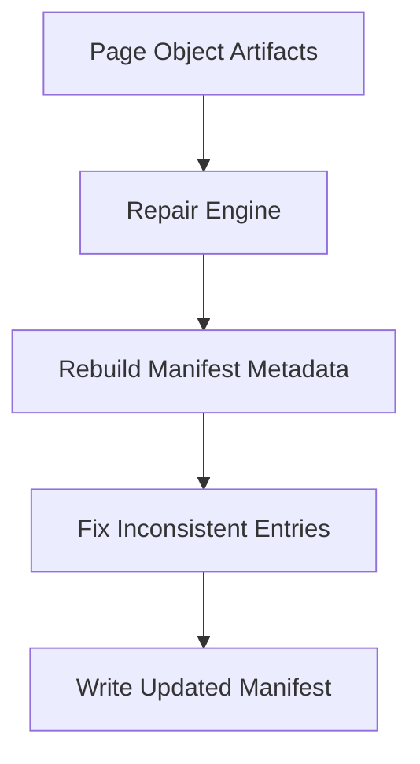
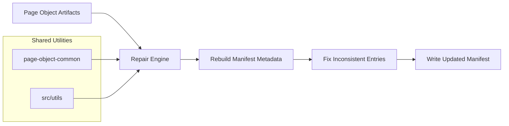
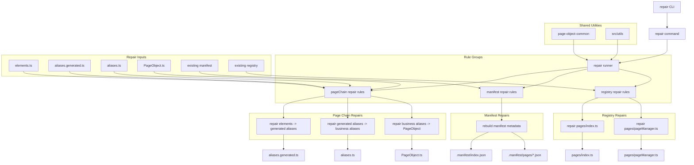
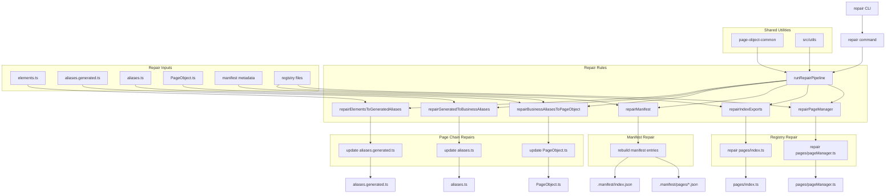

<!-- src/tools/page-object-repair/README.md -->

# Page Object Repair

---

# 1. Overview

The **Page Object Repair** tool detects and fixes inconsistencies between **generated page-object artifacts and manifest metadata**.

It reconstructs the correct framework state when artifacts or metadata drift from the expected structure.

Typical repairs include:

- fixing manifest entries
- rebuilding missing metadata
- correcting artifact references
- restoring framework consistency

The repair tool ensures the automation framework can **recover from structural inconsistencies without manual intervention**.

---

# 2. Purpose

The repair tool exists to **restore consistency across the page-object ecosystem**.

Over time, inconsistencies can occur due to:

- manual file edits
- incomplete generator runs
- merge conflicts
- outdated metadata
- structural drift

The repair tool automatically rebuilds metadata to restore a valid automation state.

Key goals:

- repair manifest inconsistencies
- synchronize metadata with artifacts
- recover from structural drift
- reduce manual maintenance

---

# 3. Toolchain Context

Within the automation architecture, the repair tool acts as the **recovery layer**.

```
Generated Artifacts
        ↓
Validator detects issues
        ↓
Repair fixes inconsistencies
        ↓
Framework returns to valid state
```

The repair tool focuses on **restoring metadata consistency across the automation framework**.

---

# 4. Inputs

The repair tool reads several framework artifacts.

### Page Object Artifacts

Location:

```
src/pageObjects/objects
```

Artifacts include:

```
elements.ts
aliases.generated.ts
aliases.ts
PageObject.ts
```

---

### Page Registry

Location:

```
src/pageObjectss
```

Files:

```
index.ts
pageManager.ts
```

---

### Manifest Metadata

Location:

```
src/pageObjectss/.manifest
```

Structure:

```
src/pageObjectss/.manifest
├── index.json
└── pages/*.json
```

The manifest contains metadata describing each page object.

---

# 5. Outputs

The repair tool updates files when inconsistencies are detected.

Possible repaired files include:

```
src/pageObjects/.manifest/index.json
src/pageObjects/.manifest/pages/*.json
```

Repair operations **do not modify developer-written page object logic**.

---

# 6. Repair Chain

The repair process focuses on restoring metadata consistency.



Each step restores the metadata required for the framework to function correctly.

---

# 7. Repair Responsibilities

## Manifest Repair

The primary responsibility of the repair tool is rebuilding manifest metadata.

This includes:

- restoring missing page entries
- correcting incorrect pageKey mappings
- fixing outdated metadata
- updating artifact references

---

## Metadata Synchronization

Repair ensures metadata fields match the current artifact structure.

Example repaired values:

```
className
elementCount
artifact paths
metadata references
```

---

## Structural Recovery

If the manifest becomes inconsistent with artifacts, the repair tool reconstructs the expected metadata structure.

This ensures the generator and validator can operate correctly afterward.

---

# 8. Manifest System

The repair tool works directly with the **page manifest system**.

Location:

```
src/pageObjects/.manifest
```

Structure:

```
src/pageObjects/.manifest
├── index.json
└── pages
    ├── <pageKey>.json
```

Example entry:

```json
{
  "pageKey": "athena.common.login-or-registration",
  "className": "LoginOrRegistrationPage",
  "elementCount": 4,
  "urlPath": "/",
  "title": "Login page"
}
```

Repair ensures manifest metadata remains consistent with the artifact structure.

---

# 9. Registry Relationship

The repair tool does not regenerate registry files directly.

However, it ensures metadata used by the registry remains valid.

Registry files:

```
src/pageObjects/index.ts
src/pageObjects/pageManager.ts
```

---

# 10. Repair Commands

Available commands:

```
npm run repair:run
npm run repair:run:verbose
npm run repair:help
```

---

# 11. Repair Modes

## Standard Repair

```
npm run repair:run
```

Repairs inconsistencies detected in metadata.

---

## Verbose Repair

```
npm run repair:run:verbose
```

Displays detailed repair information.

---

# 12. Repair Strategy

Repair works by rebuilding metadata using the **existing artifact structure**.

Steps:

1. Load artifact structure
2. Reconstruct expected metadata
3. Compare with existing manifest
4. Repair inconsistent entries
5. Write updated manifest

Repair operations are **deterministic and repeatable**.

---

# 13. Import Strategy

The repair tool uses TypeScript path aliases for module resolution.

Example:

```
@businessLayer/pageObjects/objects/*
@businessLayer/pageObjects/*
```

Configured in `tsconfig.json`.

---

# 14. Validation Relationship

The repair tool works closely with the validator.

Typical workflow:

```
validator detects inconsistencies
        ↓
repair tool fixes metadata
        ↓
validator confirms structure is valid
```

---

# 15. Typical Workflow

Typical developer workflow:

1. Run validator
2. Detect structural issues
3. Run repair tool
4. Validate again

Example:

```
npm run validator:check
npm run repair:run
npm run validator:check
```

---

# 16. Shared Utilities

The repair tool relies on shared utilities located in:

```
src/pageObjectTools/page-object-common
```

Utilities include:

```
extractTsObjectKeys.ts
pagePaths.ts
readPageMap.ts
tsObjectParser.ts
```

These utilities support:

- artifact path resolution
- TypeScript parsing
- metadata reconstruction

Additional helpers are provided by:

```
src/utils
```

These utilities provide:

- CLI formatting
- logging
- argument parsing
- filesystem helpers

---

# 17. Example End-to-End Flow



The repair process restores framework consistency by rebuilding metadata from the existing artifact structure.

---

# 18. Example End-to-End Flow v1



---

# 19. Example End-to-End Flow v2


---