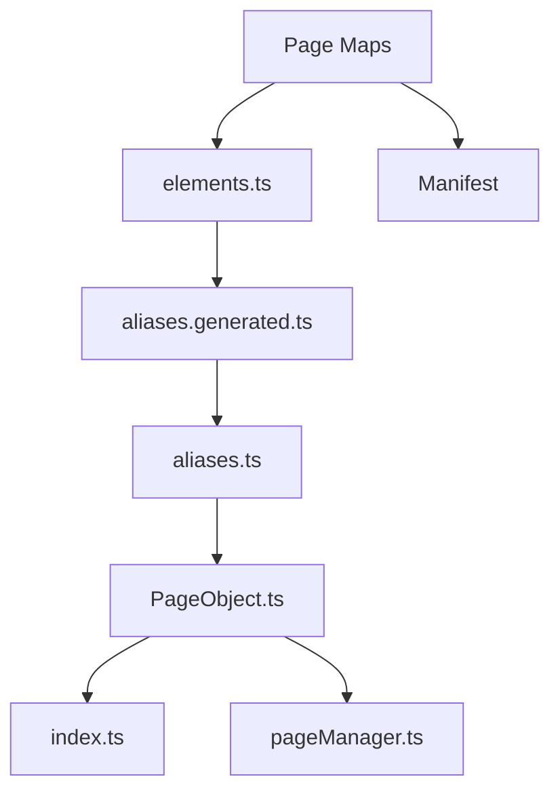
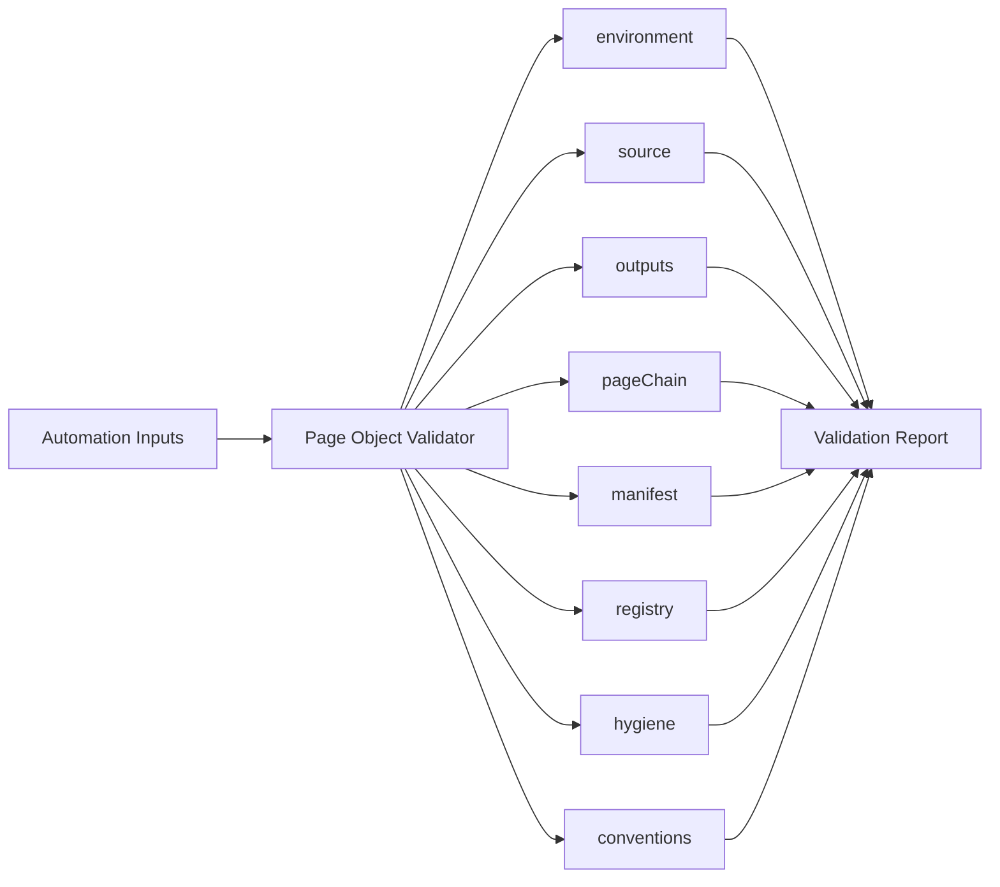
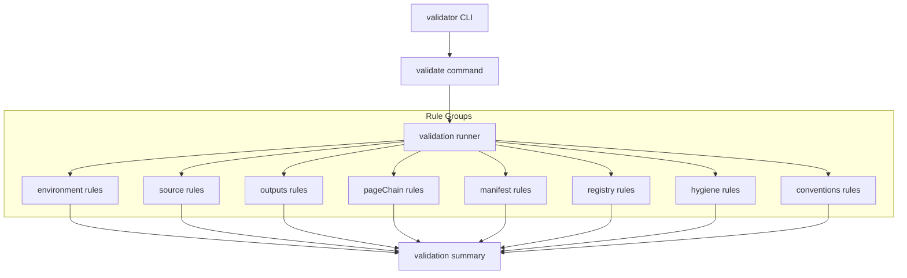

<!-- src/tools/page-object-validator/README.md -->

# Page Object Validator

---

# 1. Overview

The **Page Object Validator** analyzes the page-object ecosystem and verifies that all artifacts follow the expected automation structure.

It detects inconsistencies between:

- page maps
- generated page object artifacts
- generated aliases
- business aliases
- registry files
- manifest metadata

The validator provides detailed reports showing **warnings, errors, and structural problems** within the framework.

This tool helps maintain **automation reliability and structural integrity**.

---

# 2. Purpose

The validator ensures that the automation framework remains **consistent and maintainable**.

Its primary goals are:

- detect structural inconsistencies
- enforce framework conventions
- validate artifact dependencies
- identify missing or invalid metadata
- prevent broken automation code
- catch drift before tests run

The validator acts as a **quality gate for page-object artifacts**.

---

# 3. Toolchain Context

Within the automation architecture, the validator acts as the **verification layer**.

```text
Page Scanner / Page Maps
        ↓
Page Object Generator
        ↓
Page Object Validator
        ↓
Validation Report
        ↓
(optional) Repair Tool
```

The validator ensures the framework structure is correct before tests execute.

---

# 4. Inputs

The validator analyzes several framework components.

### Page Maps

Location:

```text
src/businessLayer/pageScanner
```

Page maps provide source metadata used during validation checks.

---

### Page Object Artifacts

Location:

```text
src/businessLayer/pageObjects/objects
```

Files include:

```text
elements.ts
aliases.generated.ts
aliases.ts
<PageName>Page.ts
```

---

### Page Registry

Location:

```text
src/businessLayer/pageObjects
```

Files:

```text
index.ts
pageManager.ts
```

---

### Manifest Metadata

Location:

```text
src/businessLayer/pageObjects/.manifest
```

Structure:

```text
src/businessLayer/pageObjects/.manifest
├── index.json
└── **/*.json
```

---

# 5. Outputs

The validator produces a **structured validation report**.

The report contains:

- passed checks
- warnings
- errors
- affected files
- grouped rule results
- suggested fixes

Example summary output:

```text
--------------------------------
VALIDATE SUMMARY
--------------------------------
Checks run       : 17
Passed checks    : 17
Warn checks      : 0
Failed checks    : 0
Total warnings   : 0
Total errors     : 0
Exit code        : 0
--------------------------------
Result           : ALL GOOD
--------------------------------
```

The validator **does not modify files**.

---

# 6. Validation Chain

The validator verifies the integrity of multiple framework layers.

Validation covers:

- page maps
- generated artifacts
- alias chain
- page objects
- manifest metadata
- registry files
- framework conventions



Each layer must remain synchronized to ensure the automation framework operates correctly.

---

# 7. Validation Responsibilities

## Environment Validation

Ensures required folders and configuration are available.

Checks include:

- maps directory exists
- page objects directory exists
- registry directory exists
- manifest path exists or can be read

---

## Source Validation

Ensures page maps are valid inputs.

Checks include:

- page-map schema
- required keys present
- pageKey formatting
- readiness metadata
- duplicate conflicts

---

## Outputs Validation

Ensures generated files exist where expected.

Checks include:

- expected generated files exist
- required page folders exist

---

## Page Chain Validation

Ensures the artifact dependency chain remains consistent.

Checks include:

- elements vs generated aliases
- generated aliases vs business aliases
- business aliases vs page object methods
- page object structure
- page object readiness wiring
- page metadata propagation

---

## Manifest Validation

Ensures manifest metadata reflects the current artifact structure.

Checks include:

- manifest entries exist
- metadata fields match page maps
- referenced files exist
- manifest index is synchronized

---

## Registry Validation

Validates page registry files.

Checks include:

```text
src/businessLayer/pageObjects/index.ts
src/businessLayer/pageObjects/pageManager.ts
```

The validator ensures:

- page objects are exported
- page manager references are correct
- registry structure remains valid

---

## Hygiene Validation

Checks generator-managed code quality.

Examples:

- duplicate exports
- malformed managed regions
- broken file layout

---

## Convention Validation

Ensures naming conventions are respected.

Checks include:

- pageKey naming
- className format
- element key format
- file naming consistency

---

# 8. Current Rule Groups

The validator currently runs grouped rules such as:

```text
environment
source
outputs
pageChain
manifest
registry
hygiene
conventions
```

This grouping keeps reports readable and easier to troubleshoot.

---

# 9. Manifest System

The validator checks the **manifest metadata system**.

Location:

```text
src/businessLayer/pageObjects/.manifest
```

Example index:

```json
{
  "version": 1,
  "pages": {
    "athena.azonline.common.login-or-registration": "athena/azonline/common/login-or-registration.json"
  }
}
```

Example page entry:

```json
{
  "pageKey": "athena.azonline.common.login-or-registration",
  "className": "LoginOrRegistrationPage",
  "pageMeta": {
    "urlPath": "/",
    "title": "Login page",
    "elementCount": 4
  }
}
```

The validator ensures metadata matches the artifact structure.

---

# 10. Registry Validation

Registry files are validated to ensure page objects are accessible to the framework.

Registry files:

```text
src/businessLayer/pageObjects/index.ts
src/businessLayer/pageObjects/pageManager.ts
```

Validator checks include:

- page object exports
- page manager references
- missing page registrations
- stale exports
- broken accessor paths

---

# 11. Validator Commands

Available commands:

```bash
npm run pageobjects:validate
npm run pageobjects:validate:verbose
npm run pageobjects:validate:strict
npm run pageobjects:validate:strict:verbose
```

Help command:

```bash
npm run pageobjects:validate:cli -- help
```

---

# 12. Validation Modes

## Standard Validation

```bash
npm run pageobjects:validate
```

Reports errors and warnings.

---

## Verbose Validation

```bash
npm run pageobjects:validate:verbose
```

Displays detailed rule execution.

---

## Strict Validation

```bash
npm run pageobjects:validate:strict
```

Treats warnings as blocking issues.

---

## Strict + Verbose

```bash
npm run pageobjects:validate:strict:verbose
```

Best for CI or debugging failing validations.

---

# 13. Import Strategy

The validator uses TypeScript path aliases to resolve framework modules.

Examples:

```text
@businessLayer/pageObjects/objects/*
@businessLayer/pageObjects/*
@toolingLayer/pageObjects/*
@utils/*
```

These aliases are configured in `tsconfig.json`.

---

# 14. Repair Relationship

The validator integrates with the repair tool.

Typical flow:

```text
Validator detects issues
        ↓
Developer runs repair tool
        ↓
Validator confirms structure is valid
```

When structural errors occur, the validator may be followed by:

```bash
npm run pageobjects:repair
```

---

# 15. Typical Workflow

Typical developer workflow:

1. Generate page objects
2. Run validator
3. Fix or repair issues

Example:

```bash
npm run check:types
npm run pageobjects:generate
npm run pageobjects:validate
```

If issues are detected:

```bash
npm run pageobjects:repair
npm run pageobjects:validate
```

---

# 16. Shared Utilities

The validator relies on shared utilities located in:

```text
src/toolingLayer/pageObjects/common
src/utils
```

Utilities support:

- TypeScript object parsing
- artifact path resolution
- page-map loading
- metadata extraction
- CLI formatting
- filesystem helpers

---

# 17. Example End-to-End Flow



The validator runs grouped rules and produces a structured validation report highlighting warnings, errors, and structural issues.

---

# 18. Detailed End-to-End Flow



---

# 19. Typical Healthy Output

A healthy repository usually shows:

```text
Checks run       : 17
Passed checks    : 17
Warn checks      : 0
Failed checks    : 0
Total warnings   : 0
Total errors     : 0
Exit code        : 0
Result           : ALL GOOD
```

---

# 20. What Validator Does Not Do

The validator does **not**:

- generate page objects
- repair broken files
- scan live pages
- rewrite developer code
- replace TypeScript compilation checks

It is a **verification tool**, not a generator or repair tool.

---

# 21. Recommended Sequence

Recommended command sequence during development:

```bash
npm run check:types
npm run pageobjects:generate
npm run pageobjects:validate
```

If needed:

```bash
npm run pageobjects:repair
npm run pageobjects:validate
```

---

# 22. Final Notes

The current validator model is built around:

- page maps as source truth
- generator outputs as managed artifacts
- manifest as metadata layer
- registry as access layer
- validator as quality gate
- repair as recovery path

This keeps the page-object toolchain reliable, scalable, and maintainable as the framework grows.
