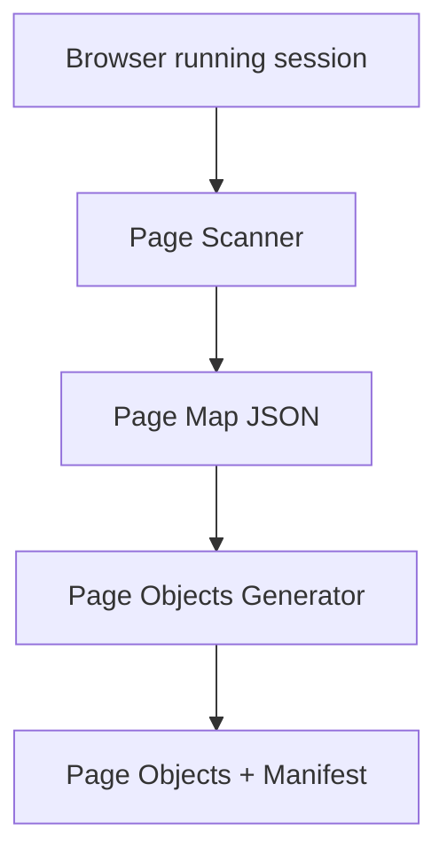
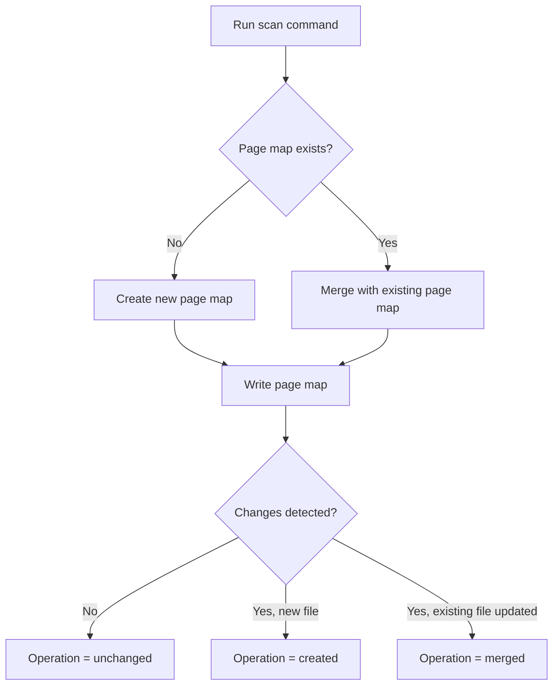
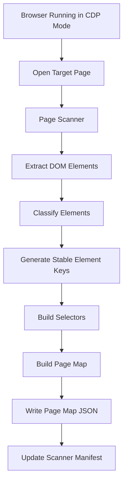
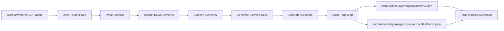

<!-- src/toolingLayer/pageScanner/README.md -->

# Page Scanner

---

# 1. Overview

The **Page Scanner** is responsible for discovering and extracting page structure from a running web application.

It uses **Playwright and DOM analysis** to automatically identify page elements and produce structured **page-map JSON files** used by the automation framework.

The scanner converts **live page DOM information into structured metadata** that later tools use to generate automation code.

Output from the scanner becomes the **foundation of the page-object generation pipeline**.

---

# 2. Purpose

The Page Scanner automates the discovery of page elements and produces structured metadata describing the page.

Its primary goals are:

- automatically discover page elements
- generate stable automation metadata
- reduce manual locator creation
- enforce consistent element naming
- support scalable page automation

Instead of manually defining page metadata, developers can **scan the page and generate the page-map automatically**.

---

# 3. Toolchain Context

Within the automation architecture, the scanner acts as the **metadata discovery layer**.



The scanner **does not generate automation code directly**.  
It produces **page-map metadata**, which downstream tools convert into automation artifacts.

---

# 4. Inputs

The scanner requires:

### Browser Session (CDP)

The scanner connects to an already running browser using **Chrome DevTools Protocol (CDP)**.

This allows scanning pages that:

- require login
- require manual navigation
- are part of complex flows
- already exist in a running browser session

### Target Page

The browser must already have the target page open.

Example:

```text
https://example.com/login
```

### Page Key

Each scan requires a **pageKey** identifying the page.

Example:

```text
athena.azonline.common.login-or-registration
```

Structure:

```text
<platform>.<application>.<product>.<name>
```

### Existing Page Map

The scanner automatically checks whether a page map already exists.

Location:

```text
src/businessLayer/pageScanner
```

If a page map exists, the scanner merges new scan results into it.  
If a page map does not exist, the scanner creates a new file.

There is **no separate merge command**.

---

# 5. Outputs

The scanner generates **page-map JSON files**.

Location:

```text
src/businessLayer/pageScanner
```

Example output file:

```text
src/businessLayer/pageScanner/athena/azonline/common/login-or-registration.json
```

Example page map structure:

```json
{
  "pageKey": "athena.azonline.common.login-or-registration",
  "url": "https://example.com/login",
  "urlPath": "/login",
  "title": "Login page",
  "scannedAt": "2026-03-09T12:48:41.552Z",
  "elements": {
    "loginButton": {
      "type": "button",
      "preferred": "css=#login",
      "fallbacks": [
        "role=button[name=/login/i]"
      ]
    }
  }
}
```

These page maps are later consumed by the **pageObjects generator**, validator, and repair pipeline.

---

# 6. Browser Connection (CDP Mode)

The scanner connects to a browser using the **Chrome DevTools Protocol (CDP)**.

This allows scanning pages that:

- require authentication
- require manual navigation
- are part of complex flows
- exist inside an already running browser session

Instead of launching a new browser, the scanner attaches to an existing one.

## Start Browser in CDP Mode

### Windows PowerShell (Microsoft Edge)

```powershell
$profile = Join-Path $env:TEMP ("edge-cdp-" + (Get-Date -Format "yyyyMMdd-HHmmss"))
Start-Process "C:\Program Files (x86)\Microsoft\Edge\Application\msedge.exe" "--remote-debugging-port=9222 --user-data-dir=$profile"
Start-Sleep -Seconds 2
$CDP = (Invoke-RestMethod http://localhost:9222/json/version).webSocketDebuggerUrl
```

### macOS (Microsoft Edge)

```bash
PROFILE_DIR="/tmp/edge-cdp-$(date +%Y%m%d-%H%M%S)"

open -na "Microsoft Edge" --args   --remote-debugging-port=9222   --user-data-dir="$PROFILE_DIR"

sleep 2

CDP=$(curl -s http://localhost:9222/json/version | jq -r .webSocketDebuggerUrl)

echo "CDP URL: $CDP"
```

## Run Scanner

```bash
npm run scan:page:verbose -- --connectCdp="$CDP" --pageKey="athena.azonline.motor.car-details"
```

Parameters:

| Parameter | Description |
|-----------|-------------|
| `--connectCdp` | WebSocket URL used to connect to the running browser |
| `--pageKey` | Page identifier used to generate the page-map |
| `--tabIndex` | Browser tab index to scan |
| `--outDir` | Optional output root directory |
| `--verbose` | Enables debug logging |
| `--logToFile` | Writes scanner logs to file |
| `--logFilePath` | Custom log file path |

## Close Browser Session

### Windows

```powershell
taskkill /IM msedge.exe /F
```

### macOS

```bash
pkill -f "Microsoft Edge.*--remote-debugging-port=9222"
```

This ensures the temporary CDP browser instance is fully closed.

---

# 7. Scan Behavior

The scanner follows a single command flow.



The scanner automatically determines the operation:

- `created` → new page map created
- `merged` → existing page map updated
- `unchanged` → no changes detected
- `failed` → scan failed

There is **no separate merge mode**.

---

# 8. Scanning Pipeline

The scanner follows a multi-stage pipeline to extract page metadata.



Each stage transforms raw DOM information into structured automation metadata.

---

# 9. DOM Extraction

DOM extraction collects interactive elements from the page.

The scanner focuses on elements such as:

- buttons
- inputs
- links
- selects
- checkboxes
- radio buttons
- textareas

Extraction is implemented in:

```text
scanner/domExtract.ts
scanner/domExtractors/
```

DOM extraction runs inside the browser through Playwright.

---

# 10. Element Classification

After extraction, elements are classified into automation types.

Examples:

| HTML Element | Classified Type |
|--------------|-----------------|
| `button` | `button` |
| `input[type=text]` | `input` |
| `select` | `select` |
| `a` | `link` |

Classification logic is implemented in:

```text
scanner/pageMap/classifyElementType.ts
```

---

# 11. Element Key Generation

Each discovered element is assigned a **stable automation key**.

Examples:

```text
loginButton
submitFormButton
emailInput
```

Key generation logic is located in:

```text
scanner/keyNaming
```

Strategies include:

- semantic naming
- heuristic rules
- normalization rules
- DOM attribute analysis

This helps produce readable and stable element identifiers.

---

# 12. Selector Generation

Selectors are generated using multiple strategies.

Location:

```text
scanner/selectors
```

Selector strategies include:

### CSS Strategy

```text
css=#login
```

### Role Strategy

```text
role=button[name=/login/i]
```

### Text Strategy

```text
text=Login
```

Selectors are grouped into:

```text
preferred
fallbacks
```

This improves locator robustness.

---

# 13. Page Map Builder

The page map builder constructs the final page metadata object.

Location:

```text
scanner/pageMap/buildPageMap.ts
```

Responsibilities:

- assembling page metadata
- grouping elements
- assigning selectors
- attaching element types
- generating element keys
- computing readiness aliases

The builder outputs the final **page-map JSON structure**.

---

# 14. Page Map Update Strategy

If a page map already exists, the scanner merges updates into it.

Location:

```text
scanner/pageMap/mergePageMaps.ts
```

Merge behavior:

- preserve existing element keys where possible
- update selectors when needed
- add newly discovered elements
- retain existing stable structure
- avoid rewriting unchanged files

This keeps scanning deterministic from the command perspective while preserving useful continuity in page-map evolution.

---

# 15. Scanner Manifest

The scanner also maintains a manifest index so downstream tooling can discover page maps without relying on flat file scanning.

Location:

```text
src/businessLayer/pageScanner/.manifest/index.json
```

Example shape:

```json
{
  "version": 1,
  "generatedAt": "2026-04-16T17:43:53.047Z",
  "pages": {
    "athena.azonline.motor.car-details": {
      "file": "src/businessLayer/pageScanner/athena/azonline/motor/car-details.json",
      "elementCount": 9,
      "scannedAt": "2026-04-16T17:43:53.037Z"
    }
  }
}
```

This manifest is used by pageObjects tooling to load scanner output consistently.

---

# 16. Scanner Commands

Available commands:

```text
npm run scan:page
npm run scan:page:verbose
npm run scan:help
```

The scanner uses one command path and decides internally whether the result is a create, merge, or unchanged operation.

---

# 17. Shared Utilities

The scanner uses shared utilities from:

```text
src/utils
```

These utilities provide:

- CLI formatting
- logging
- argument parsing
- filesystem helpers
- path utilities

Scanner-specific types are located in:

```text
scanner/types.ts
```

---

# 18. Example End-to-End Flow



The scanner converts a live web page into structured **page-map metadata** that drives the rest of the automation framework.

---

# 19. Key Principle

Page Scanner is a **metadata tool**.

It is responsible for:

- discovering structure
- producing page maps
- updating the scanner manifest

It is **not** responsible for:

- generating page objects
- business logic
- repairing page objects
- test orchestration
