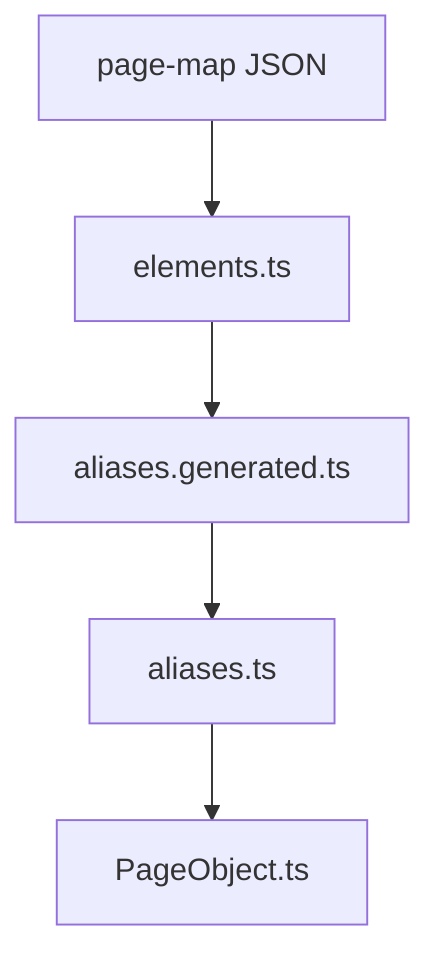
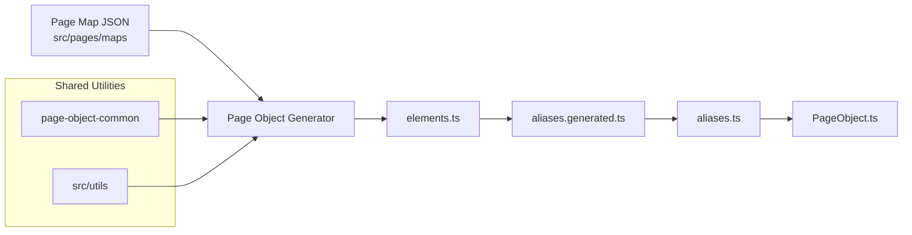

<!-- src/tools/page-object-generator/README.md -->

# Page Object Generator

---

# 1. Overview

The **Page Object Generator** builds and synchronizes Playwright page-object artifacts from **page-map definitions**.

It transforms page metadata into a structured automation layer consisting of:

- `elements.ts`
- `aliases.generated.ts`
- `aliases.ts`
- `<PageName>Page.ts`
- registry exports (`src/pages/index.ts`)
- page manager (`src/pages/pageManager.ts`)
- page manifest metadata (`src/pages/.manifest`)

The generator ensures page-object artifacts remain **deterministic, scalable, and maintainable** as the number of automated pages grows.

---

# 2. Purpose

The generator exists to automate the creation and synchronization of page-object code.

Its main goals are:

- eliminate manual page-object boilerplate
- maintain consistent automation architecture
- synchronize generated artifacts
- reduce maintenance effort
- support scalable page-object growth

Instead of writing page objects manually, developers define **page metadata in page-maps**, and the generator builds the required automation structure.

---

# 3. Toolchain Context

Within the automation architecture, the generator acts as the **code creation layer**.

It transforms **page metadata** into **automation artifacts**.

Page Maps  
↓  
Page Object Generator  
↓  
Generated Page Object Artifacts

The generator focuses exclusively on **creating and synchronizing page-object code**.

---

# 4. Inputs

The generator reads **page-map JSON files**.

Location:

```
src/pages/maps
```

Example page map file:

```
src/pages/maps/athena.common.login-or-registration.json
```

Example structure:

```json
{
  "pageKey": "athena.common.login-or-registration",
  "urlPath": "/",
  "title": "Login page",
  "scannedAt": "2026-03-09T12:48:41.552Z",
  "elements": {
    "loginButton": {
      "type": "button",
      "preferred": "css=#login",
      "fallbacks": ["role=button[name=/login/i]"]
    }
  }
}
```

Key fields used by the generator:

| Field | Description |
|------|-------------|
| `pageKey` | Unique page identifier |
| `elements` | Element definitions |
| `urlPath` | Page path |
| `title` | Page title |
| `scannedAt` | Scan timestamp |

---

# 5. Outputs

The generator creates or updates several automation artifacts.

Generated page-object directory:

```
src/pages/objects/<product>/<group>/<page>/

├── elements.ts
├── aliases.generated.ts
├── aliases.ts
└── <PageName>Page.ts
```

Shared framework files:

```
src/pages/index.ts
src/pages/pageManager.ts
```

Manifest metadata:

```
src/pages/.manifest
├── index.json
└── pages/*.json
```

---

# 6. Page Object Chain

The generator builds artifacts in a **strict dependency chain**.



Each stage depends on the previous artifact.

---

# 7. Generated File Responsibilities

## elements.ts

Defines page element locators used by automation.

Example:

```ts
export const elements = {
  loginButton: {
    type: "button",
    preferred: "css=#login",
    fallbacks: ["role=button[name=/login/i]"]
  }
}
```

This file represents the **automation-level element definitions**.

---

## aliases.generated.ts

Automatically generated alias layer.

Maps elements to generated aliases and contains page metadata.

Example:

```ts
export const aliasesGenerated = {
  loginButton: elements.loginButton
}
```

Also includes metadata fields:

- `pageMeta.pageKey`
- `pageMeta.urlPath`
- `pageMeta.urlRe`
- `pageMeta.title`
- `pageMeta.titleRe`

---

## aliases.ts

Human-maintained alias layer.

Purpose:

- provide business-friendly naming
- create stable API for tests
- separate generated logic from manual customization

Example:

```ts
export const aliases = {
  clickLogin: aliasesGenerated.loginButton
}
```

Generator behavior:

- adds missing aliases
- preserves existing aliases
- never overwrites manual alias code

---

## PageObject.ts

Defines the Playwright page object class.

Example:

```ts
export class LoginOrRegistrationPage {

  constructor(private readonly page: Page) {}

  async clickLogin() {
    await this.aliases.clickLogin.click()
  }

}
```

Generator maintains **method bindings for aliases** while preserving custom developer code.

---

# 8. Manifest System

The generator maintains metadata about all page objects.

Location:

```
src/pages/.manifest
```

Structure:

```
src/pages/.manifest
├── index.json
└── pages
    ├── athena.common.login-or-registration.json
```

Example manifest entry:

```json
{
  "pageKey": "athena.common.login-or-registration",
  "product": "athena",
  "group": "common",
  "name": "login-or-registration",
  "className": "LoginOrRegistrationPage",
  "pageObjectImportPath": "@page-objects/athena/common/login-or-registration/LoginOrRegistrationPage",
  "elementCount": 4,
  "urlPath": "/",
  "title": "Login page"
}
```

Purpose of the manifest:

- store page metadata
- support incremental generation
- track generator state
- detect changes

---

# 9. Registry Generation

The generator updates registry files used by the automation framework.

### index.ts

Exports all generated page objects.

```ts
export { PageManager } from "./pageManager"

export * from "@page-objects/athena/common/login-or-registration/LoginOrRegistrationPage"
```

### pageManager.ts

Provides a central access layer for page objects.

Example usage:

```ts
pageManager.athena.loginOrRegistration
```

---

# 10. Generator Commands

Available commands:

```bash
npm run generator:elements
npm run generator:elements:verbose
npm run generator:elements:changed
npm run generator:elements:changed:verbose
npm run generator:help
```

---

# 11. Generation Modes

## Full Generation

```
npm run generator:elements
```

Regenerates artifacts for **all pages**.

## Changed-only Generation

```
npm run generator:elements:changed
```

Updates only pages that have changed.

---

# 12. Changed-only Strategy

The generator detects changes using:

- manifest comparison
- page-map hash
- element count differences

Important rule:

The generator **preserves manual code**.

Example:

If `elements.ts` contains:

```
loginButton
logoutButton
customElement
```

and the page map contains:

```
loginButton
logoutButton
```

The generator **does not remove `customElement`**.

---

# 13. Import Strategy

Generated imports use **TypeScript path aliases**.

Example:

```
@page-objects/athena/common/login-or-registration/LoginOrRegistrationPage
```

Configured in `tsconfig.json`:

```json
{
  "@page-objects/*": ["src/pages/objects/*"]
}
```

Benefits:

- cleaner imports
- consistent architecture
- scalable folder structure

---

# 14. Validation Relationship

The generator integrates with validation rules.

Important principle:

**elements.ts is the base file for validation**

Validation chain:

```
elements.ts
   ↓
aliases.generated.ts
   ↓
aliases.ts
   ↓
PageObject.ts
```

---

# 15. Typical Workflow

Typical developer workflow:

1. Update page-map JSON  
2. Run generator  
3. Run validator  

Example:

```
npm run generator:elements
npm run validator:check
```

---

# 16. Shared Utilities

The Page Object Generator relies on several shared utilities located in:

```
src/tools/page-object-common
```

These utilities provide reusable functionality used by the generator to read page maps, resolve artifact paths, and parse TypeScript objects.

```
src/tools/page-object-common
├── extractTsObjectKeys.ts
├── pagePaths.ts
├── readPageMap.ts
└── tsObjectParser.ts
```

### extractTsObjectKeys.ts

Utility used to extract exported object keys from TypeScript files.

Example use case:

```
export const elements = { ... }
```

This allows the generator to safely read element definitions without executing TypeScript code.

---

### pagePaths.ts

Responsible for computing consistent file paths for page-object artifacts.

Example responsibilities:

- resolve page object file paths
- resolve elements file paths
- resolve alias file paths
- ensure consistent directory structure

Example usage:

```
getPageArtifactPaths(pageObjectsDir, pageKey)
```

---

### readPageMap.ts

Loads and normalizes page-map JSON files from the maps directory.

Responsibilities:

- discover page-map files
- load page-map metadata
- expose page-map structures to the generator

---

### tsObjectParser.ts

Low-level TypeScript object parser used internally by utilities such as `extractTsObjectKeys`.

It enables safe extraction of keys from exported TypeScript objects.

---

# 17. Example End-to-End Flow



This process transforms page metadata into fully usable automation code while shared utilities handle file parsing, path resolution, and CLI helpers.

---
